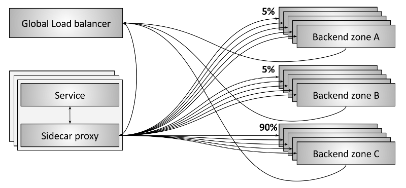

# 4.6 全局负载均衡

未来的负载均衡系统会越来越将单个负载均衡器看做通用组件。

图 13 展示了全局负载均衡系统的一个例子。这个例子包含如下内容：

- 每个 sidecar 同时和位于三个 zone 的后端通信；
- 图上可以看到，90% 的流量到了 zone C，而 zone A 和 B 各只有 5%；
- sidecar 和后端都定期向全局负载均衡器汇报状态。这使得全局负载均衡器可以基于 延迟、代价、负载、当前失败率等参数做出决策；
- 全局负载均衡器定期配置每个 sidecar 的路由信息。

:::center
   
图 4-10 全局负载均衡器
:::

全局负载均衡器可以做越来越复杂、单个负载均衡器无法完成的事情。例如：

- 自动检测和路由 zonal failure（可用区级别故障）
- 应用全局安全和路由策略
- 使用机器学习和神经网络技术检测和缓解流量异常，包括 DDoS 攻击
- 提供集中式 UI 和可视化平台，方便工程师理解和运维整个分布式系统