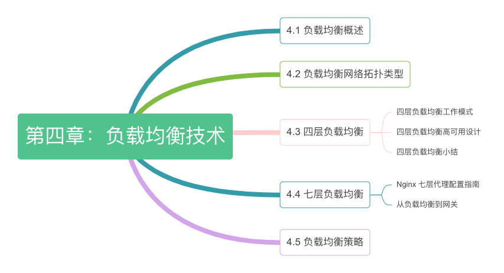

# 第四章：负载均衡与代理技术

:::tip <a/>

一个篮子装不下所有的鸡蛋，那么就多用几个篮子来装。

:::right
—— 分布式系统的基本思想。
:::

或者出于扩展服务能力的考虑，又或者出于提高容错性的考虑，大多数系统通常以集群形式对外提供服务。

以集群形式对外提供服务时，外界的请求无论由哪台服务器处理，都应获得一致的结果；另一方面，集群还需要对外界保持足够的透明度。也就是说，外界与集群交互时仿佛面对一台高性能、高可用的服务器。集群内部增加或删除服务器时，外界不会察觉，也无需对应调整任何配置。

为集群提供访问入口并实现上述职责的组件称为“负载均衡器”（或称代理）。负载均衡器是业内最活跃的领域之一，产品层出不穷（如专用网络设备、软件层面的实现等）、部署拓扑多样（中间代理型、边缘代理型、客户端内嵌型等）。无论其形式、部署拓扑如何，所有负载均衡器的核心职责无外乎 “选择处理外界请求的目标”（即负载均衡算法）和“将外界请求转发至目标”（即负载均衡的工作模式）。本章，我们围绕这两个核心职责展开，从中理解负载均衡器的工作原理。
:::center
   
  图 4-0 本章内容导读
:::
