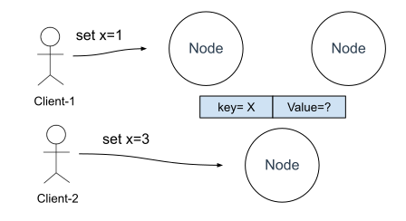
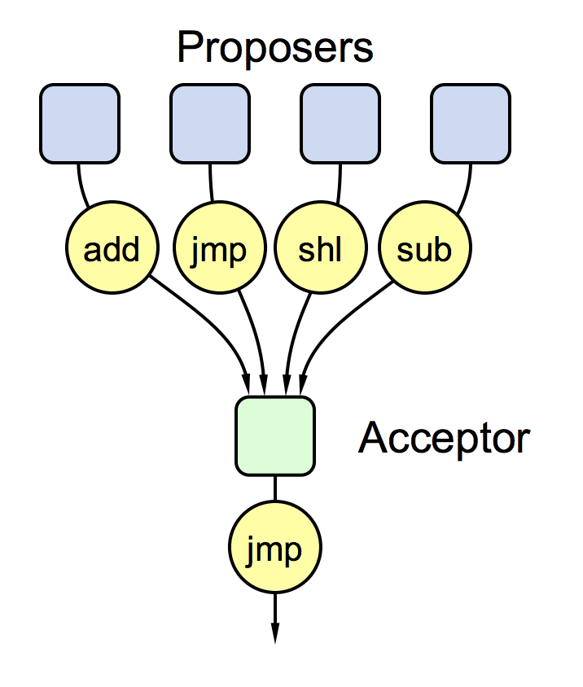
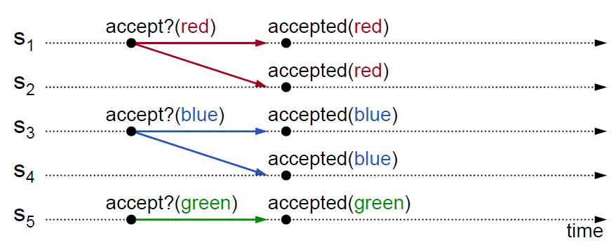
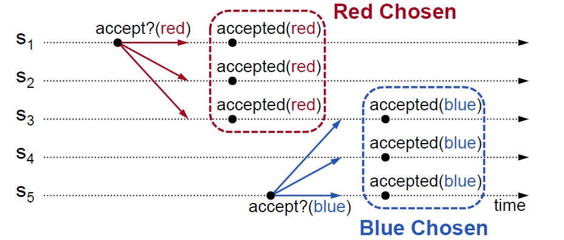
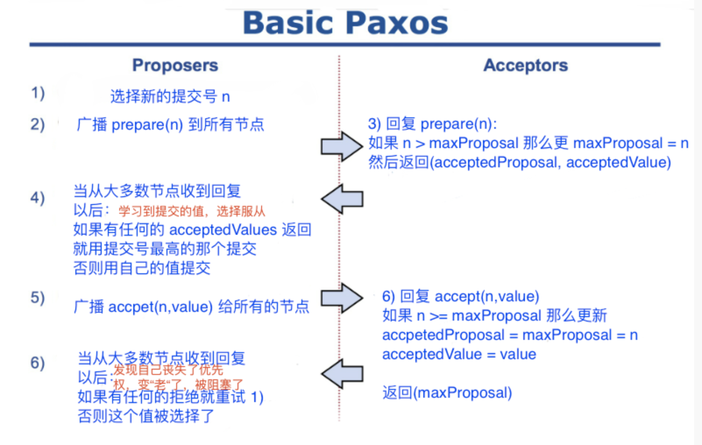
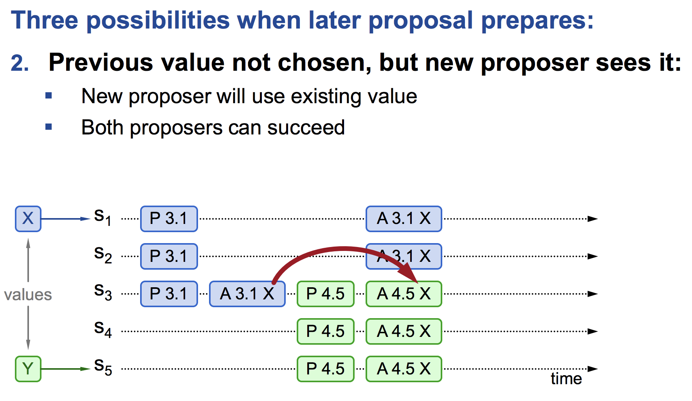
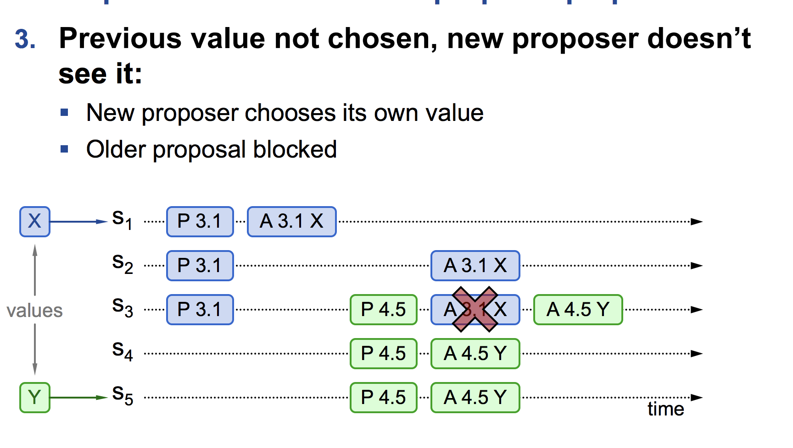
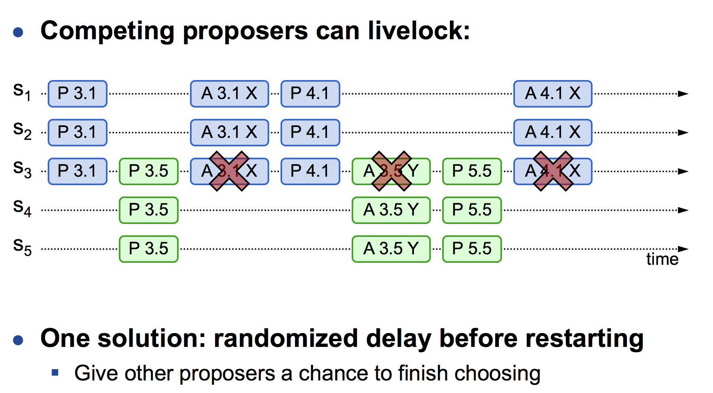

# 5.3.3 Basic Paxos

## 1. 问题背景

:::tip 背景设定

很久以前，在遥远的爱琴海上，有一座与世隔绝的小岛，叫做 Paxos。。。算了，还是换个更对口味的例子吧。

从前有个村，老村长退休了，需要选一个新村长，选取新村长的事件称之为提案（Proposal）。张三、李四都想当村长（张三、李四我们称为提议节点，Proposer），但当村长需要多位村委（决策节点，Acceptor）的投票同意，村委使用少数服从多数（Quorum）投票机制。选举结束之后，要把结果同步给村民（记录节点，Learner）。
:::

如果继续把问题讲下去，笔者似乎通篇都要讲李三、李四的段子，我们还是把背景再转换为分布式工程问题吧。假如我们设计一个分布式集群，这个集群由节点 A、B、C（3 个村委） 组成，提供只读的 KV 存储服务。既然要创建一个只读服务，必须先要对只读变量赋值，而且后续不能对该变量进行修改（村长选定了，结果就不能再更改）。所以，多个节点中，所有的节点必须要先对只读变量的值（提案）达成共识，然后所有的节点再一起创建这个只读变量。

例如，当有多个客户端（李三、李四，Proposer）访问这个系统，试图创建同一个只读变量（Proposal，李三提议李三当村长）时，集群中所有的节点（村委）该如何达成共识，实现各个节点中的 x 值的一致呢（所有的民村一致认为李三十村长）？

	
	

实现多个节点 x 值一致的复杂度主要来源于以下两个因素的共同影响：

- 系统内部各个节点的**通信是不可靠的**。不论是系统中企图设施数据的提议节点，还是决定操作是否批准的决策节点，其发出、收到的信息都可能存在延迟、丢失的情况。
- 客户端**写入是并发的**，如果是串行的修改数据，仅单纯使用 Quorum 机制，少数节点服从多数节点，就足以保证数据被正确读写。而并发访问就变成了 “**分布式环境下多个节点并发操作共享数据**” 的问题。

我们把上面的背景问题总结转化，其实就是下面两个核心需求：

- **安全性** Safety：
	- 一个变量只会被确定一个值（只能一个人当村长），一个变量只有在值被确定之后，才能被学习。
- **活性** Liveness：
	- 提案最终会被接受（一定能选出个村长）；一个提案被接受之后，最终会被学习到。
	- 必须在有限时间内做出决议（不能有多轮投票）。

Basic Paxos 的问题背景相信已经讲清楚了，那怎么解决？

最简单的场景是多个提议节点、单个决策节点，决策节点接受第一个发给它的值，作为被选中的值，但问题是如果决策节点故障，整个系统就会不可用。

	
	
只有一个决策节点会有单点故障

为了克服单点故障问题，我们借鉴多数派（Quorum）的机制，思路就是写入一半以上的节点。如果集群中有 N 个节点，客户端需要写入 W >= N/2 + 1 个节点，那么使用多数派的机制最多可容忍 (N-1)/2 个节点故障。但是问题还是存在，**每个决策节点该接受几个提案呢**? 

我们先看第一种情况，**按时序决策节点只接受它收到的第一个提案**。但考虑多个提议节点同时对一个提案进行提议，最后可能没有一个提议能够取得多数的投票，出现了平票问题（Split Votes）。如下图所示，red 和 blue 各有 2 票，没办法确定谁被选择？ 这也就意味着我们无法保证在一轮投票中达成共识，这就无法实现活性（liveness）需求。

	
	
split_votes 平票问题

再看第二种情况，决策节点就需要允许接受多个不同的提案，用多数派的机制解决 Split Votes 的问题。但新的问题是有了少数服从多数原则，就会碰到冲突的问题。例如，不同提案节点提议不同的值，可能都会被选择（S~3~ 收到了 blue 和 red，S~3~ 该确认选择哪个值？ ），这就破坏了每个提案只有一个值的原则，这违背了安全性（safety）的需求。

	
	

:::tip 注意，Paxos 强调
Once a value has been chosen, future proposals must propose the same value.
:::

也就是说，我们讨论的 Basic-Paxos 只会 Chosen 一个值。基于此，就需要一个两阶段（2-phase）协议，对于已经 Chosen 的值，后面的提案要放弃自己的提议，提出已经被选中的值。例如，S~5~ 发起提案之前，先广播给 S~3~、S~4~、S~5~3 个节点，询问是否是否已经有接受的提案，如果已有，则撤销自己的提案，S~5~ 的题案由 blue 改为 red，这一阶段在 Basic Paxos 称为准备（prepare）阶段。

:::tip 第一阶段实际是分布式抢占锁的过程

如果并发操作一个变量不使用锁，会出现各种意外情况，假设有一个变量 x 在当前系统存储的值是 2，同时有外部请求 A、B 分别对系统发送操作指令，把 x 的值加 1 和 把 x 值乘 3，如果不加任何控制，将可能得到 `2+1)*3=9` 或者`（2*3+1）=7`。

到了分布式环境下，由于要考虑到分布式系统内可能任何时刻出现的通信故障，如果一个节点取得锁之后、释放锁之前发生故障，这将导致整个系统被无限期的等待所阻塞，因此分布式环境中的加锁就不能完全等同于单机系统并发控制中以互斥量实现的加锁，还要提供一个其他节点能抢占锁的机制，以避免因通信问题出现死锁。

:::

仅单纯使用二阶段协议仍然无法解决这个问题，分布式系统中的网络延迟无法忽视。如图所示，S~1~ 和 S~5~ 在第一个阶段都发现没有其他的值被选中，因此提出自己的提案，但在这个时序下会有两个不同的值被选中。

	
	

所以你会发现，矛盾的点其实就是这个 S3，也就是少数服从多数原则，能保证任意的大多数都是有交集的。交集中的点会发现矛盾（和之前接受的值有矛盾理应选择拒绝）。

:::tip 思考：3 个节点的容忍度是 1，那么 4 节点的容忍度是多少？

答案：也是 1，因为要形成发现矛盾的交集对于 4 来说，要达到 3/4，才能构成大多数，这就是为什么集群选单数的原因，因为双数从算法的角度来说没什么帮助。
:::

如图 S~3~ 应该拒绝 S~1~ 的提案，这样就可以保证 S~5~ 的提案成功，S~1~的提案因为冲突而失败。这种方式我们需要对提案进行排序，有了排序，决策节点就可以拒绝老的提议。如果你熟悉分布式系统，应该能想到 "Time, Clocks and the Ordering of Events in a Distributed System" 这篇论文，我们不能简单用时间来判断提案的先后顺序。

## 2. Basic Paxos 算法描述

现在我们终于可以开始描述 Paxos 算法了。

Basic Paxos 对于此问题的解决方案是，定义一个 Proposal Number 来标识唯一的提案。

一个简单的 Proposal Number 的定义为：`<seq_id, server_id>`，seq_id 可以是一个自增的 ID，同时为了避免崩溃重启，必须能在本地持久化存储，最后再拼接上 server_id，确保是分布式系统中唯一 ID。

当决策节点收到这个提案后，将会给两个承诺一个应答。

**两个承诺**：

- 承诺不会再接受提案 ID 小于或者等于 n 的 Prepare 请求；
- 承诺不会再接受提案小于 n 的 Accept 请求。

**一个应答**：

- 不违背以前作出的承诺下，回复已经 Accept 过的提案中提案 ID 最大的那个提案的值和提案 ID，没有则返回空值。

我们再具体一点描述 Basic Paxos 算法，首先是**准备阶段**，选择一个提交号 n，提交 prepare(n)，接受者需要返回自己接受的值和已经接受的提交号。当从大多数收到回复以后就可以做判断了，如果有返回接受值，选择提交号最大的值进行下一阶段（这个行为对应的是发现有值可能被接受了，尝试服从或者学习这个接受），不然就可以用自己的值进行下一阶段。

下一阶段就是**接受阶段** accept(value,n)，如果接受者发现自己目前收到的 n，没有比 accpet 给的 n 大，就接受这个值，并且更新自己的 n，否则就拒绝（这里就保证提交者能够发现自己变老了或者被拒绝了）。如果接受者发现提交号大于自己当前的最大提交号，就接受这个值，不然就拒绝。当提交者从大多数人那里接受到返回以后发现有拒绝的情况，就进行重试拿一个新的 n 开始，否则这个值就被接受了。

总结 Basic Paxos 中的值就是设置一次，不存在再设次一次的情况，整个流程如下图所示。

	
	

## 3. Basic Paxos 验证

那这样的一个二阶段提交，看看能不能解决前面的问题。假设一个分布式系统中有五个节点，分别是 S~1~、S~2~、S~3~、S~4~、S~5~，这5个节点同时扮演着提案节点和决策节点的角色。此时，有两个并发请求希望将同一个值分别设定为 X（由 S~3~ 作为提案节点提出） 和 Y（由 S~5~ 作为提案节点提出），以 P 代表准备阶段，以 A 代表批准阶段，这时会发生以下几种情况。

### 3.1 情况一：提案已 Chosen

	
	

- S~1~ 收到客户端提案请求 X，于是 S~1~ 向 S1-S3 发起 Prepare(3.1) 请求，PROMISE() 响应返回没有提案被 Chosen
- 由于 S1-S3 没有任何提案被 Chosen，S1 继续向 S1-S3 发送 Accept(3.1, X) 请求，提案被成功 Chosen
- 在提案被 Chosen 后，S5 收到客户端提案值为 Y 的请求，向 S3-S5 发送 Prepare(4.5) 请求，由于编号 4 > 3 会收到提案值为 X 已经被 Chosen 的 PROMISE() 响应
- 于是 S5 将提案值 Y 替换成 X，向 S1-S3 发送 Accept(4.5, X) 请求，提案再次被 Chosen

### 3.2 情况 2：提案未 Chosen，Proposer 可见

	
	

情况 2 和情况 1 类似，在 S3 Chosen 了提案后，S5 收到来自 S3 的 PROMISE() 响应包含了已经 Chosen 的提案值 X，所以同样会将提案值替换成 X，最终所有 Acceptor 对 X 达成共识。

### 3.3 情况 3：提案未提交，Proposer 不可见

	
	

情况 3 中，提案只被 S1 Chosen，S3 还未 Chosen 该提案，S3-S5 的 Promise() 响应中没有任何提案信息，所以 S5 自行决定提案值为 Y，发送 Accept(4.5, Y) 请求。

由于此时 S3 承诺的提案编号 n 变为了 4 且 4 大于 3，所以 S3 不再接受 S1 后续的 Accept(3.1, X) 请求。提案值 X 被阻止，而提案值 Y 最终被 Chosen。

## 活锁

看起来所有的问题都解决了，但是活性问题无法保证。这个情况发生在提交之间相互阻塞的情况，S3 S4 S5 拿着更高的提交号导致 S1 S2 S3 的 accept 被拒绝重新进行提交，又把 S3 S4 S5 给拒绝了。

	
	

提议者没有看到先前提议的情况下，当 S1 发现自己的提议没有通过，就会发起新一轮 Prepare RPC，然后就有可能又封锁了 S5 的提议，S5 又会回到 Prepare 阶段，有概率双方都轮流封锁对方的协议，导致无法达成共识

解决这个问题的办法就是把重试时间进行一些随机化，减少这种巧合发生，或者把重试的时间指数增长等等。

另外一个解决方案是 Multi-Paxos 将使用领导人选举来避免这种情况，只有一个提议者就不会出现活锁了
