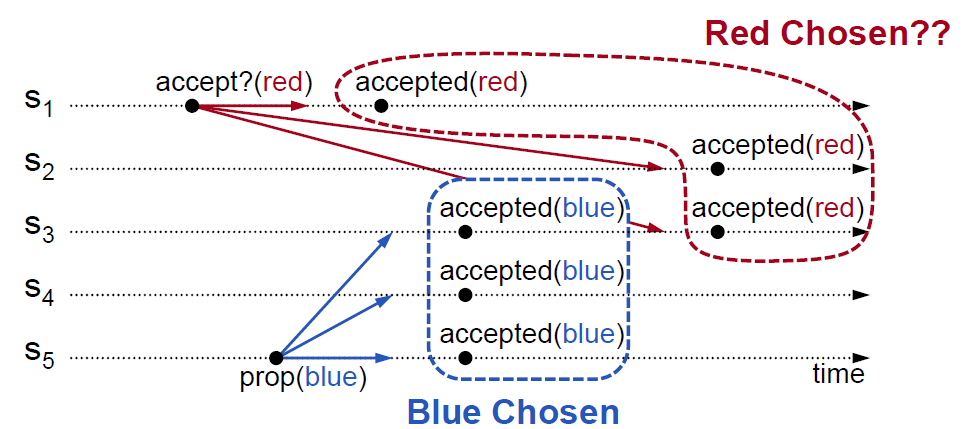
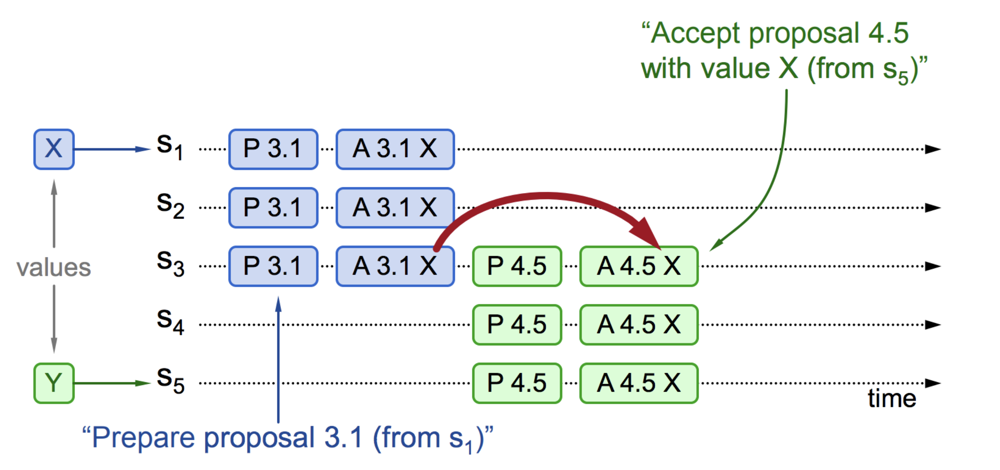
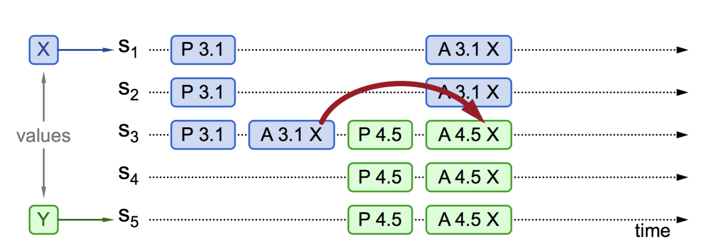
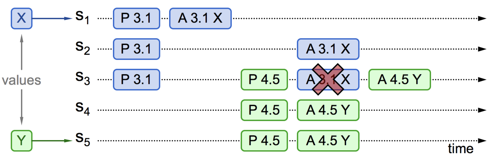
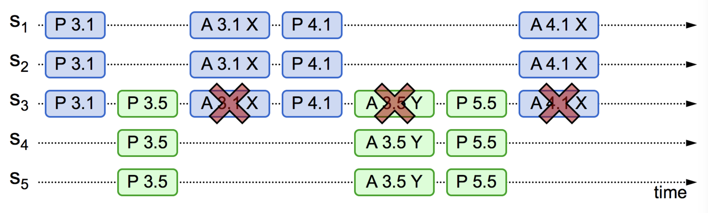

# 6.3.2 Paxos 算法

希望你没有对前篇 Paxos 的“复杂”做的铺垫所吓倒，共识问题已经算是一个古老的领域，30 余年间已经有无数简洁直白的视频、论文等资料进行过解读。网络中流传甚广的 Raft 和 Paxos 视频讲解[^1]，即使没有多少技术背景，也能通俗地理解 Paxos。

接下来，我们先了解 Paxos 基本背景，然后直面 Paxos 算法细节，最后再用具体的例子验证 Paxos 算法。

## 1. Paxos 算法背景

在 Paxos 算法中，节点分为下面三种角色：

- **提议者（Proposer）**：提议者是启动共识过程的节点，它提出一个值，请求其他节点对这个值进行投票，提出值的行为称为发起“提案"（Proposal），提案包含提案编号 (Proposal ID) 和提议的值 (Value)。注意的是，Paxos 算法是一个典型的为“操作转移”模型设计的算法，为简化表述，本文把提案类比成“变量赋值”操作，但你应该理解它是“操作日志”相似的概念，后面介绍的 Raft 算法中，直接就把“提案”称做“日志”了。
- **决策者（Acceptor）**：接受或拒绝提议者发起的提案，如果一个提案被超过半数的决策者接受，意味着提案被“批准”（accepted）。提案一旦被批准，意味着在所有节点中达到共识，便不可改变、永久生效。
- **记录者（Learner）**：记录者不发起提案，也不参与决策提案，它们学习、记录被批准的提案。

在 Paxos 算法中，节点都是平等的，它们都可以承担一种或者多种角色。例如，提议者即可发起提案，也可以就一个提案进行表决，但为了 Quorum 的计算更加明确，表决提案的节点数最好是奇数个。

Paxos 是基于 Quorum 的算法，但“少数服从多数”并不能解决所有的问题。例如，由于并发操作导致的提案冲突。

如图 6-5 所示，S~1~ 向 S~1~、S~2~、S~3~ 发起提案（red）。同时，S~5~ 也向 S~3~、S~4~、S~5~ 发起提案（blue）。它们的提案 Quorum 都达成了，也就是说一个提案有两个值被批准，这显然破坏了一致性原则。

:::center
   <br/>
  图 6-5 网络延迟导致冲突
:::

根据图 6-5，你会发现提案冲突发生在 S~3~，S~3~ 是两个 Quorum 的交集点，它的时间线上有两个不同的值被批准。

我们知道，设计程序的一个基本常识是，如果多个线程同时操作某个共享变量，一定要加上互斥锁，不然会出现各种意外情况。不难发现，S~3~ 问题的本质是：“在分布式环境下并发操作共享变量的问题”。

因为分布式环境下随时可能出现通信故障，我们不能“套用”进程加锁的机制解决 S~3~ 的问题。举个例子，假如一个节点获得锁之后，释放锁之前故障了。那么，整个系统就会被无限期等待阻塞。

解决上述问题的关键在于，得有一种可供其他节点抢占锁的机制，避免因通信故障导致死锁。

笔者在 5.4.2 节 介绍过“乐观锁”，分布式抢占锁的设计思想和“乐观锁”有异曲同工之妙。回顾乐观锁的示例 SQL，WHERE 条件的作用是判断在它操作之前，数据是否被修改。如果修改过，则请求最新的数据，更新版本号，然后用重试的方式再次修改。

```SQL
UPDATE accounts 
SET balance = balance + ?, 
    version = version + 1 
WHERE id = ? AND version = ?;
```

我们可以借鉴“乐观锁”的思路，尝试解决图 6-5 中的并发冲突问题。请看下面的操作：

首先，S~1~ 发起提案，S~3~ 收到 S~1~ 提案时，应该意识到 S~5~ 发起的提案（blue）的 Quorum 已经达成，S~1~ 提案（red）已经失效。根据先到先得原则，S~1~ 应该更新自己的提案值（red 替换为 blue），这个操作相当于对提案编号（乐观锁中的 version）“锁定”，防止之后出现多个冲突的提案编号。

了解接受了哪些编，接下来的处理就简单了。现在，我们可以直面 Paxos 算法的细节了。

## 2. Paxos 算法描述

简而言之，Paxos 算法本质是一个支持多次重复的二阶段提交协议。

Paxos 算法的第一个阶段称“准备阶段”（Prepare）。提议者选择一个提案编号 $\mathit{N}$（通常是单调递增的数字，相当于乐观锁中的 version，更高的编号意味着更高的优先级），向所有的决策者广播许可申请（称为 $\mathit{Prepare(N)}$ 请求），如果决策者：
- 尚未承诺 $\mathit{≥N}$ 编号的提案：则“承诺”（promise）不再接受任何编号小于 $\mathit{N}$ 的提案，返回一个响应，其中包含承诺的提案编号以及对应的提案值（如果有）；
- 已承诺 $\mathit{≥N}$ 编号的提案：拒绝 Prepare 请求，不返回任何响应。

提议者从多数决策者获得了“承诺”（Promise），则“准备阶段”达成。接着，决策者选择提案值：如果决策者的响应中返回了提案值，从中选择编号最高的提案值；如果没有提案值返回，则使用决策者初始提案值。

完成以上操作后，进入下一个阶段。

Paxos 算法的第二个阶段称“批准阶段”（Accept）。提议者向所有决策者广播批准申请（称为 $\mathit{accept(N, V)}$ 请求），请求批准：“提案编号 $\mathit{N}$ 提案值 $\mathit{V}$”。如果决策者发现提案编号 $\mathit{N}$ 不小于它已承诺的最大编号，则“批准”（accepted）该提案；否则拒绝该提案。当多数的决策者批准提案时，提议者认为本轮提案成功、共识达成。一旦提案成功，提议者会将最终的决议广播给所有记录者节点，供它们学习、记录最终结果。

:::center
   <br/>
  图 6-6 Paxos 算法流程
:::

## 3. Paxos 算法验证

证明 Paxos 算法的正确性比重新实现 Paxos 算法还难。我们没必须推导 Paxos 的正确性，通过以下几个例子来验证 Paxos 算法。

下面的示例中，X、Y 代表客户端，S~1~ ~ S~5~ 是服务端，它们既是提议者又是决策者，图中的 P 代表 “准备阶段”，A 代表“批准阶段”。为了便于理解，提案编号$\mathit{N}$ 由自增序号和 Server ID 组成。例如，S~1~ 的提案编号为 1.1、2.1、3.1...。

现在，我们来分析 S~1~ 、S~5~ 同时发起提案，会出现什么情况。

**情况一：提案已批准**。如图 6-7 所示，S~1~ 收到客户端的请求，于是 S~1~ 作为提议者，向 S~1~...S~3~ 广播 Prepare(3.1) 消息，决策者 S~1~...S~3~ 没有接受过任何提案，所以接受该提案。接着，S~1~ 广播 Accept(3.1, X) 消息，提案 X 成功被批准。

在提案 X 被批准后，S~5~ 收到客户端的提案 Y，S~5~ 作为提议者向 S~3~...S~5~ 广播 Prepare(4.5) 消息。对 S~3~ 来说，4.5 比 3.1 大，且已经接受了 X，它回复提案 (3.1, X)。S~5~ 收到 S~3~...S~5~ 的回复后，使用 X 替换自己的 Y，接着进入批准阶段，广播 Accept(4.5, X) 消息。S~3~...S~5~ 批准提案，所有决策者就 X 达成一致。

:::center
   <br/>
  图 6-7 提案已批准
:::

**情况二：事实上，对于情况一，也就是“取值为 X”并不是一定需要多数派批准，S~5~ 发起提案时，准备阶段的应答中是否包含了批准过 X 的决策者也影响决策**。如图 6-8 所示，S~3~ 接受了提案 (3.1, X)，但 S~1~、S~2~ 还没有收到 Accept(3.1, X) 消息。此时 S~3~、S~4~、S~5~ 收到 Prepare(4.5) 消息，S~3~ 回复已经接受的提案 (3.1, X)，S~5~ 将提案值 Y 替换成 X，广播 Accept(4.5, X) 消息给 S~3~、S~4~、S~5~，对 S~3~ 来说，编号 4.5 大于 3.1，所以批准提案 X，最终共识的结果仍然是 X。

:::center
   <br/>
  图 6-8 提案部分接受，新提议者可见
:::

**情况三：另外一种可能的情况是 S~5~ 发起提案时，准备阶段的应答中未包含批准过 X 的决策节点**。S~1~ 接受了提案 (3.1, X)，S~3~ 先收到 Prepare(4.5) 消息，后收到 Accept(3.1, X) 消息，由于 3.1 小于 4.5，会直接拒绝这个提案。提案 X 没有收到多数的回复，X 提案就被阻止了。提案 Y 顺利通过，整个系统最终对“取值为 Y”达成一致。

:::center
   <br/>
  图 6-9 提案部分接受，新提议者不可见
:::


**情况四：从情况三可以推导出另一种极端的情况**，多个提议者同时发起提案，在准备阶段互相抢占，反复刷新决策者上的提案编号，导致任何一方都无法达到多数派决议，这个过程理论上可以无限持续下去，形成“活锁”（livelock）。

解决这个问题并复杂，随机重试时间，就能减少这种巧合发生。
:::center
   <br/>
  图 6-10 出现活锁问题
:::

以上，就是整个 Paxos 算法的工作原理。

Paxos 的价值在于推动了分布式共识算法的发展，但它有以下缺陷：只能处理单一提案，且达成共识至少需要两次网络往返，高并发情况下可能导致活锁。因此，Paxos 算法主要用于理论研究，较少直接应用于工程实践。为了应对多次提案和大规模分布式系统的需求，Lamport 在论文《Paxos Made Simple》中提出了 Paxos 的优化变体 —— Multi Paxos。Multi Paxos 引入了“选主”机制，通过多次运行 Paxos 算法来处理多个提案。

不过，Lamport 的论文主要关注的是 Paxos 的算法基础和正确性证明，对于领导者选举以及解决多轮提案的效率问题，并没有给出充分的实现细节。2014 年，斯坦福的学者 Diego Ongaro 和 John Ousterhout 发表了论文《In Search of an Understandable Consensus Algorithm》，该论文基于 Multi Paxos 思想，提出了“选主”、“日志复制”等概念及其实现细节，提出了简化和改进版的 Raft 算法。该论文斩获 USENIX ATC 2014 大会 Best Paper 荣誉，Raft 算法更是成为后来 etcd、Consul 等分布式系统的实现基础。


[^1]: 讲解作者是斯坦福教授 John Ousterhunt，他还指导了 Diego Ongaro 写出了 Raft 的论文。本章配图也多来源于 John Ousterhunt 所发表的内容。
[^2]: 参见 https://lamport.azurewebsites.net/pubs/time-clocks.pdf
