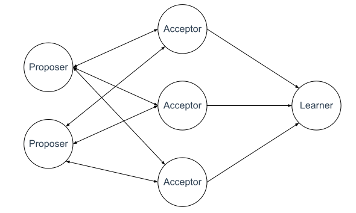
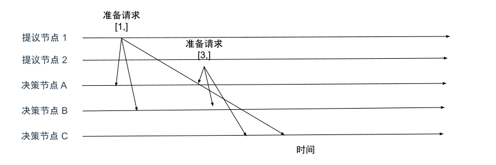
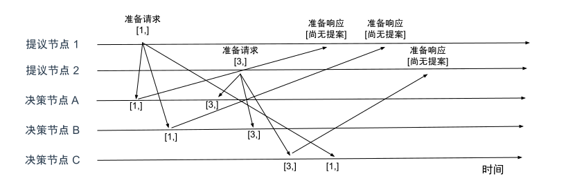
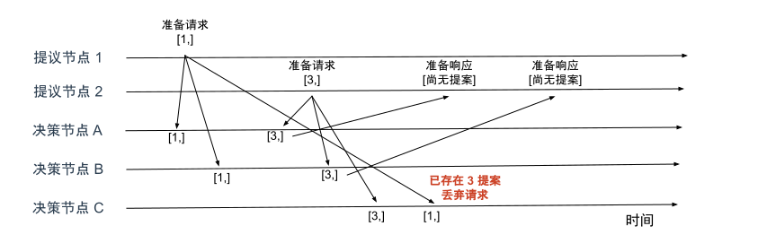

# 5.3.3 Basic Paxos 算法

在一些经典的算法中，有一些既形象又独有的概念（例如二阶段提交的协调者），Basic Paxos 也不例外。为了帮助人们更好理解 Basic Paxos，Lamport 在讲解时也使用了一些独有且比较重要的概念，例**提案**（Proposal）、**准备**（Prepare）请求、**接受**（Accept）请求以及赋予节点的 3 种**角色**。这其中最重要的概念就是“角色”，这 3 个角色其实就是对 Paxos 中最核心的 3 个功能的抽象。

- **提议节点**：称为 Proposer，提议一个值，用于投票表决。这个提议行为被称为提案（Proposal）。
- **决策节点**：称为 Acceptor，是应答提案的节点，决定该提案是否可被投票、是否可被接受。提案一旦被超过半数的节决策节点接受，即称该提案被批准（Accpet）。提案批准意味着该值不能被更改，也不会被丢失，且最终所有的节点都会接受它。
- **记录节点**：称为 Learner，不参与决策也不参与投票。只是单纯地从提案、决策节点中学习已经达成共识的提案。一般来说学习者属于数据备份节点，比如 Master-Slave 模型中的 Slave，被动地接受数据，容灾备份。

在使用 Paxos 算法的系统中，所有的节点都是平等的，它们都可以承担以上一种或者多种角色，不过为了便于确保有明确的多数派，决策者的数量应该被设置为奇数个。

	
	
Paxos 中角色的关系

让我们思考一下，假如我们设计一个分布式集群，这个集群由节点 A、B、C 组成，提供只读的 KV 存储服务。创建一个只读服务，必须先要对只读变量赋值，而且后续不能对该变量进行修改。所以，多个节点中，所有的节点必须要先对只读变量的值达成共识，然后所有的节点再一起创建这个只读变量。

例如，当有多个客户端（例如客户端 1、2）访问这个系统，试图创建同一个只读变量（例如 x）时，集群中所有的节点该如何达成共识，实现各个节点中的 x 值的一致呢？

	
	

实现多个节点 x 值一致的复杂度主要来源于以下两个因素的共同影响：

- 系统内部各个节点的**通信是不可靠的**。不论是系统中企图设施数据的提议节点，还是决定操作是否批准的决策节点，其发出、收到的信息都可能存在延迟、丢失的情况（非拜占庭容错系统不考虑消息传递错误，见 5.1 节）。
- 系统外部用户**访问是并发的**，如果是串行的修改数据，仅单纯使用 Quorum 机制，少数节点服从多数节点，就足以保证数据被正确读写。而并发访问就变成了 “**分布式环境下多个节点并发操作共享数据**” 的问题。

第一个通信不可靠的问题笔者在前面章节详细阐述过，关于第二个问题详细解释下，学过计算机的同学应该都知道，并发操作一个变量需要通过互斥锁保证数据被正确操作。如果不使用锁，并发操作一个变量会出现各种意外情况，假设有一个变量 x 在当前系统存储的值是 2，同时有外部请求 A、B 分别对系统发送操作指令，把 x 的值加 1 和 把 x 值乘 3，如果不加任何控制，将可能得到 `2+1)*3=9` 或者`（2*3+1）=7`。到了分布式环境下，由于要考虑到分布式系统内可能任何时刻出现的通信故障，如果一个节点取得锁之后、释放锁之前发生故障，这将导致整个系统被无限期的等待所阻塞，因此分布式环境中的加锁就不能完全等同于单机系统并发控制中以互斥量实现的加锁，还要提供一个其他节点能抢占锁的机制，以避免因通信问题出现死锁。

以上，我们知道了分布式环境中的锁必须是可抢占的。

## 2. 如何达成共识

Paxos 算法包括两个阶段，第一阶段准备（Prepare）就相当于上面抢占所锁的过程。如果某个提案节点准备发起提案，必须先向所有的决策节点广播一个许可申请（称为 Prepare 请求）

### 2.1 准备阶段

先来看第一个阶段，客户端 1、2 作为提议节点，分别向所有的决策节点发送包含提案号的提案准备请求（需要注意，准备请求中只需要指定提案号就可以，不需要提案值）。

	
	

接着，节点 A、B 收到提案号为 1 的准备请求，节点 C 收到编号为 3 的提案请求后，进行如下处理。

	
	

由于 A、B 节点之前没有通过任何提案，所以，它们将返回一个 “尚无提案” 的响应，也就是说 A、B 节点告诉提案者，我之前没有通过任何提案，并承诺以后不再响应小于或者等于 1 的准备请求，也不会通过编号小于 1 的提案。节点 C 也是如此，它将返回一个 “尚无提案” 的响应，并承诺以后不再响应提案编号小于或者等于 3 的准备请求，也不会通过编号小于 3 的提案。

	
	

当节点 C 收到提案编号为 1 的准备请求时，由于提案编号 1 小于它之前响应的提案编号 3 的准备请求，所以节点 C 将丢弃该准备请求，不做响应。
