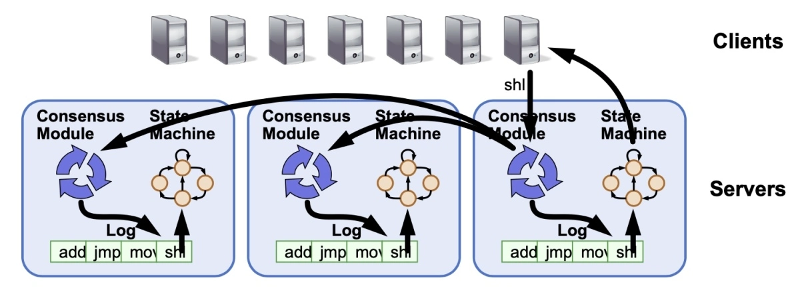
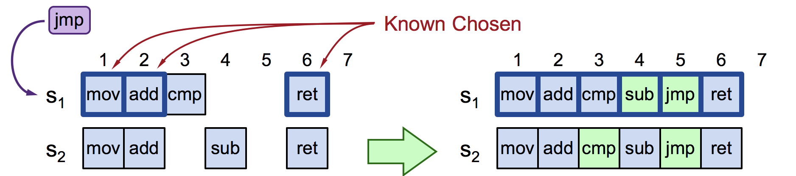

# 5.3.4 Multi Paxos

:::tip 额外知识
lamport 提到的 Multi Paxos 是一种思想，所以 Multi Paxos 算法实际上是个统称，Multi Paxos 算法是指基于 Multi Paxos 思想，通过多个 Basic Paxos 实例实现的一系列值的共识算法。
:::

lamport 在论文中对 Multi Paxos 的描述称之为**Implementing a State Machine**，我们从理论转向现实问题，浅薄地解释下分布式中的 State Machine。

在分布式环境中，如果我们要让一个服务具有容错能力，那么最常用最直接的办法就是让一个服务的多个副本同时运行在不同的节点上。但是，当一个服务的多个副本都在运行的时候，我们如何保证它们的状态都是同步的呢，或者说，如果让客户端看起来无论请求发送到哪一个服务副本，最后都能得到相同的结果？实现这种同步方法就是所谓的**状态机复制**（State Machine Replication）。

:::tip 额外知识

状态机（State Machine）来源于数学领域，全称是有限状态自动机，自动两个字也是包含重要含义的。给定一个状态机，同时给定它的当前状态以及输入，那么输出状态时可以明确的运算出来的。
:::

分布式系统为了实现多副本状态机（Replicated state machine），常常需要一个**多副本日志**（Replicated log）系统，如果日志的内容和顺序都相同，多个进程从同一状态开始，并且以相同的顺序获得相同的输入，那么这些进程将会生成相同的输出，并且结束在相同的状态。

	
	

多副本日志问题是如何保证日志数据在每台机器上都一样？不过，笔者先不回到这个问题，我们再继续返回到 Multi Paxos 。

既然 Paxos Basic 可以确定一个值，**想确定多个值（日志）那就运行多个 Paxos Basic ，然后将这些值列成一个序列（ Replicated log），在这个过程中并解决效率问题** -- 这就是 Multi Paxos 。

Replicated log 类似一个数组，因此我们需要知道当次请求是在写日志的第几位，Multi-Paxos 做的第一个调整就是要添加一个日志的 index 参数到 Prepare 和 Accept 阶段，表示这轮 Paxos 正在决策哪一条日志记录。

下面我们举个例子说明，当 S~1~ 收到客户端的请求命令 jmp（提案）时（假设此时是 S~3~ 宕机）：

- 会先尝试日志项 3，发现已经写入了 cmp（但 cmp 还未被选中），于是运行 Basic Paxos 在日志项 3 放置 cmp。
- 继续找下一个没有选中的位置 —— 也就是第 4 位，由于 S~2~ 已经存在 sub，产生冲突，最终 sub 在日志项 4 达成共识。
- S~1~ 继续尝试下一个日志项，直到给 jmp 找到一个可以达成共识的位置（日志项 4）。

	
	

我们思考一下上面的流程中的一些问题，jump 提案经历了 3 轮 Basic Paxos，共需要 6 个 RTT。除此，当多个节点同时进行提议的时候，对于 index 的争抢会比较严重，会出现冲突导致活锁。Paxos 想要从理论走向实践，必须要解决这两类问题。

Lamport 的第一个想法是**选择一个 Leader，任意时刻只有一个 Proposer，这样就可以避免冲突**。关于 Leader 的选举，Lamport 提出了一种简单的方式：让 server_id 最大的节点成为 Leader（在上篇说到提案编号由自增 id 和 server_id 组成，就是这个 server_id）。如此，节点之间就要维持 T 间隔的心跳，如果一个节点在 2T 时间内没有收到比自己 server_id 更大的心跳，那它自己就转为 Leader，担任 Proposer 和 Acceptor 的职责，并开始处理客户端请求。那些非 Leader 的节点如果收到客户端的请求，要么丢弃要么将请求重定向到 Leader 节点。

Lamport 提出的选举方案是一种很简单的策略，这种方式系统存在同时 2 个 Leader 的概率，不过即使是系统中有 2 个 Leader，Paxos 也是能正常工作的，只是冲突的概率就大了很多。

除了选主的优化方式，另外一个思路就是**优化二阶段提交的次数**，具体的方式是减小 Prepare 请求之前，在此之前，我们再回顾下 Prepare 阶段的作用：

- 阻止那些更老的还未完成的提案被选中
- 看看有没有已经被选中的值，如果有，提议者的提议就应该使用这个值

优化 Prepare 阶段的前提是要保证以上功能的完整性。关于第一点，我们可以通过改变提议序号的含义来解决这个问题，**将提议序号全局化，代表完整的日志 ，而不是为每个日志记录都保留独立的提议序号**。这样的话就只需要一次 prepare 请求就可以 prepare 所有的日志了。

关于第二点，需要拓展 Prepare 请求的返回信息，和之前一样，Prepare 还是会返回最大提案编号的 acceptedValue，除此之外，Acceptor 还会向后查看日志记录，如果要写的这个位置之后都是空的记录，没有接受过任何值，那么 Acceptor 就额外返回一个标志位 noMoreAccepted。

后续，如果 Leader 接收到超过半数的 Acceptor 回复了 noMoreAccepted，那 Leader 就不需要发送 Prepare 请求了，直接发送 Accept 请求即可，这样只需要一轮 RPC。

最后，把以上共识问题分解为 Leader Election、Entity Replication 和 Safety 三个问题来思考，解题思路即“Raft 算法” ，Diego Ongaro 和 John Ousterhout 在 2014 年 发表的题为《In Search of an Understandable Consensus Algorithm》的论文提出了 Raft 算法，并获得了 USENIX ATC 2014 大会的 Best Paper，后来更是成为 Etcd、Consul 等分布式程序的实现基础。

