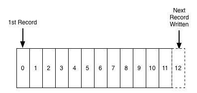
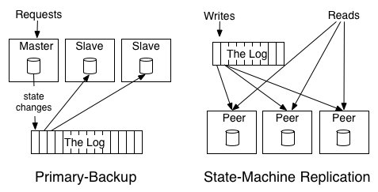

# 6.2 日志与复制状态机

如果要统计分布式系统有多少块基石，“日志”一定是其中之一。

这里的“日志“，并不是工程师熟悉的，通过 log4j 或者 syslog 输出的描述发生事情的文本。而是 MySQL 中的 binlog（Binary Log）、MongoDB 中的 Oplog（Operations Log）、Redis 中的 AOF（Append Only File）、PostgreSQL 中的 WAL（Write-Ahead Log）...。这些日志名字不同，但它们的全都是**只能追加、完全有序的记录序列**。

图 5-1 展示了日志结构，是有序的、持久化的记录序列，以追加的方式在末尾添加记录，读取时则从左到右顺序扫描。
:::center
   <br/>
  图 5-1 日志是有序的、持久化的记录序列 [图片来源](https://engineering.linkedin.com/distributed-systems/log-what-every-software-engineer-should-know-about-real-time-datas-unifying)
:::

有序的日志记录了什么时候发生了什么，这句话的含义通过分布式系统中数据复制的两种模式来理解：

- 主备模式（Primary-backup）：主节点（Master）负责执行操作，例如“+1”、“-2”等，同时将这些操作的结果（如“1”、“3”、“6”）记录到日志中。备节点（Slave）根据日志直接同步结果；
- 复制状态机模式（State-Machine Replication）：日志记录的不是最终结果，而是具体的操作指令，如“+1”、“-2”等。这些指令按照日志中的顺序被依次复制到各个节点（Peer），每个节点按顺序执行这些操作，最终达到一致的状态。

:::center
   <br/>
  图 5-2 分布式系统复制数据的两种模式
:::

无论哪一种模式，它们都揭示了：“**顺序是节点之间保持一致性的关键因素**”。如果打乱了这些操作的顺序，就会得到不同的运算结果。

再进一步解释以“复制状态机”（State Machine Replication）构建的分布式系统，其基本原理如图 5-3 所示。

:::tip 复制状态机的基本原理
两个“相同的” (identical)、“确定的” (deterministic) 进程：

- 相同的：进程的代码、逻辑、以及配置完全一致，它们在设计和实现上是完全相；
- 确定的：进程的行为是完全可预测的，不能有任何非确定性的逻辑，比如随机数生成或不受控制的时间依赖。

如果它们以相同的状态启动，按相同的顺序获取相同的输入。那么，最终将达到相同的状态。

:::

共识算法（图中的 Consensus Module，是 Paxos 或者 Raft 算法）以广播的形式将一条日志发送到所有节点，它们就日志什么位置，记录什么（序号为 9，执行 set x=3）达成一致。也就说，每一台节点中，都有着相同顺序的日志序列。

```json
{ "index": 9, "command": "set x=3" },
```

节点内的进程(图中的 State Machine）依次执行日志序列。那么，所有节点最终成一致的状态。多个这样的进程加上有序的日志，就组成了我们熟知的各种分布式系统。

:::center
   <br/>
  图 5-3 复制状态机（State Machine Replication）工作过程 [图片来源](https://raft.github.io/raft.pdf)
:::


[^1]: https://engineering.linkedin.com/distributed-systems/log-what-every-software-engineer-should-know-about-real-time-datas-unifying 