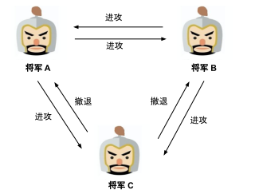
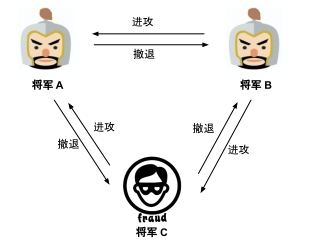
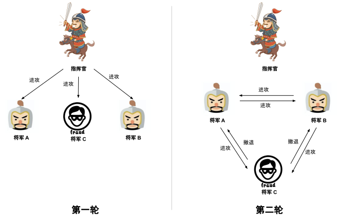
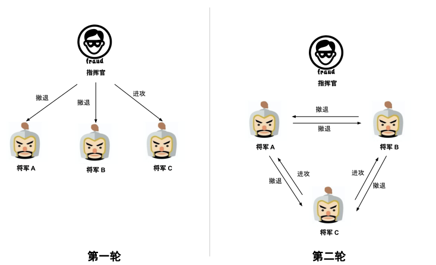
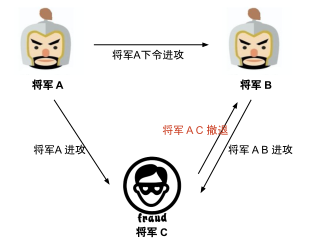

# 5.2 拜占庭将军问题

Lamport 认为“故事让问题变得欢迎”，因此他在提出观点和问题时常用故事背景吸引眼球。所以，拜占庭将军问题[^1]不是研究历史，而是 Lamport 在研究分布式系统容错性时编的一个故事。

:::tip 拜占庭将军问题描述

拜占庭帝国派出多支军队去围攻一个强大的敌人，每支军队有一个将军，但由于彼此距离较远，他们之间只能通过信使传递消息。敌方很强大，必须有超过半数的拜占庭军队一同参与进攻才可能击败敌人。在此期间，将军们彼此之间需要通过信使传递消息并协商一致后，在同一时间点发动进攻。
:::

回顾上面的问题，一群将军想要实现一个目标（一致进攻或者一致撤退），但是单独行动行不通，必须合作达成共识。由于存在叛徒，将军们不知道该如何达到一致。注意，这里的一致性才是拜占庭将军讨论的问题，如果叛徒的数量多到不可解决，那就是拜占庭（灭国）的问题了。那么我们的目标就是忠诚的将军们能够达成一致，对于那些忠诚们的将军来说，进攻或者撤退都可以，只要能够达成一致就没问题。

但仔细想想，只靠”**一致性**“就可以解决问题么？如果万事俱备，客观上每个忠诚的将军只要进攻了就一定能够胜利，但因叛徒的存在，它们都因”一致性“没有进攻；反之，条件不利，将军们不应该进攻，但却因叛徒的存在，所有人都”一致性“地进攻了。所以解决拜占庭将军们的问题，还要提出一个**正确性**的要求。

## 1. 二忠一叛变难题

为了更加深入的理解拜占庭将军问题, 我们把问题简化一下，假设有三个拜占庭将军，分别为 A、B、C。三个将军要决定的只有一件事情：明天是进攻还是撤退。为此将军们需要依据”**少数服从多数**“的原则投票表决，只要两个人意见达成一致就可以了。

如图所示，举例来说，A、B 投票进攻，C 投票撤退：

- 那么 A 的信使传递给 B 和 C 的消息都是进攻。
- B 的信使传递给 A 和 C 的消息都是进攻。
- C 信使传递给 A 和 B 的消息都是撤退。 

如此一来，三个将军就都知道进攻方和撤退方二者的占比是 2:1 了，显而易见，进攻方胜出，按照少数服从多数原则，C 也会进攻，最终三位将军同时进攻，战争获得胜利。

	
	
将军 A、B 决定进攻，将军 C 决定撤退

目前看起来一切比较顺利，理解起来也比较简单，**但假如三位将军中出现一位叛徒呢？** 叛徒的目标是破坏忠诚将军们之间的一致性达成，让拜占庭军队收到损失。比如将军 A 向 将军 B、C 分别发送撤退的消息，将军 B 向将军 A、C 分别发送进攻的消息。如果将军 C 是叛徒，那么 C 该做什么才能让两位忠诚的将军做出相反的决定呢？

目前看来 **撤退：进攻 = 1：1**，无论 C 投哪一方，都会变成 2:1，这时候还是会形成一个一致性的作战方案。可是，作为叛徒，将军 C 肯定不会按常理出牌，于是将军C 让信使告诉将军 A 要进攻，让另一个信使告诉将军 B 要撤退。至此：

- 将军 A 看到的投票结果是 **进攻方：撤退方 = 2:1**
- 将军 B 看到的投票结果是 **进攻方：撤退方 = 1:2**

如图所示，按照少数服从多数的原则，忠诚的将军 A 单独冲向战场，最后的结果当然是将军 A 寡不敌众，败给了敌人。

	
	
叛徒向将军 A、B 发送不同的作战指令

截止目前，同学们是否发现，明明大多数将军都是忠诚的（2/3），却被少数的叛徒（1/3）耍得团团转？实质上，拜占庭将军问题恰恰在此：**在一致性的达成过程中，叛徒将军（恶意节点）甚至不需要超过半数，就可以破坏占据多数正常节点一致性的达成，这也是我们常说的二忠一叛难题**。

事实上，你可能不相信甚至无法接受的结论是：对于三个将军中存在一个叛徒的场景，想要总能达到一致的行动方案是不可能的（ Lamport 在论文中说的）。此外，论文中给出了一个更加普适的结论：如果存在 m 个叛将，那么至少需要 3m+1个 将军，才能最终达到一致的行动方案。

但是拜占庭问题该怎么解决呢？Lamport 在论文中给出了两种拜占庭将军问题的解决方案，我们先来看第一种。

## 2. 口信消息型解决方案

首先, 对于口信消息(Oral message)的定义如下：

- 任何已经发送的消息都将被正确传达。
- 消息的接收者知道是谁发送了消息。
- 消息的缺席可以被检测。

基于口信消息的定义，我们可以知道， 口信消息不能被篡改但是可以被伪造。基于对图场景的推导，我们知道存在一个叛将时，必须再增加 3 个忠将才能达到最终的行动一致。为加深理解，我们将利用 3 个忠将 1 个叛将的场景对口信消息型解决方案进行推导。

在口信消息型解决方案中，首先发送消息的将军称为指挥官，其余将军称为副官。对于 3 忠 1 叛的场景需要进行两轮作战信息协商，如果没有收到作战信息那么默认撤退。

- **第一轮** 指挥官向 3 位副官发送了进攻的消息。
- **第二轮** 三位副官再次进行作战信息协商，由于将军 A、B 为忠将，因此他们根据指挥官的消息向另外两位副官发送了进攻的消息，而将军 C 为叛将，为了扰乱作战计划，他向另外两位副官发送了撤退的消息。最终指挥官、将军 A 和 B 达成了一致的进攻计划，可以取得胜利。

	
	
指挥官为忠将的场景

图是指挥官为叛将的场景，在第一轮作战信息协商中，指挥官向将军 A、B 发送了撤退的消息，但是为了扰乱将军 C 的决定向其发送了进攻的消息。在第二轮中，由于所有副官均为忠将，因此都将来自指挥官的消息正确地发送给其余两位副官。最终所有忠将都能达成一致撤退的计划。

	
	
指挥官为叛徒的场景

这个解决方法，其实就是 Lamport 在论文中提到的口信消息型拜占庭将军问题之解（A Solution with Oral Message）：**如果叛将人数为 m，将军人数不少于 3m+1，那么最终能达成一致的行动计划**。值的注意的是，在这个算法中，叛将人数 m 是已知的，且叛将人数 m 决定了递归的次数，即叛将数 m 决定了进行作战信息协商的轮数，如果存在 m 个叛将，则需要进行 m+1 轮作战信息协商。这也是上述存在 1 个叛将时需要进行两轮作战信息协商的原因。

在二忠一叛的问题中，在存在1位叛徒的情况下，必须增加 1 位将军，将 3 位将军的协议共识转换为 4 为将军的协商共识，这样才能实现忠诚将军的一致性作战计划。那么有没有办法在不增加将军人数的情况下直接解决二忠一叛问题呢？

## 3. 签名消息型解决方案

同样，对签名消息的定义是在口信消息定义的基础上增加了如下两条：

- 忠诚将军的签名无法伪造，而且对他签名消息的内容进行任何更改都会被发现。
- 任何人都能验证将军签名的真伪。

基于签名消息的定义，我们可以知道，签名消息无法被伪造或者篡改（关于签名消息，可以看 2.5 节 HTTPS 介绍）。

为了深入理解签名消息型解决方案，我们同样以 3 将军问题为例进行推导。忠将率先发起作战协商的场景，将军 A 率先向将军 B、C 发送了进攻消息，一旦叛将 C 篡改了来自将军 A 的消息，那么将军 B 将发现作战信息被将军 C 篡改，将军 B 将执行将军 A 发送的消息。

	
	
忠将率先发起作战计划

图7是叛将率先发起作战协商的场景，叛将General C率先发送了误导的作战信息，那么General A、B将发现General C发送的作战信息不一致，因此判定其为叛将。可对其进行处理后再进行作战信息协商。

签名消息型解决方案下，无论叛徒如何捣乱，将军 A、B都能执行一致的作战计划，需要注意，签名消息的拜占庭将军问题之解，也是需要 m+1（m为叛将数量）轮协商。我们也可以从另外一个角度理解：n 位将军，能容忍（n-2）为叛将。

最后，签名消息型拜占庭问题之解，解决的是忠将们如何就作战计划达成共识的问题，它不关心现实情况，不与实际场景结合，比如在合适进攻的时候，忠将们执行的作战计划却是撤退。如果要选择落地的方案，我们可以考虑改进后的拜占庭容错算法，比如 PBFT 算法。

## 4. 小结

看完故事回到现实，分布式系统领域中拜占庭将军问题中的角色与计算机世界的对应关系如下：

- **将军**对应计算机节点。
- **忠诚的将军**对应运行良好的计算机节点。
- **叛变的将军**被非法控制的计算机节点。
- **信使被杀**通信故障使得消息丢失。
- **信使被间谍替换**通信被攻击, 攻击者篡改或伪造信息。

这样一来，你是否理解了分布式场景面临的问题，以及知道了如何解决的办法呢？

如上文所述，拜占庭将军问题描述的是最困难、最复杂的分布式故障场景，该场景除了存在故障行为，还存在恶意行为。存在恶意行为的场景中（比如数字货币、Web3等区块链技术中），我们必须使用拜占庭容错（Byzantine Fault Tolerance）算法。常用的拜占庭容错算法有 PBFT、PoW 算法。

在计算机分布式系统中，最常用的是非拜占庭容错算法，即故障容错（Crash Fault Tolerance，CFT）算法。CFT 算法解决的是分布式系统中存在故障，但不存在恶意节点下的分布式共识问题。也就是说这个场景可能会丢失消息或者消息重复，但不存在消息错误或者被伪造的问题。

最显著的 CFT 算法就是 Paxos，这也是我们下一节继续探讨的内容。

[^1]: 参见 https://lamport.azurewebsites.net/pubs/byz.pdf
