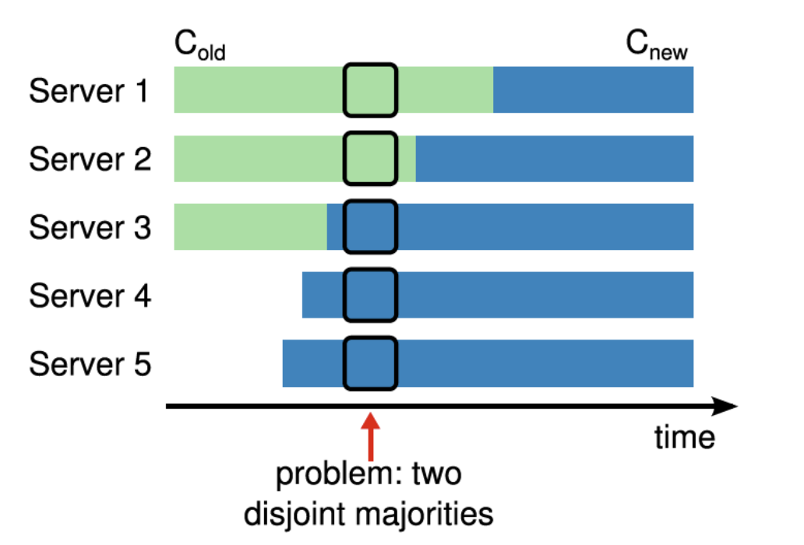
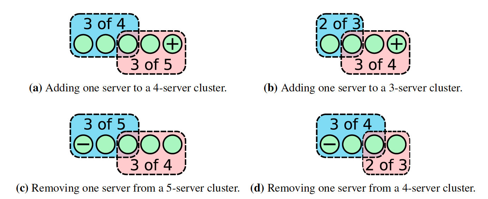

# 6.3.3 成员变更问题

前面篇节讲述 Raft 的 Leader 选举和事物协商假定的条件集群是固定，但实际的场景中，我们会遇到很多改变集群节点数的情况，例如服务器故障需要移除副本、集群扩容增加副本等等。

那么如何更改集群的节点配置呢？ 我们先假设有这么个 **configuration（配置）** 来管理所有的成员信息，为了让所有成员在同一时刻都能获取到更新后的集群配置，选择集群停机后再更新配置是最简单的方案，但在一个致力于解决分布式可用性的容错系统中，用影响可用性的方式解决成员变更问题显然不可接受。

:::tip configuration
配置是成员变更中的一个重要概念，用于说明集群由哪些节点组成，如图一个由 Server 1、Server 2、Server 3 组成的集群配置就是 [Server1、Server2、Server3] 集合。

在上面的背景下，某种情况需要对集群增加两个新节点 [Server 4、Server 5]，动态添加成员时比如恰巧 Server 1、Server 2 网络产生了分割，这就导致了产生两个多数派集群。
:::

自然的，如果把配置当成 Raft 中的日志，成员动态变更的需求就变成了**配置日志一致性问题**。但成员变更存在一个特殊性：**集群成员的动态变更导致多数派的数量也随之变化**。如果处理方式不当，可能会导致两个多数派（变更前的多数派 C~old~（旧配置）和变更的多数派 C~new~（新配置））之间不存在相交的成员，这样就产生两个 Leader 在各自认为的“多数派”中工作的问题。

:::center
    
  图 6-21 成员变更的某一时刻 C~old~ 和 C~new~ 中同时存在两个不相交的多数派
:::

如上图所示，3 个节点的集群扩展到 5 个节点，直接扩展可能会造成 Server1 和 Server2 构成 C~old~ 的多数派，Server3、Server4 和 Server5 构成 C~new~ 的多数派。因为这两个多数派不存在相交的成员，所以有可能在一个日志索引上会提交两个不同的日志项，从而导致协议冲突，影响 Raft 的安全性。

Diego Ongaro 在论文中提出了一种两阶段的成员变更方法：Joint Consensus（联合共识），但这种方式实现起来很复杂。其他研究人员就提出一种更简单的方案 —— 单成员变更（Single Server Changes）。单成员变更的思路是**既然同时提交多个会存在问题，那每次就提交一个成员变更，这样 C~old~ 的多数派和 C~new~ 的多数派始终会有一个节点重叠，这样就不存在不相交的问题了**，如果要添加多个成员，那就执行多次单成员变更。

使用单节点变更方式很容易枚举出所有情况，如图 6-22 所示，穷举集群奇/偶数节点下添加和删除一个节点的情况，如果每次只增加和删除一个节点，那么 **C~old~ 的多数派和 C~new~ 的多数派之间一定存在交集，也就说是在同一个 term 中，C~old~ 和 C~new~ 中交集的那一个节点只会进行一次投票，要么投票给 C~old~，要么投票给 C~new~，这样就避免了同一 term 下出现两个 Leader**。

:::center
    
  图 6-22 穷举集群添加节点的情况
:::

目前绝大多数的 Raft 算法，例如 Etcd、Hashicrop Raft 都是使用单节点变更方法。联合共识的方案由于其复杂性和落地难度笔者就不再过多介绍，有兴趣的读者可阅读 Raft 论文。