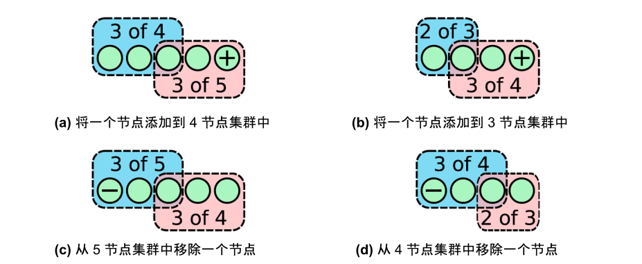

# 6.4.3 成员变更

前面的讨论中，我们假设的都是集群的成员是固定的，也就是集群的 Quorum 是固定的。但生产环境中，有很多集群节点变更的情况，如服务器故障需要移除、集群扩容增加节点等等。

讨论如何实现成员动态变更之前，先理解 Raft 中“配置”（configuration）的概念。

:::tip 配置
配置说明集群由哪些节点组成。例如，一个集群有三个节点（Server 1、Server 2、Server 3），该集群的配置就是 [Server1、Server2、Server3]。
:::

如果把“配置”当成 Raft 中的“特殊日志”。这样一来，成员的动态变更就可以转化为“配置日志”的一致性问题。但注意的是，各个节点中的日志“应用”（apply）到状态机是异步的，不可能同时操作。这种情况下，成员变更就会出现问题。

举一个具体的例子，一个 Raft 集群配置为 C~old~ [Server1、Server2 和 Server3]，该集群的 Quorum 为（N/2）+1 = 2。现在，我们计划增加两个节点，新集群配置为 C~new~ [Server1、Server2、Server3、Server4、Server5]，该集群的 Quorum 为（N/2）+1 = 3。由于提交日志是异步的，假设 Server1，Server2 比较迟钝，还在用老配置 C~old~，而 Server3，Server4，Server5 的状态机已“apply”新配置 C~new~：
- 假设 Server5 触发选举，赢得 Server3，Server4，Server5 的投票（满足 C~new~ 的 3 Quorum 要求），成为 Leader；
- 假设 Server1 也触发选举，赢得 Server1，Server2 的投票（满足 C~old~ 的 2 Quorum 要求），成为 Leader。

一个集群有两个 Leader，那么同一个日志索引就会有不同日志，破坏了 Raft 的安全性。

:::center
    
  图 6-21 某一时刻，集群存在两个 Quorum 
:::

产生这个问题的根本原因是：成员变更的过程中，产生了两个没有交集的 Quorum，也就是 [Server1，Server2] 和 [Server3, Server4, Server5] 两个 Quorum 各自为营。

最初，Diego Ongaro 在论文中提出了一种基于两阶段的“联合共识”（Joint Consensus）成员变更方案，但这种方案实现起来很复杂。后来，Diego Ongaro 又提出的一种更简单的方案 —— “单成员变更”（Single Server Changes）。单成员变更的思路是，既然同时提交多个成员变更会存在问题，那每次就提交一个成员变更，如果要添加多个成员，那就执行多次单成员变更方案。

单成员变更方案很容易穷举出所有情况，如图 6-22 所示，穷举集群奇/偶数节点下添加/删除情况。如果每次只操作一个节点，那么 **C~old~ 的 Quorum 和 C~new~ 的 Quorum 之间一定存在交集**。同一个 term 中，C~old~ 和 C~new~ 中交集的那个节点只会进行一次投票，要么投票给 C~old~，要么投票给 C~new~，不可能出现两个符合条件的 Quorum，也就不会出现两个 Leader。

以图 6-22 第二种情况为例，C~old~ 为 [Server1、Server2、Server3]，该集群的 Quorum 为（N/2）+1 = 2，C~new~ 为 [Server1、Server2、Server3、Server4]，该集群的 Quorum 为（N/2）+1 = 3。假设 Server1、Server2 比较迟钝，还在用 C~old~ ，其他节点的状态机已经“apply” C~new~：
- 假设 Server1 触发选举，赢得 Server1，Server2 的投票，满足  C~old~ Quorum 要求，当选 Leader；
- 假设 Server3 也触发选举，赢得 Server3，Server4 的投票，但**不满足 C~new~ 的 Quorum 要求，选举失效**。

:::center
    
  图 6-22 穷举集群添加节点的情况
:::

目前，绝大多数 Raft 算法的实现或系统，如 Hashicrop Raft、Etcd 等都是使用单节点变更方案。联合共识方案由于其复杂性和落地难度笔者就不再过多介绍，有兴趣的读者可以阅读 Raft 论文了解相关内容。