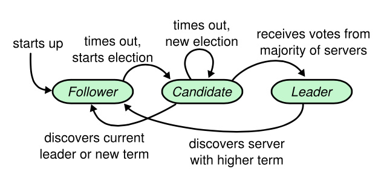

# 6.4.1 Leader 选举

Raft 将时间分割为不同长度的任期，记作 term，term 使用连续的整数进行单数递增，并随着 RPC 消息在成员之间交换。raft 并没有强制要求集群中只能存在一个 Leader，而是规范了一个 term 只会存在一个 Leader，这意味着 Raft 允许新旧多个 Leader 同时存在，此种情况需要通过 term 来拒绝那些过期的 Leader。


Raft 算法中，节点有三种状态：Leader（领导人）、Follower（跟随者）、Candidate（候选人），任何时候任意的 Raft 节点都处于这 3 种状态之一。正常情况下，集群中只会存在一个 Leader，其他成员都为 Follower，Candidate 是 Leader 选举过程中的中间状态。Raft 使用一种心跳机制来触发 Leader 选举，并会根据当前的心跳，任期等状态来进行状态的迁移转化，就如下图所示

<div  align="center">
	
	<p>raft 成员状态变更</p>
</div>

首先，在Raft节点启动的时候，所有任务都是Follower状态， 因为此时没有Leader，所有Follower都在固定的超时时间内都收不到来自Leader的心跳，从而变成了Candidate状态，开始选举Leader。

Candidate 会并行的向集群中的所有服务器节点发送投票请求，它会保持当前状态直到三种状态的迁移变化。

- **开始下一轮新的选举**：发出的投票请求在固定时间内没有收到其他节点的响应，或者是收到响应（或者同意投票）的节点数量没有达到 N/2+1，那么选取超时，进入下一轮选举
- **选举成功**，成为新的Leader：如果选举过程中收到大于N/2+1数量的节点的投票，那么选举成功，当前的节点成为新的Leader
- **成为Follower**：如果选举过程中收到来及其他节点的Leader心跳，或者是请求投票响应的Term大于当前的节点Term，那么说明有新任期的Leader
如果节点选举成功，成为了Leader，那么Leader将会在固定周期内发送心跳到所有的节点，但是如果心跳请求收到的响应的Term大于当前节点的Term，那么当前节点的就会成为Follower。比如Leader节点的网络不稳定，掉线了一段时间，网络恢复的时候，肯定有其他节点被选为了新的Leader，但是当前节点在掉线的时候并没有发现其他节点选为Leader，仍然发送心跳给其他节点，其他节点就会把当前的新的Term响应给已经过时的Leader，从而转变成Follower


Leader 是 Raft 的核心，一个稳定的 Leader 对 Raft 的可用性至关重要。在 Leader 选举期间，Raft 是不能继续向客户端提供服务，因为我们并不希望非必要的 Leader 变更，而触发 Leader 选举最重要的条件是心跳间隔时间。

为了 让 Raft 的使用者在进行系统设计时有个参考，Raft 给出了以下不等式，只要系统满足以下要求，Raft 就能选举并维护一个稳定的 Leader。

```
消息交互时间 << 心跳间隔时间 << 平均故障时间
```