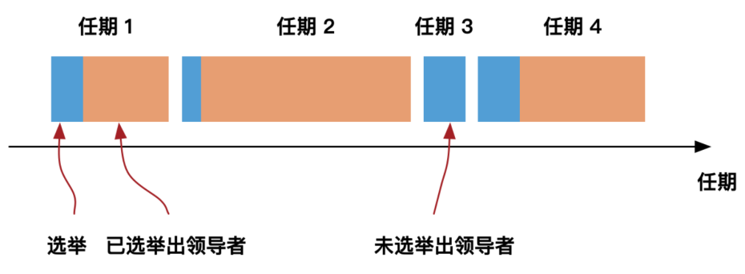
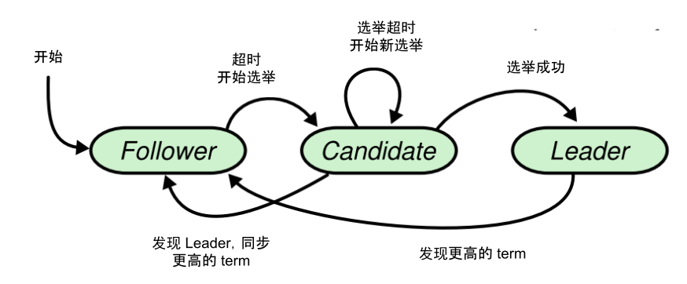

# 6.4.1 Leader 选举

Raft 算法中，节点有三种状态：

- **leader**：领导者，接收 client（客户端）的所有请求，raft 算法中所有的操作以 leader 为准。领导者平常的工作包括 3 个部分：处理写请求，管理日志复制，不断发送心跳信息通知其他节点”我是领导者，我还活者，你们现在不要发起新的选举“。
- **follower**：跟随者，相当于普通群众，被动接收和处理来自领导者的消息。当领导者心跳超时时，就主动站出来，推荐自己当选候选人
- **candidate**：候选人，用于选举出一个新的 leader。候选人向其他节点发送投票（RequestVote RPC）消息，通知其他节点来投票，如果赢得子大多数选票，就升级为领导者。

Raft 算法中，节点之间采用 RPC 进行通信，下面两种 RPC 是 Raft 基础功能的必要实现：

- **RequestVote RPC**：请求投票 RPC，候选人在选举期间发起，用于通知其他节点投票
- **AppendEntries RPC**：日志复制 RPC，由领导者发起，用于复制日志和提供心跳消息。

Raft 算法中还有个很重要的概念 -- term（任期），**Raft 将时间分割为不同长度的任期，记作 term（任期），每个 term 由单调递增的数字（任期编号）标识**。例如，节点 A 的任期编号为 1，任期编号随着选举的举行变化而变化，即每个 term 始于一个新的选举。

	
	
raft 成员状态变更

任期一般包含两阶段：第一阶段是选举阶段，第二阶段为已选举出领导者的阶段。但任期也可能只包含选举阶段（并没有成功选举出领导者）。如图所示，term 1 开始一次新选举，这次选举成功并开始正常操作，term 2 也同样如此，但 term 3 选举失败，并继续进行 term 4。

term 在 Raft 中起到了逻辑时钟的作用，可用于保证在某些极端的情况下最终只有一个 leader。笔者举几个例子说明 term 在**平票问题**和**脑裂**时产生的作用。先来看第一种情况，2 个节点 A 和 B，它们的 term 都为 1，Leader 宕机后转变为 Candidate 开始选举，两个 Candidate 都没有达到大多数同意，这时节点 A 先发生**随机时间**超时，节点 A 把它的任期加 1，重新开始新的选举。由于**各个节点都会无条件优先接受比自己任期更大的请求**，所以节点 A 这次得到大多数同意，成为 Leader。

对于 Leader 宕机后又恢复或者网络分区故障恢复后这样的情况，由于联系不上 leader，Follower 会转变成 Candidate，把自己的 term 加 1 并开始选举成为新的 Leader，**分裂出来的新集群具有更大的 term**。当之前宕机的 Leader 恢复或网络分区恢复后，旧的 Leader 虽然在运行，但它的 term 已经不足以形成多数派，一旦新的 Leader 发送请求给旧 Leader，旧 Leader 发现有更大的 term 时，就会转换为 follower，并且更新自己的 term 为新 leader 的 term。

综合前面所讲述的内容，笔者对选举过程进行描述，以了解节点状态的迁移转化过程。

	
	
raft 选举过程

- 节点启动时处于 follower 状态。
- 该节点在一段时间内没有收到任何请求，触发超时转变为 Candidate 状态。
- candidate 增加自己的任期，开始新的选举，向所有的节点发送投票请求（RequestVote RPC）。投票之后会出现以下三种结果：
	- **选举超时**，发出的投票请求在固定时间内没有收到其他节点的响应，或者是收到响应（或者同意投票）的节点数量没有达到 N/2+1，那么选取超时进入下一轮选举。
	- **选举成功**，如果选举过程中收到大于N/2+1数量的节点的投票，那么选举成功，当前的节点成为新的Leader。
	- **选举失败**，如果选举过程中收到来及其他节点的 Leader 心跳，或者是请求投票响应的 Term 大于当前的节点 Term，那么说明有新任期的 Leader。成为 Follower。
