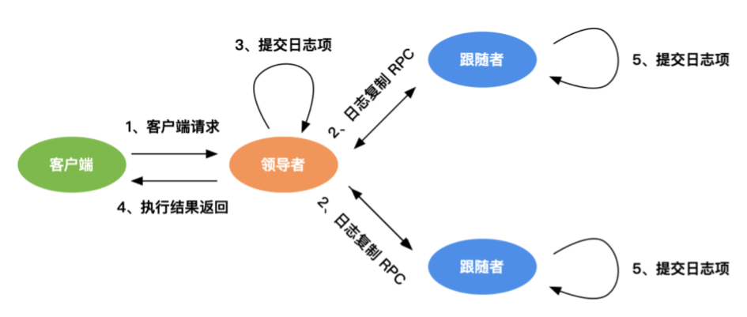
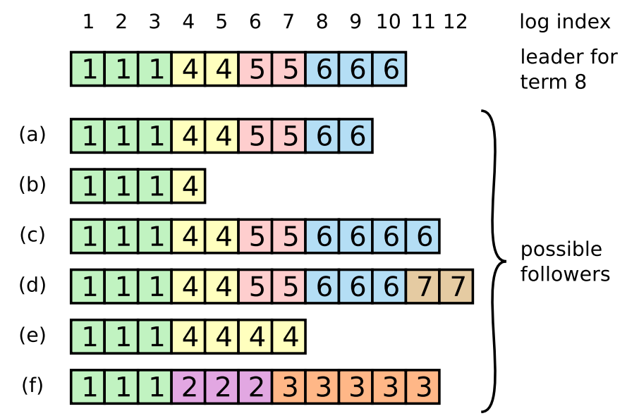

# 6.4.2 日志复制

理解日志复制的问题之前，我们得先搞清楚 Raft 中的日志和日志项是什么。

在分布式系统中有一种常见的复制状态机的抽象，就是把具有一定顺序的一系列 action 抽象成一条日志（log），每个 action 都是日志中的一个日志项（log entry）。如果想使每个节点的服务状态相同，就要把日志中所有的 entry 按照记录顺序执行一遍。所以复制状态机的核心问题就变成了让每个节点都具有相同日志的问题，也就是如何把日志复制到每一个节日中。

日志项是一种数据格式，它包含用户指定的数据（或者说是指令 Command）以及其他附加信息，例如索引值（Log index，连续单调递增的数字）、任期编号（Term，创建这个日志项的 Leader 任期编号），如下图所示。

	
	
日志项

在 Raft 集群中，每个服务器可以看成是一个复制状态机（Replicated State Machine），如下图。
复制状态机通常基于复制日志（replicated log）实现。每个服务器存储一个包含一系列指令的日志，并且按顺序执行指令。由于日志都包含相同顺序的指令，状态机会按照相同的顺序执行指令，由于状态机是确定的（deterministic），因此状态机会产生相同的结果。

	
	
raft 

图：复制状态机工作过程：1. 客户端请求；2. 共识模块执行共识算法进行日志复制，将日志复制至集群内各个节点；3. 日志应用到状态机；4. 服务端返回请求结果

## 日志复制

	
	
日志项

- Leader 首先以日志项（log entry）的形式将事务请求追加（append）至本地日志中
- Leader 并行地通过消息（AppendEntries RPC）将日志项广播给所有的 follower。
- follower 将请求的日志项追加到自己的本地日志中，并将执行结果发送给 Leader
- 当 Leader 收到大多数的 follower 的成功回复后，这个 entry 就会被认为达到提交（committed）状态，leader 将这个 entry 应用到状态机中，并回复客户端此次请求成功。

此时读者应该产生一个疑问，上面的过程笔者只提到了 leader 的日志项提交，那 follower 什么时候提交日志项呢？ 答案是 Leader 发送心跳或者下一次日志协商的 AppendEntries 消息来通知 follower 提交（committed）日志项。这种做法可以**使协商优化成一个阶段，降低处理客户端请求一半的延迟**。

为此 raft 引入了 committedIndex 变量，committedIndex 代表已经达成日志共识的索引，也是应用到状态机的最大日志索引值。根据日志复制的过程，第一轮的 AppendEntries 只会持久化日志项，并不会执行提交操作，只有 Leader 才知道该日志项是否复制到多数派，是否可以提交。 

当 Leader 收到多数派的 follower 的成功响应后，Leader 将提交该日志项，并更新 committedIndex，同时在下一个心跳或者下一个日志协商的 AppendEntries 消息中携带 committedIndex。follower 无论收到哪一类消息，都会从中获取 committedIndex，因此在 follower 的本地日志中，所有小于或者等于 committedIndex 的日志均可以执行提交操作。

## 日志对其

实际上日志项的管理不只是简单地追加，当一个 follow 新加入集群或者 leader 刚晋升之时，leader 并不知道要同步哪些日志给 follow，同时 旧的 leader 转变为 follower 时，也会携带一些上一任 term 中仅在本地被 committed 的日志项，而当前新的 leader 并不存在这些日志项。一个极端情况下的集群，如图所示，，a、b 节点丢失了部分数据，c、d 节点多出部分数据，而 e、f 节点既丢失数据又存在多处的数据。

	
	
日志项

此时，leader 就应该命令 follower 删除这些冲突的日志项。

Raft 算法中，Leader 通过强制 followers 直接复制自己的日志项来处理不一致的日志。具体分为以下两个步骤：

Leader 收到探测消息的响应后，如果 index 和 term 不一致，则说明 follower 落后于 leader，将递减 nextIndex 并发起新一轮的探测消息，直到找到对应的 nextIndex 为止。

找到 nextIndex 后，leader 从 nextIndex 开始按照日志顺序，以日志复制的形式将日志项发送给 follower，Follow 收到日志复制消息时，以 leader 为准，覆盖本地的日志项。

只需要比较 index 和 term，通过这种方式，新加入的 follower 节点只需要通过 AppendEntries 消息就能使 follower 的数据自动趋于一致。