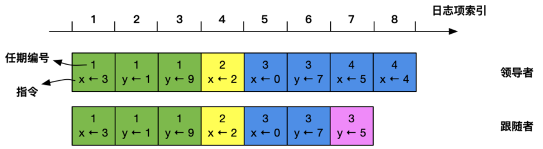
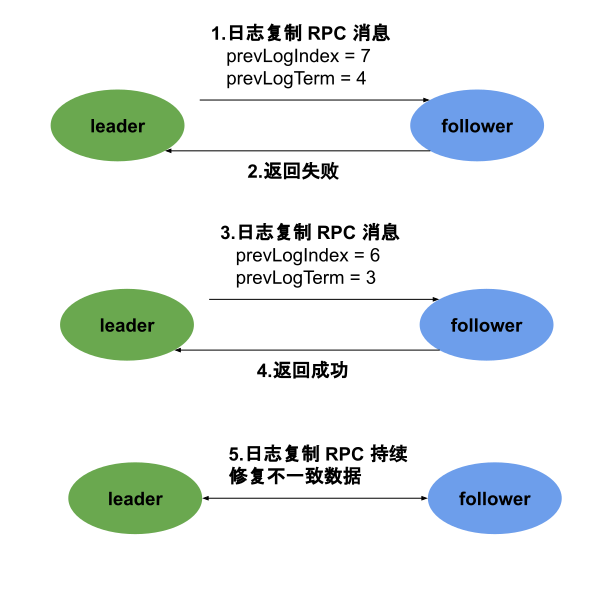

# 6.3.2 日志复制

理解日志复制的问题之前，我们得先搞清楚 Raft 中的日志和日志项是什么。

分布式系统中有一种常见的复制状态机的抽象，就是把具有一定顺序的一系列动作抽象成一条日志（log），每个动作都是日志中的一个日志项（log entry）。我们可以把 Raft 中的日志项理解为包含以下几个关键数据的数据格式：

- **指令**: 一条由客户端请求转换成状态机需要执行的指令。
- **索引值**：日志项对应的整数索引值，用于标识日志项，是一个连续、单调递增的整数。如此，Raft 可以不用关注空洞日志，也可以通过最大日志索引定位缺失的数据。
- **任期编号**：创建这个日志项的 Leader 任期编号。

:::center
  
 图 6-17 日志项概念
:::

## 日志复制

Raft 是强 Leader 模型的算法，日志项只能由 Leader 复制给其他成员，这意味着日志复制是单向的，Leader 从来不会覆盖本地的日志项，即所有的日志项以 Leader 为准。

:::center
  
 图 6-18 日志项复制过程
:::

1. Leader 首先以日志项（log entry）的形式将事务请求追加（append）至本地日志中。
2. Leader 并行地通过消息（AppendEntries RPC）将日志项广播给所有的 Follower。
3. Follower 将请求的日志项追加到自己的本地日志中，并将执行结果发送给 Leader
4. 当 Leader 收到大多数的 Follower 的成功回复后，这个 entry 就会被认为达到提交（committed）状态，Leader 将这个 entry 应用到状态机中，并回复客户端此次请求成功。

此时读者应该产生一个疑问，上面的过程笔者只提到了 Leader 的日志项提交，那 Follower 什么时候提交日志项呢？ 答案是 Leader 发送心跳或者下一次日志协商的 AppendEntries 消息来通知 Follower 提交（committed）日志项。这种做法可以**使协商优化成一个阶段，降低处理客户端请求一半的延迟**。

为此 Raft 引入了 committedIndex 变量，committedIndex 代表已经达成日志共识的索引，也是应用到状态机的最大日志索引值。根据日志复制的过程，第一轮的 AppendEntries 只会持久化日志项，并不会执行提交操作，只有 Leader 才知道该日志项是否复制到多数派，是否可以提交。 

当 Leader 收到多数派的 follower 的成功响应后，Leader 将提交该日志项，并更新 committedIndex，同时在下一个心跳或者下一个日志协商的 AppendEntries 消息中携带 committedIndex。follower 无论收到哪一类消息，都会从中获取 committedIndex，因此在 Follower 的本地日志中，所有小于或者等于 committedIndex 的日志均可以执行提交操作。

## 实现日志的一致性

实际上日志项的管理不只是简单地追加，当一个 Follower 新加入集群或者 Leader 刚晋升之时，Leader 并不知道要同步哪些日志给 Follower，同时旧的 Leader 转变为 Follower 时，也会携带一些上一任 term 中仅在本地被 committed 的日志项，而当前新的 Leader 并不存在这些日志项。

Raft 算法中，通过 Leader 强制 Follower 复制自己的日志项，来处理不一致的日志。具体包括两个步骤：

1. Leader 通过日志复制 RPC 的一致性检查，找到 Follower 与自己相同日志项的最大索引值。即在该索引值之前的日志，Leader 和 Follower 是一致的，之后的日志就不一致了；
2. Leader 强制将 Follower 该索引值之后的所有日志项删除，并将 Leader 该索引值之后的所有日志项同步至 Follower，以实现日志的一致。

因此，处理 Leader 与 Follower 日志不一致的关键是找出上述的最大索引值。Raft 引入两个变量，来方便找出这一最大索引值：

- **prevLogIndex**：表示 Leader 当前需要复制的日志项，前面那一个日志项的索引值。例如，下图，如果领导者需要将索引值为 8 的日志项复制到 Follower，那么 prevLogIndex 为 7
- **prevLogTerm**：表示 Leader 当前需要复制的日志项，前面一个日志项的任期编号。例如，下图，如果领导者需要将索引值为 8 的日志项复制到 Follower ，那么 prevLogTerm 为 4

:::center
  
 图 6-19 领导者处理不一致日志
:::

Leader处理不一致的具体过程分析如下：

1. Leader 通过日志复制 RPC 消息，发送当前自己最新日志项给 Follower，该消息的 prevLogIndex 为 7，prevLogTerm 为 4。
2. 由于 Follower 在其日志中，无法找到索引值为 7，任期编号为 4 的日志项，即 Follower 的日志和 Leader 的不一致，故 Follower 会拒绝接收新的日志项，返回失败。
3. 此时，Follower 在其日志中，找到了索引值为 6，任期编号为 3 的日志项，故 Follower 返回成功。
4. Leader 收到 Follower 成功返回后，知道在索引值为 6 的位置之前的所有日志项，均与自己的相同。于是通过日志复制 RPC ，复制并覆盖索引值为 6 之后的日志项，以达到 Follower 的日志与 Leader 的日志一致。

:::center
  
图 6-20 Leader 处理不一致日志过程
:::

从上面的步骤看到，Leader 通过日志复制 RPC 消息的一致性检查，比较 index 和 term，从而找到 Follower 节点上与自己相同日志项的最大索引值，然后复制并更新该索引值之后的日志项，实现各个节点日志自动趋于一致。

