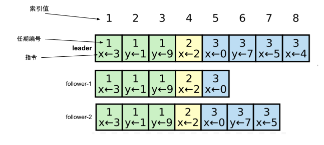

# 6.4.2 日志复制

使用 Quorum 机制选举出的 Leader 代表了整个集群的意志，Leader 顺理其章地承担起“**处理系统发生的所有变更，并将变更复制到所有 Follower 节点**”的职责。

在 Raft 算法中，日志承载着系统所有变更。图 6-17 展示了 Raft 集群的日志模型，每个“日志条目”（log entry）包含索引、任期、指令等关键信息：

- **指令**: 表示客户端请求的具体操作内容，也就是待“状态机”（State Machine）执行的操作。
- **索引值**：日志条目在仓库中的索引值，单调递增。
- **任期编号**：日志条目是在哪个任期（Leader 任期）中创建的，用于解决“脑裂”或日志不一致问题。

:::center
   <br/>
 图 6-17 Raft 集群的日志模型（x ← 3 代表x赋值为3）
:::

Raft 通过 RPC 消息将日志复制到各个 Follower 节点，该 RPC 被称为 AppendEntries RPC。其结构大致如下：
```json
{
  "term": 5, // Leader 的当前任期号
  "leaderId": "leader-123",
  "prevLogIndex": 8, // 前一日志的索引
  "prevLogTerm": 4, // 前一日志的任期
  "entries": [
    { "index": 9, "term": 5, "command": "set x=4" }, // 要复制的日志条目
  ],
  "leaderCommit": 7// Leader 的“已提交”的索引号
}
```

根据图 6-17，当 Raft 集群收到客户端请求（例如 set x=4）时，日志复制的过程如下：

- 如果当前节点不是 Leader，节点会将请求转发给 Leader；
- Leader 接收请求后：
  - 将请求转化为日志条目（log entry），并写入本地仓库，初始状态为“未提交”（uncommitted）；
  - 生成一条 AppendEntries RPC，将日志条目广播给所有的 Follower；
- Follower 节点收到 Leader 的 AppendEntries RPC 后，检查日志的任期（如本地任期是否比 Leader 任期大）和一致性（如根据 prevLogIndex 判断日志是否缺失），并将新日志条目追加到本地仓库；
- 一旦 Leader 确认日志条目被足够数量的节点（达到 Quorum）确认，Leader 将该日志条目标记为“已提交”（committed），并向客户端返回执行结果。已提交的日志意味着：日志不可回滚，指令永久生效，可安全地“应用”（apply）到状态机。

:::center
   <br/>
 图 6-17 日志项概念
:::

Leader 向客户端返回结果，并不意味着日志复制的过程就此结束，Follower 并不知道日志条目是否被大多数节点确认。Raft 的设计是：Leader 通过心跳或下一次日志复制过程中携带 leaderCommit，通知 Follower 已提交日志条目的最高索引。这个设计的把“日志条目达成共识的过程优化成一个阶段”，从而降低客户端请求一半的延迟时间。


:::tip 如何选择节点的数量

Raft 日志复制过程需要等待多数节点确认。节点越多，等待的延迟也相应增加。所以说，以 Raft 构建的分布式系统并不是节点越多越好。如 etcd，推荐使用 3 个节点，对高可用性要求较高，且能容忍稍高的性能开销，可增加至 5 个节点，如果超出 5 个节点，可能得不偿失。
:::

继续看日志复制的另一种情况。实际上，上述日志复制的例子中，只有 follower-1 会成功追加日志，这是因为 follower-2 节点的日志并不连续。日志的连续性相当重要，如果日志条目没有按正确的顺序“应用”（apply）到状态机，各个 follower 节点的状态肯定不一致，这就破坏 Raft 一致性的保证。

当 follower-1 收到 AppendEntries 消息后，它会根据 prevLogIndex 和 prevLogTerm 检查本地日志的连续性。如果日志缺失或存在冲突，follower-2 会返回失败信息，指明哪一部分日志与 Leader 的日志不一致。

```json
{
  "success": false,
  "term": 4,
  "conflictIndex": 4, // 表示发生缺失的日志索引，Follower 的日志中最大索引为 3，所以缺失的索引是 4。
  "conflictTerm": 3//缺失日志的“上一个有效日志条目”的任期号
}
```

Leader 收到失败信息后，根据 conflictIndex 和 conflictTerm 寻找出一个与 Follower 日志最大匹配的日志索引（例如，6）。然后，Leader 重新开始日志复制过程，从该索引位置向 follower-1 发送日志条目，逐步恢复与 Follower 节点日志的一致性。