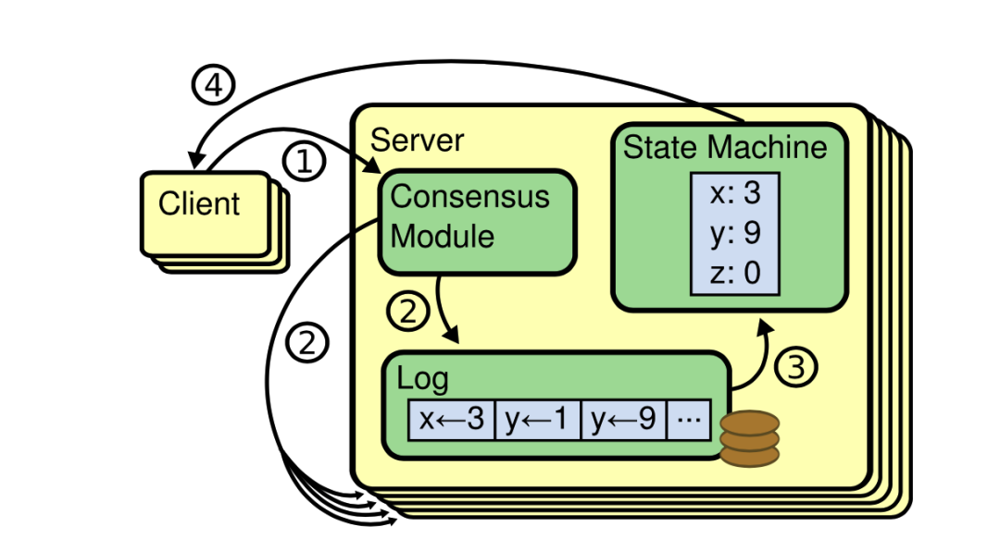

# 第六章：分布式系统共识概论

探讨分布式环境面临的各类问题以及解决方案之前，得先正确认识问题。作为分布式系统的根本问题之一，本章我们就从共识问题开始。

受翻译影响，网上很多讨论 Paxos 或 Raft 的内容多使用“分布式一致性协议”或者“分布式一致性算法”这样的描述字眼。例如，Mike Burrows 对 Paxos 的评价原话是 “There is only one consensus protocol...”，很多文章翻译成 “世界上只有一种一致性算法...” 。

虽然在汉语中“共识（consensus）”和“一致（consistency）”是一个意思，但在计算机工程中它们之间还是有明显的区别：consensus 是大家关心的某件事情（比如选举、分布式锁、全局ID、数据复制等等）达成一致的**过程及其算法**；而 consistency 则描述的是存储的数据之间不自相矛盾，侧重于节点共识过程最终达成稳定状态的**结果**。paxos、raft、ZAB 等等属于 consensus 的理论/实现，所以使用“共识”来表达更清晰一些，而 CAP 定理中的 C 和数据库 ACID 的 C 才是真正的“一致性” —— consistency 问题（这两个 C 也存在区别，笔者将在 6.4 节介绍）。

那么为什么要研究共识呢？在分布式系统中，为了消除单点提高系统可用性，有一种使用副本形式的容错模型。这种容错模型使用多个成员组成集群，成员之间数据完全一致（所以也叫副本），使用副本形式的分布式容错系统可以保证即使在小部分（≤ (N-1)/2）节点故障的情况下，系统仍然能正常对外提供服务。**复制状态机**是分布式系统中实现以上容错机制的基本方法，而共识算法（Consensus Algorithm）是构建复制状态机系统最关键的角色。

:::tip 复制状态机

复制状态机（Replicated State Machine）是指多台机器具有完全相同的状态，运行完全相同的确定性状态机。它让多台机器协同工作犹如一个强化的组合，其中少数机器宕机不影响整体的可用性。
:::

如图 6-2 所示，一个复制状态机副本的工作流程：

1. 客户端请求。
2. 共识模块执行共识算法进行日志复制，将日志复制至集群内各个节点。
3. 日志应用到状态机。
4. 服务端返回请求结果。

	
	
图 6-2 复制状态机工作过程

既然共识在分布式下容错系统下如此重要，那么到底是什么共识？实现共识有哪些难点？毫无疑问，搞清楚这些问题从 Leslie Lamport[^1] 1982 年发表的论文 《The Byzantine General Problem》（拜占庭将军问题）开始最合适不过。拜占庭将军问题是分布式领域最复杂的一个容错模型，一旦搞懂了它，我们就能掌握分布式共识问题解决的思路，还能更深刻地理解常见的共识算法。

[^1]: Lamport 在分布式系统理论方面有非常多的成就，比如 Lamport 时钟、拜占庭将军问题、Paxos 算法等等。除了计算机领域之外，其他领域的无数科研工作者也要成天和 Lamport 开发的一套软件打交道，目前科研行业应用最广泛的论文排版系统 --  LaTeX (名字中的 “La” 就是指 Lamport)
