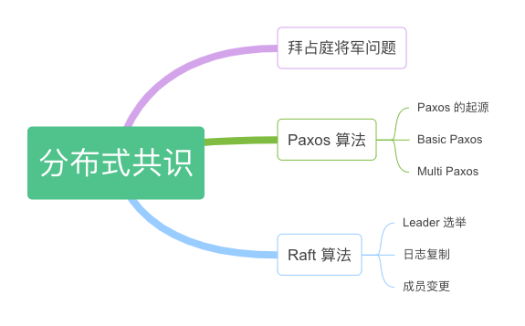

# 第六章：分布式共识

笔者一直认为分布式系统是软件工程里面最难啃的领域，因为分布式的底色就是无序、冲突和复杂。虽然这些复杂是道门槛，但对于程序员构建自己的的知识体系而言，只要理解这些复杂产生的原因，那么也就懂了构建大规模分布式系统的要素是什么。

如图 6-1 所示，在本章，我们从解决问题的本质去理解分布式系统，从共识问题认识 Paxos，以工程实践为目的去了解 Raft 的设计思路。理解了问题，以及这些共识算法的解题思路，自然也能体会到 etcd、consul 以及各类分布式容错系统的设计原理。

	
	
图 6-1 本章内容导图

