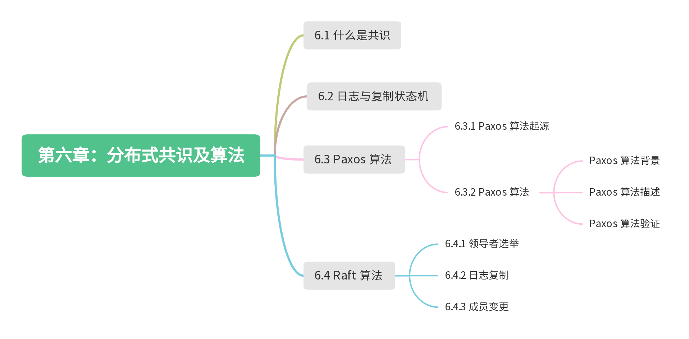

# 第六章：分布式共识及算法

:::tip <a/>

一个篮子装不下所有的鸡蛋，那么就多用几个篮子来装。

:::right
—— 分布式设计的基本思想。
:::

笔者一直认为分布式容错系统是软件工程里面最难啃的领域，想想在充斥着无序、冲突和不可靠的网络环境中实现数据一致就感到头疼。虽然这些复杂是道门槛，但对于程序员构建自己的知识体系而言，只要理解这些复杂产生的原因，那么也就懂了构建大规模分布式系统的要素是什么。

如图 6-1 所示，在本章，我们知难而上，从解决问题的角度去分析分布式容错系统。先讨论什么是共识，然后沿着 Paxos 论文讨论如何建立共识，最后以工程实践为目的去了解 Raft 的设计思路。最后，理解了这些问题以及共识算法的解题思路，自然能体会到 etcd、consul 以及各类分布式容错系统的设计原理，也能更好地把这些理解应用到现实。

	
	
图 6-1 本章内容导图

