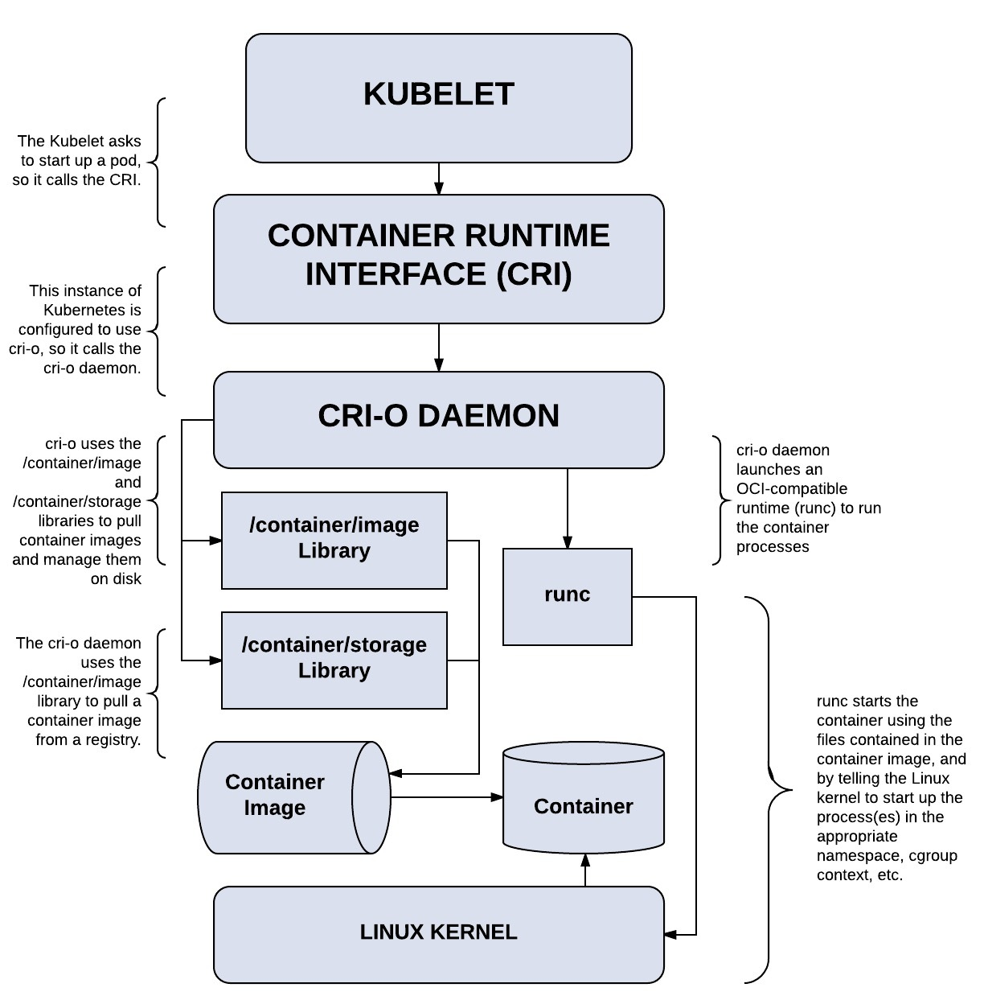

# Kubernetes专用运行时：CRI-O

当容器运行时的标准被提出以后，Red Hat 的一些人开始想他们可以构建一个更简单的运行时，而且这个运行时仅仅为 Kubernetes 所用，这就是 CRI-O。

 CRI-O 实现了一个最小的 CRI 接口。允许 直接从 Kubernetes 运行容器，而不需要任何不必要的代码或工具。只要容器符合 OCI 标准，CRI-O 就可以运行它。

当 Kubernetes 需要运行容器时，它会与 CRI-O 进行通信，CRI-O 守护程序与 runc（或另一个符合 OCI 标准的运行时）一起启动容器。当 Kubernetes 需要停止容器时，CRI-O 会来处理，它只是在幕后管理 Linux 容器，以便用户不需要担心这个关键的容器编排。

	

## CRI-O 工作流程

它重用了很多开源的基础组件，下面我们来看一下各个组件的功能及工作流程，下面我们来看一下各个组件的功能及工作流程

	

- Kubernetes 通知 kubelet 启动一个 pod。

- kubelet 通过 CRI(Container runtime interface) 将请求转发给 CRI-O daemon。

- CRI-O 利用 containers/image 库从镜像仓库拉取镜像。

- 下载好的镜像被解压到容器的根文件系统中，并通过 containers/storage 库存储到 COW 文件系统中。

- 在为容器创建 rootfs 之后，CRI-O 通过 oci-runtime-tool 生成一个 OCI 运行时规范 json 文件，描述如何使用 OCI Generate tools 运行容器。

- 然后 CRI-O 使用规范启动一个兼容 CRI 的运行时来运行容器进程。默认的运行时是 runc。

- 每个容器都由一个独立的 conmon 进程监控，conmon 为容器中 pid 为 1 的进程提供一个 pty。同时它还负责处理容器的日志记录并记录容器进程的退出代码。

- 网络是通过 CNI 接口设置的，所以任何 CNI 插件都可以与 CRI-O 一起使用。

## 受信/非受信容器混合

CRI-O 最出名的特点是它支持“受信容器”和“非受信容器”的混合工作负载。比如，CRI-O 可以使用 Clear Containers 做强隔离，这样在多租户配置或者运行非信任代码时很有用。

以下为只实现了 OCI 标准的容器，但可以通过 CRI-O 来作为 Kubernetes 间接使用 OCI 兼容的容器运行时。

- Clear Containers：由 Intel 推出的兼容 OCI 容器运行时，可以通过 CRI-O 来兼容 CRI。
- Kata Containers：符合 OCI 规范，可以通过 CRI-O 或 containerd CRI Plugin 来兼容 CRI。
- gVisor：由谷歌推出的容器运行时沙箱 (Experimental)，可以通过 CRI-O 来兼容 CRI。
