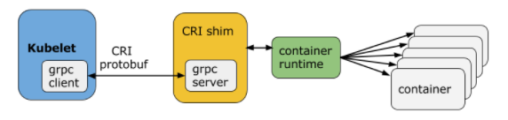

# 7.7.1 CRI in Kubernetes

Kubernetes 从 1.5 版本开始，在遵循 OCI 基础上，将容器操作抽象为一个接口，该接口作为 Kubelet 与运行时实现对接的桥梁，Kubelet 通过发送接口请求对容器进行启动和管理，各个容器运行时只要实现这个接口就可以接入 Kubernetes。

这个接口就是 Kubernetes 容器运行时接口： CRI(Container Runtime Interface)。

## 1. 容器运行时交互接口 CRI 

CRI（Container Runtime Interface，容器运行时接口）是 Kubernetes 定义的一组与容器运行时进行交互的接口，用于将 Kubernetes 平台与特定容器实现解耦，建立业界容器编排对接的标准规范。

CRI 是一套通过 Protocol Buffer 定义的 API，如下图：

	

从上图可以看出：CRI 主要有 gRPC client、gRPC Server 和具体容器运行时实现三个组件。其中 Kubelet 作为 gRPC Client 调用 CRI 接口，CRI shim 作为 gRPC Server 来响应 CRI 请求，并负责将 CRI 请求内容转换为具体的运行时管理操作。

因此，任何容器运行时实现想要接入 Kubernetes，都需要实现一个基于 CRI 接口规范的 CRI shim（gRPC Server）。由于容器运行时与镜像的生命周期是彼此隔离的，因此 CRI 主要定义了两类接口：

- RuntimeService 定义跟容器相关的操作，如创建、启动、删除容器等。
- ImageService 定义容器镜像相关的操作，如拉取镜像、删除镜像等。

至此之后，Kubernetes 创建容器流程为： Kubernetes 通过调度制定一个具体的节点运行 Pod，该节点的 Kubelet 在接收到 pod 创建请求后， 调用 GenericRuntime 的通用组件发起创建 Pod 的 CRI 请求给 CRI shim， CRI shim 在收到 CRI 请求后，将其转换为具体的容器运行时指令，并调用相应的容器运行时来创建 Pod，最后将处理结果返回给 Kubelet。

