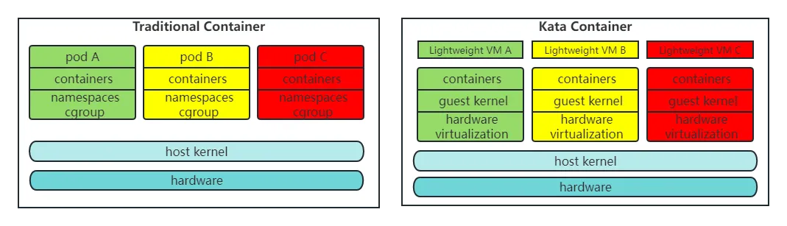

# 7.3.2 CRI 运行时规范

早期 Kubernetes 完全依赖且绑定 Docker，并没有过多考虑够日后使用其他容器引擎的可能性。当时 kubernetes 管理容器的方式通过内部的 DockerManager 直接调用 Docker API 来创建和管理容器。

	

Docker 盛行之后，CoreOS 推出了 rkt 运行时实现，Kubernetes 又实现了对 rkt 的支持，随着容器技术的蓬勃发展，越来越多运行时实现出现，如果还继续使用与 Docker 类似强绑定的方式，Kubernetes 的工作量将无比庞大。Kubernetes 要重新考虑对所有容器运行时的兼容适配问题了。

Kubernetes 从 1.5 版本开始，在遵循 OCI 基础上，将容器操作抽象为一个接口，该接口作为 Kubelet 与运行时实现对接的桥梁，Kubelet 通过发送接口请求对容器进行启动和管理，各个容器运行时只要实现这个接口就可以接入 Kubernetes，这便是 CRI（Container Runtime Interface，容器运行时接口）。

CRI 实现上是一套通过 Protocol Buffer 定义的 API，如下图：

	

从上图可以看出：CRI 主要有 gRPC client、gRPC Server 和具体容器运行时实现三个组件。其中 Kubelet 作为 gRPC Client 调用 CRI 接口，CRI shim 作为 gRPC Server 来响应 CRI 请求，并负责将 CRI 请求内容转换为具体的运行时管理操作。因此，任何容器运行时实现想要接入 Kubernetes，都需要实现一个基于 CRI 接口规范的 CRI shim（gRPC Server）。

## CRI-O

2017 年，由 Google、RedHat、Intel、SUSE、IBM 联合发起的 CRI-O（Container Runtime Interface Orchestrator）项目发布了首个正式版本。从名字就可以看出，它非常纯粹, 就是兼容 CRI 和 OCI, 做一个 Kubernetes 专用的轻量运行时。

	

虽然 CRI-O 摆出了直接挖掉 Docker 根基手段，但此时 Docker 在容器引擎中的市场份额仍然占有绝对优势，对于普通用户来说，如果没有明确的收益，并没有什么动力要把 Docker 换成别的引擎。不过我们也能够想像此时 Docker 心中肯定充斥了难以言喻的危机感。

## containerd

不过 Docker 也没有“坐以待毙”，与其将来被人分离或者抛弃不用，不如主动革新。

于是 Docker 采取了“断臂求生”的策略推动自身的重构，把原本单体架构的 Docker Engine 拆分成了多个模块，其中的 Docker daemon 部分就捐献给了 CNCF，形成了 containerd 与 Kubernetes 深度绑定在一起。containerd 作为 CNCF 的托管项目，自然符合 CRI 标准的。但 Docker 出于自己诸多原因的考虑，它只是在 Docker Engine 里调用了 containerd，外部的接口仍然保持不变，也就是说还不与 CRI 兼容。

由于 Docker 的“固执己见”且 Docker 是当时容器技术主流存在，Kuberentes 虽然提出了 CRI 接口规范，仍然需要去适配 CRI 与 Docker 的对接，因此它需要一个中间层（shim，垫片）来对接 Kubelet 和 Docker 运行时实现。

此时，Kubernetes 里就出现了两种调用链：
1. CRI 接口调用 dockershim，然后 dockershim 调用 Docker，Docker 再走 containerd 去操作容器。
2. CRI 接口直接调用 containerd 去操作容器。

	

在这个阶段 **Kubelet 的代码和 dockershim 都是放在一个 Repo**。这也就意味着 dockershim 是由 Kubernetes 进行组织开发和维护！由于 Docker 的版本发布 Kubernetes 无法控制和管理，所以 Docker 每次发布新的 Release，Kubernetes 都要集中精力去快速地更新维护 dockershim。

同时 Docker 仅作为容器运行时也过于庞大，Kubernetes 弃用 dockershim 有了足够的理由和动力。

Kubernetes 在 v1.24 版本正式删除和弃用 dockershim，这件事情的本质是废弃了内置的 dockershim 功能转而直接对接 containerd。从上图可以看出在 containerd 1.0 中，对 CRI 的适配是通过一个单独的 CRI-Containerd 进程来完成的，这是因为最开始 containerd 还会去适配其他的系统（比如 swarm），所以没有直接实现 CRI，这个对接工作就交给 CRI-Containerd 这个 shim 了。

2018 年，由 Docker 捐献给 CNCF 的 containerd，在 CNCF 的精心孵化下发布了 1.1 版，1.1 版与 1.0 版的最大区别是此时它已完美地支持了 CRI 标准，这意味着原本用作 CRI 适配器的 cri-containerd 从此不再需要。

	

Kubernetes 从 1.10 版本宣布开始支持 containerd 1.1，在调用链中已经能够完全抹去 Docker Engine 的存在。此时，再观察 Kubernetes 到容器运行时的调用链，你会发现调用步骤会比通过 DockerShim、Docker Engine 与 containerd 交互的步骤要减少两步，用户只要愿意抛弃掉 Docker 情怀，在容器编排上便可至少省略一次调用，获得性能上的收益。

从 Kubernetes 角度看，选择 containerd 作为运行时的组件，调用链更短、更稳定、占用节点资源也更少。根据 Kubernetes 官方给出的测试数据[^1]，containerd1.1 对比 Docker 18.03：Pod 的启动延迟降低了大约 20%；CPU 使用率降低了 68%；内存使用率降低了 12%，这是一个相当大的性能改善。

	

## 安全容器运行时

尽管容器有许多技术优势，然而传统以 runc 为代表基于共享内核技术进行的软隔离还是存在一定的风险性。如果某个恶意程序利用系统缺陷从容器中逃逸，就会对宿主机造成严重威胁，尤其是公有云环境，安全威胁很可能会波及到其他用户的数据和业务。

将虚拟机的安全优势与容器的高速及可管理性相结合，为用户提供标准化、安全、高性能的容器解决方案，于是就有了 Kata Containers 。

	
	
Kata Containers 与传统容器技术的对比[^1]

Kata Containers 安全容器的诞生解决了许多普通容器场景无法解决的问题，譬如多租户安全保障、差异化 SLO混合部署、可信/不可信容器混合部署等等。在这些优势的基础上，Kata Containers 也在虚拟化上也追求极致的轻薄，从而让整体资源消耗和弹性能力接近 runc 容器方案，以此达到 Secure as VM、Fast as Container 的技术目标。

为了缩短容器的调用链、高效地和 Kubernetes CRI 集成，Kata-Container 直接将 containerd-shim 和 kata-shim 以及 kata-proxy 融合到一起。并做到了运行符合 OCI 规范，同时兼容 Kubernetes CRI（虚拟机级别的 Pod 实现）。

CRI 和 Kata Containers 的集成如下图所示：

	

今天，如下图所示，符合 CRI 规范的容器运行时已达十几种，要使用哪一种容器运行时取决于你安装 Kubernetes 时宿主机上的容器运行时环境，但对于云计算厂商来说，如果没有特殊的需求（譬如因为安全性要求必须隔离内核）采用的容器运行时普遍都已是 containerd，毕竟运行性能以及稳定对它们来说就是核心生产力和竞争力。

	

[^1]: 参见 https://kubernetes.io/blog/2018/05/24/kubernetes-containerd-integration-goes-ga/

[^2]: 图片来源 https://medium.com/kata-containers/inject-workloads-with-kata-containers-in-istio-4730a57b33fd
[^3]: 图片来源 https://github.com/kata-containers/documentation/blob/master/design/architecture.md

