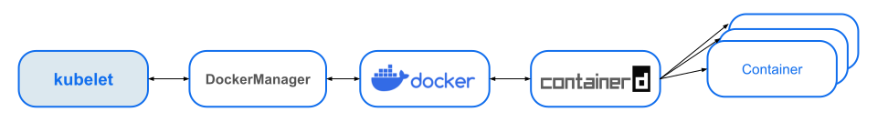
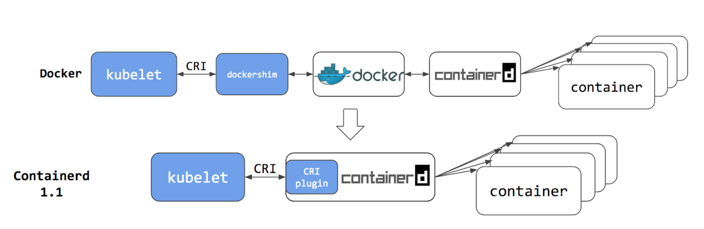
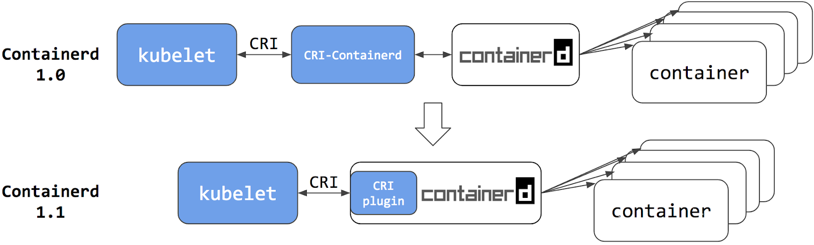
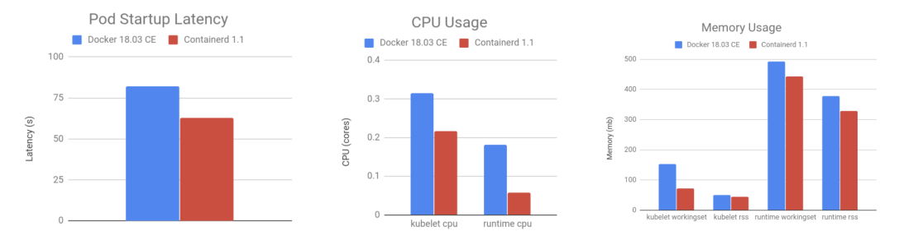
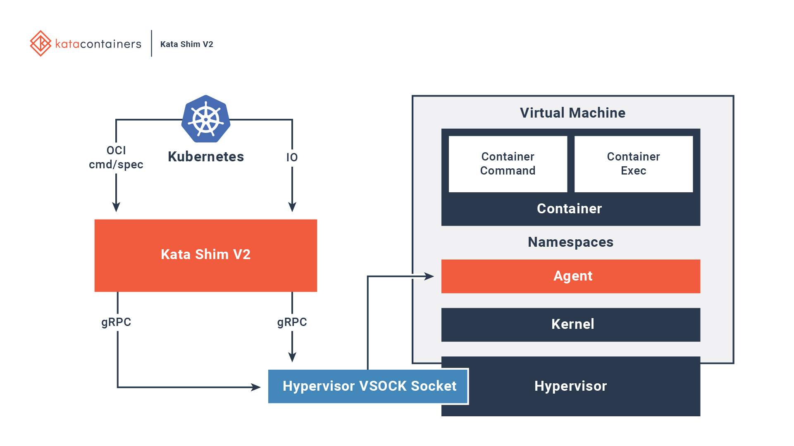

# 7.4 容器运行时接口的演变

Docker 完全没有预料到：它诞生十多年后，仍然能够再次成为舆论的焦点。事件的起因是 Kubernetes 宣布开始进入废弃 dockershim 支持的倒计时，随后讹传讹被人误以为 Docker 不能再用了。虽说此次事件有众多标题党的推波助澜，但也侧面说明了 Kubernetes 与 Docker 的关系十分微妙。

本节，我们把握这两者关系的变化，从中理解容器运行时规范以及 Kubernetes CRI 容器运行时接口的演变。

## 7.4.1 Docker 与 Kubernetes 

早期，Kubernetes 完全依赖并绑定于 Docker。

由于当时 Docker 太流行了，所以 Kubernetes 没有过多考虑够日后使用其他容器引擎的可能性。当时 kubernetes 通过内部的 DockerManager 组件直接调用 Docker API 来创建和管理容器。

:::center
  <br/>
  图 7-12 Kubernetes 早期调用 Docker 的链路
:::

后来，市场上出现了越来越多的容器运行时，比如 CoreOS[^1] 推出的开源容器引擎 Rocket（简称 rkt）。rkt 出现之后，Kubernetes 用类似强绑定 Docker 的方式又实现了对 rkt 容器引擎的支持。随着容器技术的蓬勃发展，越来越多容器运行时出现。如果继续使用与 Docker 类似强绑定的方式，Kubernetes 的工作量将无比庞大。

Kubernetes 需要重新考虑对所有容器运行时的兼容适配问题了。

## 7.4.2 容器运行时接口 CRI

Kubernetes 从 1.5 版本开始，在遵循 OCI 的基础上，将对容器的各类操作抽象为一个个接口。这些接口作为 Kubelet（Kubernetes 中的节点代理）与容器运行时实现对接的桥梁。Kubelet 通过发送接口请求来实现对容器的各类管理。

上述的接口，称为 CRI（Container Runtime Interface，容器运行时接口）。CRI 的实现上是一套通过 Protocol Buffer 定义的 API。笔者列举 CRI 接口中与操作容器相关的部分供你参考：

```protobuf
// RuntimeService 定义了管理容器的 API
service RuntimeService {

    // CreateContainer 在指定的 PodSandbox 中创建一个新的容器
    rpc CreateContainer(CreateContainerRequest) returns (CreateContainerResponse) {}
    // StartContainer 启动容器
    rpc StartContainer(StartContainerRequest) returns (StartContainerResponse) {}
    // StopContainer 停止正在运行的容器。
    rpc StopContainer(StopContainerRequest) returns (StopContainerResponse) {}
    ...
}

// ImageService 定义了管理镜像的 API。
service ImageService {
    // ListImages 列出现有的镜像。
    rpc ListImages(ListImagesRequest) returns (ListImagesResponse) {}
    // PullImage 使用认证配置拉取镜像。
    rpc PullImage(PullImageRequest) returns (PullImageResponse) {}
    // RemoveImage 删除镜像。
    rpc RemoveImage(RemoveImageRequest) returns (RemoveImageResponse) {}
    ...
}
```

从图 7-13 可以看出，CRI 规范的实现上主要由三个组件协作完成：gRPC Client、gRPC Server 和具体容器运行时实现（container runtime）。其中：

- Kubelet 作为 gRPC Client 调用 CRI 接口；
- CRI shim 作为 gRPC Server 响应 CRI 请求，并负责将 CRI 请求转换为具体的运行时管理操作。

:::center
  <br/>
  图 7-13 CRI 是通过 gRPC 实现的 API
:::

因此，市场上的各类容器运行时，只要按照规范实现 CRI 接口，即可接入到 Kubernetes 生态之中。


## 7.4.3 Kubernetes 专用容器运行时

2017 年，由 Google、RedHat、Intel、SUSE 和 IBM 联合发起的 CRI-O（Container Runtime Interface Orchestrator）项目发布了首个正式版本。

从名称可以看出，CRI-O 的目标非常明确，就是兼容 CRI 和 OCI，使得 Kubernetes 在不依赖于传统容器引擎（如 Docker）的情况下，也能实现对容器的管理。

:::center
  <br/>
  图 7-14  Kubernetes 专用的轻量运行时 CRI-O
:::

Google 推出 CRI-O 的意图明显，即直接削弱 Docker 在容器编排领域的影响。但彼时的 Docker 在容器生态中的份额仍然占有绝对优势。对于普通用户来说，如果没有明确的收益，并没有什么动力要把 Docker 换成别的容器引擎。不过，我们也能够想像 Docker 心中肯定充斥了被抛弃的焦虑。

## 7.4.4 Containerd 与 CRI 的关系演进

Docker 并没有“坐以待毙”，开始主动革新。

回顾本书第一章 1.5.1 节关于 Docker 演进的介绍，Docker 从 1.1 版本起推动自身的重构，并拆分出 Containerd。早期，Containerd 单独开源，并没有捐赠给 CNCF，Containerd 还适配了其他容器编排系统，如 Swarm，因此并没有直接实现 CRI 接口。此外，出于诸多原因的考虑，Docker 对外部开放的接口仍保持不变。

在上述两个背景下，Kubernetes 中出现了两种调用链（图 7-15 所示）：
- CRI 接口通过适配器 dockershim 调用：dockershim 再调用 Docker，最后 Docker 调用 Containerd 操作容器；
- CRI 接口通过适配器 CRI-containerd 调用：CRI-containerd 再调用 Containerd 操作容器。

:::center
  <br/>
  图 7-15  Containerd 与 Docker 都不支持直接与 CRI 交互
:::

在这个阶段，Kubelet 的代码和 dockershim 的代码都放在一个仓库内，这意味着 dockershim 需要由 Kubernetes 进行组织、开发和维护。然而，Docker 版本的更新则超出了 Kubernetes 的控制和管理。因此，每当 Docker 发布新版本时，Kubernetes 都必须集中精力快速更新和维护 dockershim。同时，Docker 仅作为容器运行时显得过于庞大，Kubernetes 弃用 dockershim 拥有了充分的理由和动力。

2018 年，Docker 将 Containerd 捐赠给 CNCF，并在 CNCF 的精心孵化下发布了 1.1 版。与 1.0 版相比，1.1 版的最大区别在于它已完美支持 CRI 标准，这意味着原本用作 CRI 适配器的 CRI-Containerd 从此不再需要。

Kubernetes v1.24 版本正式删除 dockershim，本质是废弃了内置的 dockershim 功能转而直接对接 Containerd。再观察 Kubernetes 到容器运行时的调用链，你会发现调用步骤相比通过 DockerShim、Docker Engine 与 Containerd 交互的步骤减少了两步。

此时：
- 用户只需抛弃 Docker 的情怀，容器编排至少可以省略一次调用，从而获得性能上的收益；
- 从 Kubernetes 的角度来看，选择 Containerd 作为运行时组件，调用链更短、更稳定，占用节点资源也更少。

:::center
  <br/>
  图 7-16  Containerd 1.1 起，开始完美支持 CRI 
:::


根据 Kubernetes 官方提供的性能测试数据[^2]，Containerd 1.1 相比 Docker 18.03：Pod 的启动延迟降低了大约 20%；CPU 使用率降低了 68%；内存使用率降低了 12%。这是一个相当显著的性能改善。

:::center
  <br/>
  图 7-17 Containerd 与 Docker 的性能对比
:::

## 7.4.5 安全容器运行时

尽管容器具备许多技术优势，但以 runc 为代表的基于共享内核的“软隔离”技术仍存在一定风险。如果某个恶意程序利用系统漏洞从容器中逃逸，可能对主机造成严重威胁，尤其是在公有云环境中，安全风险可能会影响到其他用户的数据和业务。

出于对传统容器安全性的担忧，Intel 在 2015 年启动了基于虚拟机的容器技术：Clear Container。Clear Container 依赖 Intel VT 的硬件虚拟化技术，以及高度定制的 QEMU-KVM（qemu-lite）来提供高性能的虚拟机容器。2017 年，Clear Container 项目与 Hyper RunV 合并，后者是一个基于 hypervisor 的 OCI 运行时。最终，这些项目合并为如今广为人知的 Kata Containers 项目。

Kata Containers 本质上是通过虚拟化技术模拟出一台“微型虚拟机”，并在这台虚拟机中运行一个精简的 Linux 内核，从而实现强隔离。Kata Containers 虚拟机内有一个特殊的 init 进程，负责管理虚拟机内的所有进程。由于虚拟机内的进程天然共享各个命名空间，这使得 Kata Containers 天生和 Pod 具有等同的概念。 

:::center
  <br/>
  图 7-18 Kata Containers 与传统容器技术的对比 [图片来源](https://katacontainers.io/learn/)
:::

此外，为了与上层的容器编排系统对接并融入容器生态，Kata Containers 运行时遵循 OCI 规范，并兼容 Kubernetes 的 CRI。Kata Containers 与 Kubernetes 的集成关系如图 7-19 所示。

:::center
  <br/>
  图 7-19 CRI 和 Kata Containers 的集成 [图片来源](https://github.com/kata-containers/documentation/blob/master/design/architecture.md)
:::

除了 Kata Containers，AWS 在 2018 年末发布了安全容器项目 Firecracker，该项目的核心其实是一个用 Rust 语言编写的，配合 KVM 使用的 VMM（Virtual Machine Manager，虚拟机管理程序），因此 Firecracker 还必须配合上 containerd 才能融入当今的容器生态。所以 AWS 又开源了 firecracker-containerd 项目，用于对接 Kubernetes 生态。

本质上 Firecracker-containerd 是另外一个私有化、定制化的 Kata containers，整体架构和 Kata containers 类似，只是放弃了一些兼容性换取更简化的实现，其细节笔者就不再赘述了。

## 7.4.6 容器运行时生态

现如今，如图 7-20 所示，目前符合 CRI 规范的容器运行时已有十几种，选择哪一种取决于 Kubernetes 安装时宿主机的容器运行时环境。

但对于云计算厂商而言，除非出于安全性需要（如必须实现内核隔离），大多数情况都会选择 Containerd 作为容器运行时。毕竟对于它们而言，性能与稳定性才是核心的生产力与竞争力。

:::center
  <br/>
  图 7-20 容器运行时生态 [图片来源](https://landscape.cncf.io/guide#runtime--container-runtime)
:::

[^1]: CoreOS 是一款产品也是一个公司的名称，后来产品改名 Container Linux。除了 Container Linux，CoreOS 还开发了 Etcd、Flannel、CNI 这些影响深远的项目。2018 年 1 月 30 号，CoreOS 被 RedHat 以 2.5 亿美的价格收购（当时 CoreOS 的员工才 130 人）。
[^2]: 参见 https://kubernetes.io/blog/2018/05/24/kubernetes-containerd-integration-goes-ga/
