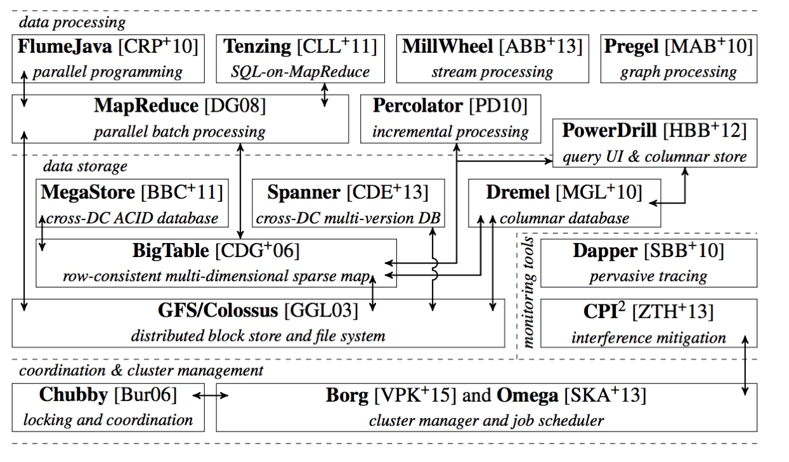

# 7.1 容器编排之争

为什么 Docker 在容器化技术满天下的时代脱颖而出？Docker 又因何落幕，Kubernetes 为何成为云原生时代的王者？对于以上的问题，如果笔者照本宣科地介绍 Kubernetes 架构如何新颖、设计如何优秀，相信并不能给读者们留有什么深刻印象，教条式介绍睡过一觉不会有多少人记起。

故事让内容变得有趣，在容器技术变革的浪潮中，曾发生过一场”史诗大战“，业界称之为 ”容器编排之争（Container Orchestration Wars）“，在当时或许认为是偶然的事件，站在尘埃落地的今天看起来却又全是必然。我们回顾这段历史，从宏观角度去理解 Kubernetes 的诞生与演变的驱动力。

IaaS 时代的虚拟机还是太过于笨重。每一台虚拟机都需要消耗CPU、内存等计算资源才能支撑应用的运行。即便应用再小，系统的开销都是固定的成本。如何为 IaaS 减肥，让虚拟机系统的开销降到最低？这个答案得云计算要发展到 PaaS 时代才能找到。

2013 年开始，云计算正式进入了 PaaS 时代。在 PaaS 时代，云计算所销售的单元，从虚拟机变成了应用运行平台。云厂商提供的服务更多，资源利用率自然也更高。

那云厂商该如何构建一套好用的 PaaS 服务呢？借力开源项目，成为各厂商的共识。

## PaaS 开源时代开启

最早出现在开发者视野中的 PaaS 开源项目当属 VMware 创立的 Cloud Foundry，与 IaaS 提供云上虚拟机的服务方式不同，基于 Cloud Foundry 的云计算能够提供应用托管的功能，开发者只需要通过一条简单的命令比如：cf push "我的应用"，就可以将项目打成一个压缩包，把压缩包上传到 Cloud Foundry 服务器之后 Cloud foundry 会开启调度器，在一群云主机中找到满足用户需求的主机（系统版本、性能、个数），通过容器化技术在选中的主机上创建容器，之后在容器内下载压缩包，解压并运行，最终成为一个对外提供服务的应用。

此外，Cloud Foundry 平台对这些应用项目提供分发，灾备，监控，重启等等服务。这种托管服务**解放了开发者的生产力，让他们不用再关心应用的运维状况，而是专心开发自己的应用，而这也就是 PaaS 的“初心” -- 平台即服务**。

## 从 Cloud Foundry 到 Docker

Cloud Foundry 最核心的组件就是应用的打包和分发机制，这也是开发者打交道最多的功能。Cloud Foundry 为每一种主流的语言都定义了一套打包的方式，但就是这个打包功能，成了 Cloud Foundry 的软肋，一直为用户所诟病，开发者不得不为每一种语言，每一种框架，甚至是每个版本应用维护一个打好的包。除此，这种方式还有可能出现本机运行成功，打了个包上传之后就无法运行的情况。本来是为赋能开发者的而生的技术，却对开发者极不友好。当开发者的抱怨积累到一定程度，想要在 PaaS 浪潮中央站稳脚跟的 Cloud Foundry 被后起之秀 Docker “红牌罚出局”也就顺理成章。

最初，Docker 是一个当时还叫 dotCloud 的公司（2010 年 Solumon Hykes 创建），在 Cloud Foundry 困于打包问题时，Docker 正在悄悄积蓄力量，在开源后的短短几个月内就迅速崛起，成为一个不容忽视的 PaaS 技术方案，吸引了云服务开发者的眼球。

滑稽的是，在 Docker 刚开源的时候，Cloud Foundry 的产品经理 James Bayer 就在社区做了一次详细的对比，告诉用户 Docker 和 Cloud Foundry 一样，都是使用了 Namespace 和 Cgroups 技术的沙箱而已，无需值得关注。

事实上，Docker 也确实就和他所说的一样，采用了这个“传统”的技术方案，但是 Docker 与 Cloud Foundry 相比，做了一点”小小的创新“，而这个创新无不体现 Solumon Hykes 的远见，**从 dotCloud 创建开始，Solumon Hykes 就一直在考虑应用打包的一致性与复用性问题，并提出了创新的解决方案，最终对 Cloud Foundry 造成了毁灭性的打击，这个解决方案就是 Docker 镜像**。

正式 Docker Image 这个“微不足道的创新”，让 Docker 席卷整个 PaaS 领域。比起 Cloud Foundry 那种执行文件+启动脚本的打包方式，Docker 镜像完美解决了两个问题：本地环境和服务器环境的差异、同一份镜像可以让所有的机器进行复用。

从这一刻开始，PaaS 的市场已经完全是 Docker 的天下。

## Docker 降世

每一波技术浪潮都会带来新的机会，科技的进步与商机是一对相辅相成的孪生兄弟。Docker 项目利用自己创新的 Docker Image 瞬间爆红，众多厂商也从中发现商机，纷纷推出自己的容器产品，想在市场中分一杯羹。CoreOS 推出了 Rocket（rkt）容器，Google 也开源了自己的容器项目 lmctfy（Let Me Container That For You）等。

但是面对 Docker 项目的强势，就算是 Google 这种大佬也毫无招架之力。因此 Google 打算和 Docker 公司开展合作，关停自己的容器项目，并且和 Docker 公司一同维护开源的容器运行，但是 Docker 公司方面很强势的拒绝了这个明显会削弱自己地位的合作。

此时 Docker 公司也意识到自己仅仅是云计算技术栈中的幕后英雄，只能当做平台最终部署应用的载体，单纯解决应用打包并没有价值，企业需要真正解决的是应用部署的问题。于是 Dcoker 公司迅速调整战略方向，再度向 PaaS 生态进军。

凭借在容器引擎市场的巨大成功以及先天的 PaaS 基因，Docker 进入容器编排领域是手到擒来。2014 年 7 月，Docker 收购了 OrchardLabs，正式开始涉足容器编排领域。Orchard Labs 的容器编排工具 fig 当时很有名，这个 fig 就是 DockerCompose 的前身。

Docker Compose 虽然能编排多个容器，但是只能对单个服务器上的容器进行操作，而不能实现在多个机器上进行容器的创建和管理。于是 Docker 在 2014 年底又发布了 Swarm 项目，并且不断招兵买马，充实着自己的平台化能力。如果说 Docker Compose 和 Kubernetes 还不算正面竞争的话，那么 Docker Swarm 的发布，则是正式向 Kubernetes 宣战了。

Kubernetes 是 Google 公司早在 2014 年就发布开源的一个容器基础设施编排框架，和其他拍脑袋想出来的技术不同，Kubernetes 的技术是有理论依据的，即 -- Borg。

Borg 是 Google 公司整个基础设施体系中的一部分，Google 也发布了多篇关于 Borg 的论文作为其理论支持。其上承载了比如 MapReduce、BigTable 等诸多业界的头部技术，Borg 项目当仁不让地位居整个基础设施技术栈的最底层。因此 Borg 系统一直以来都被誉为 Google 公司内部最强大的“秘密武器”，也是 Google 公司最不可能开源的项目，Kubernetes 项目从一开始就比较幸运地站上了一个他人难以企及的高度。

	
	
Google Omega 论文所描述的 Google 已公开的基础设施栈

面对 Kubernetes 的出现，一场 Docker 和 Kubernetes 之间的容器之战就此打响。

在这场对抗之初，由于 Kubernetes 开发灵感和设计思想来源于 Borg，Kubernetes项 目在刚发布时就被称为曲高和寡。太过超前的思想让开发者无法理解，同时由于 Kubernetes 项目一直由 Google 的工程师自行维护，所以在发布之初并没有获得太多的关注和成长。

然而，CNCF 的成立改变了这一切，RedHat 的长处就是有着成熟的社区管理体系，并且也有足够多的工程能力，这使得 Kubernetes 项目在交由社区维护开始迅速发展，并且逐渐开始和 Docker 分庭抗礼。并且和 Docker 的封闭商业模式不同，Kubernetes 反其道而行之主打开源和民主化，每一个重要功能都给用户提供了可定制化的接口，并且普通用户也可以无权限拉取修改 Kubernetes 的代码，社区有专门的 reviewer 以及 approver，只要你的 PR 通过了代码审核和批准，就会被合并到 Kubernetes 的主干，这也大大的增加了 Kubernetes 的活力。并且，依托于开放性接口，基于 Kubernetes 的开源项目和插件比比皆是，并且依托于优秀的架构设计，微服务等新兴的技术理念也迅速落地，最终形成了一个百花齐放的稳定庞大的生态。

反观 Docker 只能通过自己的工程师修改，在这一点上与 Kubernetes 相比就与远落下风。

面对 Kubernetes 社区的崛起和壮大，Docker 公司不得不承认自己的豪赌以失败告终，从 2017 年开始，Docker 将 Docker 项目的容器运行时部分 Containerd 捐赠给了 CNCF 社区，并且在当年 10 月宣布将在自己的 Docker 企业版中内置 Kubernetes 项目，这也标志着持续了近两年的容器编排之战落下帷幕。

2018年1月，RedHat 公司宣布斥资 2.5 亿美元收购 CoreOS，2018 年 3 月，这一切纷争的始作俑者 Docker 公司的 CTO Solomon Hykes 宣布辞职，至此，纷扰的容器技术圈尘埃落定，天下归一。