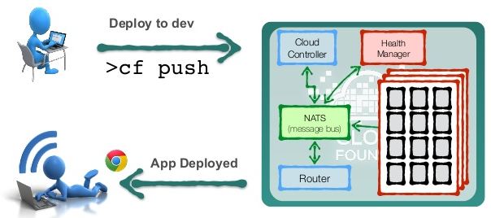
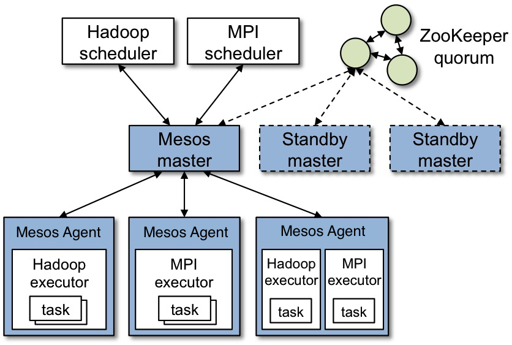

# 7.1 容器编排之争

**容器技术的兴起源于 PaaS 技术的普及**。

云计算早期的 IaaS 阶段，作为承载应用负载的虚拟机还是太过于笨重，无论业务负载大小，其消耗的 CPU、内存等计算资源独享且固定不变。在 IaaS 时代，云计算厂商一直思考的一个问题是如何充分利用资源（赚更多的钱），这个问题直到云计算进入 PaaS 时代找到了答案。

2013 年开始，云计算正式进入了 PaaS 时代，**在 PaaS 时代，云计算所销售的单元从虚拟机变成了应用运行平台，云厂商提供的服务更多，资源利用率自然也更高**。

## 1. 从 Cloud Foundry 开始

最早出现在开发者视野中的 PaaS 开源项目当属 VMware 创立的 Cloud Foundry。

Cloud Foundry 号称是业界第一个开源 PaaS 云平台，它支持多种框架、语言、运行时环境、云平台及应用服务，使开发人员能够在几秒钟内进行应用程序的部署和扩展，无需担心任何基础架构的问题。

Cloud Foundry 的典型使用方法是用户在云端部署好 Cloud Foundry 之后，本地应用只需要一条命令就能进行推送和安装。

```
cf push hello-work
```

Cloud Foundry 为应用定义了一种打包方式，push 则将本应用以及启动脚本进行压缩传到 Cloud Foundry 服务器之中，随后 Cloud foundry 开启调度器找到合适的虚拟机，下载压缩包，解压并运行，最终成为一个对外提供服务。在这个过程中，由于虚拟机会启动不同的应用，Cloud Foundry 利用 cgroups 和 namespace 机制为每个应用创建了一个“沙盒”环境。这样，在同一个虚拟机中的应用互相隔离，彼此不受影响。

<div  align="center">
	
	<p>图 Cloud Foundry 部署模型</p>
</div>


此外，Cloud Foundry 平台对这些应用项目提供分发，灾备，监控，重启等等服务。这种托管服务**解放了开发者的生产力，让他们不用再关心应用的运维状况，而是专心开发自己的应用，而这也就是 PaaS 的“初心” -- 平台即服务**。

## 2. Cloud Foundry 的软肋

历史上有太多的前辈想要解决环境不一致的问题。前有 Java “write once run erverwhere”，后有 Cloud Foundry 的 “cf-push”。PaaS 当时的火热就在于应用的打包和部署功能。但就是这个打包功能，成了 Cloud Foundry 的软肋，一直为用户所诟病。

Cloud Foundry 为每一种主流的语言都定义了一套打包的方式，开发者不得不为每一种语言、每一种框架、甚至是每个版本应用维护一个打好的包。除此，这种方式还有可能出现本机运行成功，打了个包上传之后就无法运行的情况。本来是为赋能开发者而生的技术，却对开发者极不友好，当开发者的抱怨积累到一定程度，想要在 PaaS 浪潮中央站稳脚跟的 Cloud Foundry 被后起之秀 Docker “红牌罚出局”也就顺理成章。

## 3. Docker 的制胜法宝

最初，Docker 还是一个叫 dotCloud 的公司，dotCloud 最初阶段也是选择 LXC 来快速部署软件，使用 LXC 虽然可以解决应用隔离的问题，但不能解决应用可移植性问题，为此 dotCloud 开发了一套内部管理工具，方便创建和管理容器，这个工具就是后来的 Docker。

Docker 刚开源的时候，Cloud Foundry 的产品经理就在社区做了一次详细的对比，告诉用户 Docker 和 Cloud Foundry 一样，都是使用了 Namespace 和 Cgroups 技术的沙箱而已，无需值得关注。事实上，Docker 也确实就和他所说的一样，采用了这个“传统”的技术方案，但是 Docker 与 Cloud Foundry 相比，创新性地提出了**Docker 镜像**。

比起 Cloud Foundry 那种执行文件+启动脚本的打包方式，**Docker 镜像完美解决了两个问题：本地环境和服务器环境的差异、同一份镜像可以让所有的机器进行复用**。

<div  align="center">
	
	<p>Docker 的愿景：Build, Ship, and Run Any App, Anywhere</p>
</div>

正是 Docker 镜像这个“微不足道的创新”，让 Docker 席卷整个 PaaS 领域。

## 3. Kubernetes 入场

Docker 项目利用自己创新的 Docker Image 瞬间爆红，众多厂商也从中发现商机，开始围绕容器编排做一些思考和布局，这其中就包括云计算概念的最早提出者 Google 公司。

虽然 Google 公司名声显赫，有强大的技术实力和资金实力，但在当时提到云计算，人们首先想到的却是 AWS，Google 也一直想法设法扭转局面，随着 Docker 的成功，他们从大火的容器市场看到了新的机会。Google 对容器知根知底，2007 年提交了 cgroup 到 Linux 内核，如今已经演变成容器运行时的基础。**2008 年 PaaS 平台 GAE 就已经采用了 LXC，并且开发了一套进行容器编排和调度的内部工具，也就是 Kubernetes 的前身 -- Borg**。

<div  align="center">
	
	<p>图 Kubernetes 前身 Omega 系统在 Google 内部中的地位</p>
</div>

凭借多年运行 GCP（Google Cloud Platform，Google 云端平台）和 Borg 的经验，使得 Google 非常认可容器技术，也深知目前 Docker 在规模化使用场景下的不足。如果 Google 率先做好这件事不仅能让自己在云计算市场扳回一局，而且也能抓住一些新的商业机会。比如，在 AWS 上运行的应用有可能自由地移植到 GCP 上运行，这对于 Google 的云计算业务无疑极其有利。

2013 年夏天，Kubernetes 联合创始人 Craig McLuckie、Joe Beda 和 Brendan Burns 开始讨论借鉴 Borg 的经验进行容器编排系统的开发。Kubernetes 项目获批后，Google 在 2014 年 6 月的 DockerCon 大会上正式宣布将其开源。

云计算市场中失去先机的 IT 界的领导者和创新者王者归来，容器编排的竞赛正式拉开帷幕。

## 4. Docker Swarm 入场

当然，并不是只有 Google 看到了容器市场的机会。DockerCon 2014 大会上，就有多家公司推出了自己的容器编排系统，而 Google 的进场让竞争变得更加激烈。

随着 DockerCon 2014 大会的落幕，Docker 公司也意识到自己仅仅是云计算技术栈中的幕后英雄，容器平台化能力才是致胜的关键，单纯解决应用打包并没有价值，只能当做平台最终部署应用的载体，企业真正需要解决的是应用部署问题。于是迅速调整了战略方向，再度向 PaaS 进军。

2014 年 7 月，Docker 收购了 OrchardLabs，正式涉足容器编排领域。Orchard Labs 的容器编排工具 fig 当时很有名，而这个 fig 就是 DockerCompose 的前身。Docker Compose 虽然能编排多个容器，但是只能对单个服务器上的容器进行操作，不能实现在多个机器上进行容器的创建和管理。于是 Docker 在 2014 年底又发布了 Swarm 项目，并且不断招兵买马，充实着自己的平台化能力。

Docker Swarm 可以在多个服务器上创建容器集群服务，而且依然保持着 Docker 的友好命令风格，几个命令就可以完成多机集群部署，在容器规模较小的场景下，所以许多用户更喜欢使用 Docker Swarm。

<div  align="center">
	
	<p>图 swarm 架构</p>
</div>

如果说 Docker Compose 和 Kubernetes 还不算正面竞争的话，那么 Docker Swarm 的发布，则是正式向 Kubernetes 宣战。

## 5. 搅局者 Marathon

当集群规模很大，管理的资源很多时，很多人就不愿意再使用 Docker Swarm，也没有选择 Kubernetes，而是选择了 Marathon 和 Mesos。

:::tip Mesos 是什么

举一个例子说明。假定某公司需要频繁进行大数据计算，该任务运行时需要 N 多个CPU和内存，为了满足资源需求，有两种方案：

1. 使用一个大型服务器，为任务提供足够的资源。
2. 采用分布计算，即提供一批普通配置的机器，组成集群，将计算任务拆分到各个机器上计算，然后汇总结果。

Mesos 就是实现这类分布式计算的框架.

:::

Mesos 最初是加州伯克利大学 RAD 实验室 2009 年启动的一个学术研究项目，初衷是为 spark 做集群管理，可以将不同的物理资源整合在一个逻辑资源层面上。Mesos 也在火热的容器技术中看到意识到了新的机会，在 Docker 问世后通过与 Docker 的整合焕发了第二春。

Mesos 解决问题的核心是围绕物理资源层，它上面跑什么，怎么跑其时并不关注（想要跑什么任务，开发 Scheduler 和 Executor 实现 Mesos Framework 即可）。Mesos 的架构图如下所示，如果忽略图中与 Hadoop、MPI 框架的相关模块，我们会发现架构会变得非常简单，它仅由 Zookeeper 集群、Mesos 主节点和工作节点组成。

master 根据调度策略(比如公平调度和优先级方式)，来决定将slave节点上的空闲资源(比如：CPU、内存或磁盘等)的提供给 framwork （例如 Hadoop、MPI、Hypertable、Spark、Docker 等）使用

<div  align="center">
	
	<p>图 Mesos 架构</p>
</div>

Mesos 的标杆客户是 Twitter，2010 年，Twitter 正值基础架构混乱不堪的时刻，他们看到了 Mesos 这个项目，随后马上应用，管理着 Twitter 超过 30 万台服务器上的应用部署，成为 Twitter 自定义 PaaS 的实现基础。Benjamin Hindman（Mesos 项目负责人）当时也加入了 Twitter，负责开发和部署 Mesos，Twitter 的这套基于 Mesos 的 PaaS 解决方案就是后来的 Apache Aurora。

Mesos 在 Twitter 的成功应用后，也吸引了全世界其他知名公司的采纳，比如 Airbnb、eBay 和 Netflix 等等，甚至 2015 年 Apple 的 Siri 就是运行在 Mesos 上，Mesos 也因此曾经火极一时。至于微软，他不仅投资了 Mesosphere（Benjamin Hindman 离开 Twitter 后成立的 mesos 的商业化公司），还让它的 Azure 平台率先支持了 Mesos。

## 6. Kubernetes 扭转局势

面对 Kubernetes 的出现，一场 Docker 和 Kubernetes 之间的容器之战就此打响。

2015 年 7 月 Google、RedHat 等企业共同发起成立了 CNCF（Cloud Native Computing Foundation）的基金会，希望以 Kubernetes 项目为基础，建立一个按照开源基金会方式运营的开源社区。与 Apache 基金会截然不同，CNCF 并不会把自身的组织架构和管理模式强加在其成员项目上，而是让其成员项目如 Kubernetes 更加自治化地自我管理，并提供如下维度的帮助：

- 生态绑定：将紧密围绕 Kubernetes 的插件项目（如 linkerd、fluentd、prometheus）放在同一个 CNCF 生态下，形成有机的绑定。
- 法律保护：保障 Kubernetes 的商标、Logo、License、专利、版权等被合理使用和消费。
- 市场推广：通过 meetups、K8sPort、Kubecon、Blog、Twitter、新闻媒体等线下、线上活动对 Kubernetes 等技术进行推广。
- 培训认证：制定规范、流程、课程来对 Kubernetes 等技术进行普及和相应的盈利。
- 最后，协调不同厂商之间的关系和竞争。

依托于开放性接口和优秀的架构设计，基于 Kubernetes 的开源项目和插件比比皆是，到现在，CNCF 已经形成了一个百花齐放的稳定庞大的生态。

## 7. Kubernetes 最终胜出

经过设计理念、架构、标准、生态等多方面的较量之后，Docker 在与 Kubernetes 的竞争中逐渐落败，Mesos 因其侧重在传统的资源管理，导致它在应对多云和集群管理时面临很多挑战，标杆客户 Twitter 最后也放弃了 Mesos 改用 Kubernetes。

- 2017 年 10 月的 DockerCon 欧洲大会上，Docker 宣布在自己的主打产品 Docker 企业版中内置 Kubernetes，并将 Docker 项目的容器运行时部分 Containerd 捐赠给了 CNCF 社区。
- 2017 年 11 月 29 日，AWS 宣布了他们的 Kubernetes 弹性容器服务 (EKS)。在 Amazon 宣布之前，Mesosphere、Pivotal 和 Docker 也宣布了对 Kubernetes 的原生支持。
- 2019 年 8 月 5 号，Mesosphere 宣布改名为 D2iQ，开启了围绕 Kubernetes 生命周期管理、混合云、多云的重生之旅。
- 2019 年 11 月，Mirantis 收购了 Docker 的企业部门。

至此，纷扰的容器技术圈尘埃落定，天下归一。

[^1]: Mesos 论文 https://www.usenix.org/legacy/events/nsdi11/tech/full_papers/Hindman.pdf
