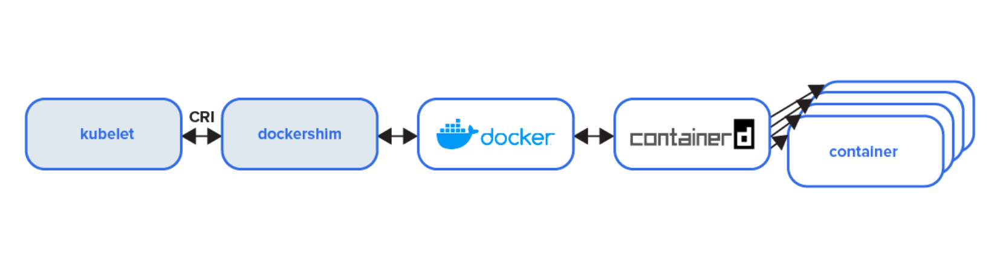
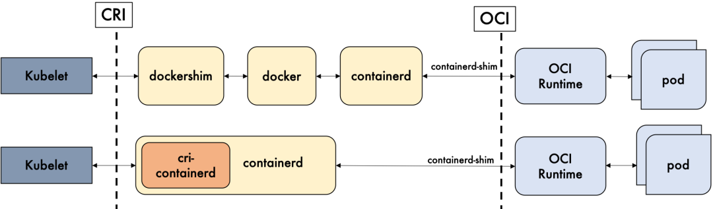

# 7.7.2 Docker 与 Kubernetes

Kubernetes 提出 CRI 操作规范时，Docker 刚拆出 containerd，并不支持 CRI 标准。但由于 Docker 是当时容器技术主流存在，Kuberentes 虽然提出了 CRI 接口规范，仍然需要去适配 CRI 与 Docker 的对接，因此它需要一个中间层或 shim（垫片） 来对接 Kubelet 和 Docker 运行时实现。

于是 kubelet 中加入了 Dockershim，当 Docker 作为容器运行时，Kubernetes 内启动一个容器流程如下图所示：

	

在这个阶段 **Kubelet 的代码和 dockershim 都是放在一个 Repo**。

这也就意味着 Dockershim 是由 Kubernetes 进行组织开发和维护！由于 Docker 的版本发布 Kubernetes 无法控制和管理，所以每次 Docker 发布新的 Release，Kubernetes 都要集中精力去快速地更新维护 Dockershim。同时如果 Docker 仅作为 runtime 实现也过于庞大，Kubernetes 弃用 Dockershim 有了足够的理由和动力。

## Kubernetes 弃用 Dockershim

Kubernetes1.24 版本正式删除和弃用 dockershim。

这件事情的本质是废弃了内置的 dockershim 功能，直接对接 containerd（后续已经支持 CRI）。从 containerd 1.0 开始，为了能够减少一层调用的开销，containerd 开发了一个新的 daemon，叫做 CRI-Containerd，直接与 containerd 通信，从而取代了 dockershim。

	

从 Kubernetes 角度看，选择 containerd 作为运行时的组件，它调用链更短，组件更少，更稳定，占用节点资源更少。