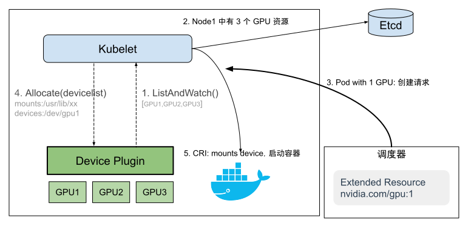

# 7.7.2 扩展资源与 Device Plugin

在 Kubernetes 中，宿主机的标准资源（如 CPU、内存和存储）由 Kubelet 自动报告。然而，在某些情况下，宿主机可能存在异构资源（如 GPU、FPGA、RDMA 或某些硬件加速器），Kubernetes 本身并未对此进行识别和管理。

## 1. 扩展资源

作为一个通用型的容器编排平台，Kubernetes 自然需要与各类异构资源集成，以满足不同用户的需求。为此，Kubernetes 提供了扩展资源（Extended Resource）机制，使集群管理员能够声明、管理和使用除标准资源之外的自定义资源。

为了能让调度器知道自定义资源在每台宿主机的可用量，宿主机节点必须能够访问 API Server 汇报自定义资源情况。汇报自定义资源的手段是向 Kubernetes API Server 发送 HTTP PATCH 请求。例如，某个宿主机节点中带有 4 个 GPU 资源。下面是一个 PATCH 请求的示例，该请求为 `<your-node-name>` 节点发布 4 个 GPU 资源。
```bash
PATCH /api/v1/nodes/<your-node-name>/status HTTP/1.1
Accept: application/json
Content-Type: application/json-patch+json
Host: k8s-master:8080
[
  {
    "op": "add",
    "path": "/status/capacity/nvidia.com~1gpu",
    "value": "4"
  }
]
```
需要注意的是，上述 PATCH 请求仅告知 Kubernetes，某宿主机节点 `<your-node-name>` 拥有 4 个名为 GPU 的资源。Kubernetes 并不理解 GPU 资源的具体含义和用途。

接着，使用 kubectl describe node 命令查看宿主机节点资源情况。可以看到，命令输出了刚才扩展的 nvidia.com/gpu 资源，容量（capacity）为 4。
```bash
$ kubectl describe node <your-node-name>
...
Status
  Capacity:
  	cpu: 2
  	memory: 2049008Ki
  	nvidia.com/gpu: 4
```

如此，配置一个 Pod 对象时，便可以像配置标准资源一样，配置自定义资源的 request 和 limits。以下是一个带有申请 nvidia.com/gpu 资源的 Pod 配置示例。

```yaml
apiVersion: v1
kind: Pod
metadata:
  name: gpu-pod
spec:
  containers:
    - name: cuda-container
      image: nvidia/cuda:10.0-base
      resources:
        request:
          nvidia.com/gpu: 1
```
上面 Pod 资源配置中，GPU 的资源名称为“nvidia.com/gpu”，它的配额是 1 个该资源。这意味着调度器将把该 Pod 分配到一个有足够 nvidia.com/gpu 资源的节点上。

当 Pod 被成功调度到宿主机节点后，进行相应的配置（设置环境变量，挂载设备驱动等操作），便可在容器内部使用 GPU 资源了。


## 2. Device Plugin

当然，除非有特殊情况，通常不需用手动的方式扩展异构资源。

在 Kubernetes 中，管理各类异构资源的操作由一种称为“Device Plugin”（设备插件）的机制负责。

Device Plugin 核心思想是提供了多个 gRPC 接口，硬件供应商根据接口规范为特定硬件编写插件。kubelet 通过 gRPC 接口与设备插件交互，实现设备发现、状态更新、资源上报等。最后，Pod 通过 request、limit 显示声明，即可使用各类异构资源，如同 CPU、内存一样。

Device Plugin 定义的 gRPC 接口如下所示，硬件设备插件按照规范实现接口，与 kubelet 进行交互，Kubernetes 便可感知和使用这些硬件资源。

```protobuf
service DevicePlugin {
	// 返回设备插件的配置选项。
	rpc GetDevicePluginOptions(Empty) returns (DevicePluginOptions) {}
	// 实时监控设备资源的状态变化，并将设备资源信息上报至 Etcd 中。
	rpc ListAndWatch(Empty) returns (stream ListAndWatchResponse) {}
	// 执行特定设备的初始化操作，并告知 kubelet 如何使设备在容器中可用。
	rpc Allocate(AllocateRequest) returns (AllocateResponse) {}

	// 从一组可用的设备中返回一些优选的设备用来分配。
	rpc GetPreferredAllocation(PreferredAllocationRequest) returns (PreferredAllocationResponse) {}

	// 在容器启动之前调用，用于特定于设备的初始化操作。确保容器能够正确地访问和使用特定的硬件资源。
	rpc PreStartContainer(PreStartContainerRequest) returns (PreStartContainerResponse) {}
}
```
目前，Kubernetes 社区中已经出现了许多 Device Plugin，例如 NVIDIA GPU、Intel GPU、AMD GPU、FPGA 和 RDMA 等。图 7-35 展示了一个 GPU Device Plugin 的工作原理。

:::center
  <br/>
  图 7-35 Device Plugin 工作原理
:::

首先，Device Plugin（例如，NVIDIA GPU device plugin）作为一个独立进程（以 DaemonSet 方式）运行在 Kubernetes 集群中的各个节点上。

当节点启动时，Device Plugin 向 kubelet 组件注册自己，告知 kubelet 该节点上有哪些特殊硬件资源可用。注册信息通常包括资源名称、资源数量和设备健康状态等。例如，一个 GPU Device Plugin 可能会注册资源名称为“nvidia.com/gpu”，并告知 kubelet 该节点上可用的 GPU 数量。

随后，Device Plugin 持续监测节点上的特殊硬件资源状态（图中的 ListAndWatch 接口）。当资源数量发生变化（如硬件故障、热插拔等）或资源健康状态发生改变时，它会及时向 kubelet 发送更新信息。

当用户创建一个 Pod 并请求特殊硬件资源时，Kubernetes 调度器根据节点上的资源状态和 Pod 的资源需求进行调度决策。一旦 Pod 被调度到某个节点并分配了特殊硬件资源，kubelet 会调用 Device Plugin 的 Allocate 接口获取设备相应的配置信息（如设备路径、驱动目录）。

接下来，kubelet 会将这些信息追加到对应的容器创建请求中（CRI 请求）。最后，具体的容器运行时（如 Docker、Containerd 等）将硬件驱动目录挂载到容器内部，容器内的应用程序便能够直接访问这些设备了。

:::tip 问题

你注意到扩展资源与 Device Plugin 的问题了么？

Pod 只能通过“nvidia.com/gpu:2”这种简单的“计数形式”来申请 2 块 GPU。然而，对于这 2 个 GPU 的具体型号、拓扑结构、是否共享或独享等属性，用户无法进行选择。所以说，Device Plugin 仅实现了基本的入门级功能，无法满足更复杂的资源管理需求。

在这些特殊场景的催化下，Nvidia、Intel 等头部厂商联合推出了 DRA（Dynamic Resource Allocation，动态资源分配）机制，允许用户以更复杂的方式描述和发现可用的异构资源，而不仅仅是简单的计数形式。例如，它可以支持 GPU 型号、性能、拓扑结构等属性的描述。

由于 DRA 是一种相对较新的机制，具体的接口规范可能会因硬件供应商和 Kubernetes 版本的不同而有所变化。限于篇幅，笔者就不再扩展讨论了，有兴趣的读者可以查阅其他资料。
:::