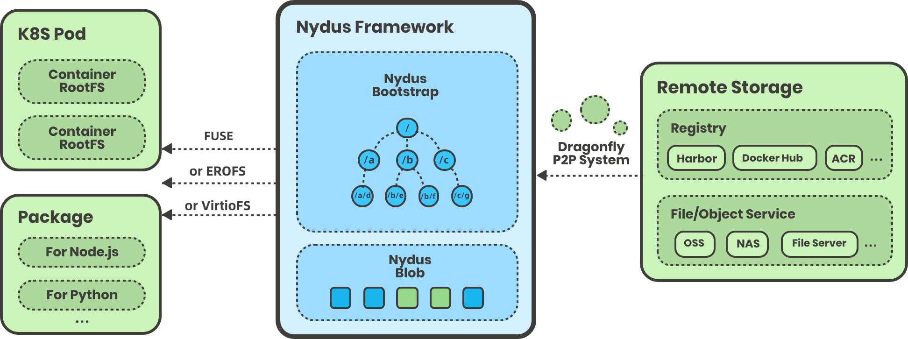
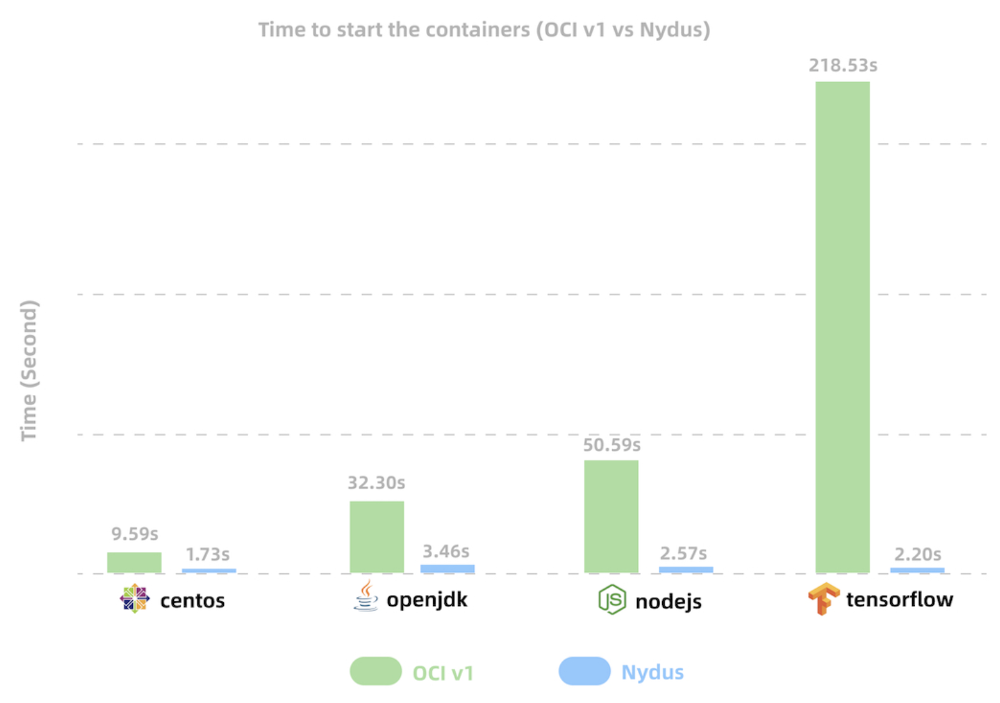

# 7.4.3 镜像加速器 Nydus

随着时间推移，在大规模集群的应用实践上，目前镜像存在着一些问题。这些问题主要集中在：

- **内容冗余**：不同层之间相同信息在传输和存储时都是冗余内容，在不读取内容的时候无法判断到这些冗余的存在。
- **无法并行**：单一层是一个整体，对同一个层既无法并行传输，也不能并行提取。
- **无法进行小块数据的校验** 只有完整的层下载完成之后，才能对整个层的数据做完整性校验。

上述这些问题核心是是镜像的基本单位是 layer。但实际上，容器的运行整个镜像并不会被充分利用，一般镜像只有 6% 的内容会被实际用到。为了解决上面这些问题，我们就考虑实现一种新型的镜像结构，对镜像存储利用率、启动速度等更进一步优化，而这些就是 Nydus 要做的工作。

## 1. Nydus 介绍及特点

Nydus 是阿里云发起的基于延迟加载原理的镜像加速项目，配合 Dragonfly 做 P2P 加速，能够极大缩短镜像下载时间、提升效率，从而让用户能够更安全快捷地启动容器应用。

Nydus 提供了容器镜像按需加载的能力，在生产环境支撑了每日百万级别的加速镜像容器创建，在启动性能，镜像空间优化，端到端数据一致性，内核态支持等方面相比 OCIv1 有巨大优势。Nydus 符合 OCI 标准，与 containerd、CRI-O、Kata-containers 等流行的运行时有良好的兼容性。

	

Nydus 镜像格式并没有对 OCI 镜像格式在架构上进行修改，主要优化了其中的 Layer 数据层的数据结构。Nydus 将原本统一存放在 Layer 层的文件数据和元数据 （文件系统的目录结构、文件元数据等） 分开，分别存放在 `Blob Layer` 和 `Bootstrap Layer` 中。并对 `Blob Layer` 中存放的文件数据进行分块，以便于延迟加载 （在需要访问某个文件时，只需要拉取对应的 Chunk 即可，不需要拉取整个 Blob Layer） 。

同时，这些分块信息，包括每个 Chunk 在 Blob Layer 的位置信息等也被存放在 Bootstrap Layer 这个元数据层中。这样，容器启动时，仅需拉取 Bootstrap Layer 层，当容器具体访问到某个文件时，再根据 Bootstrap Layer 中的元信息拉取对应 Blob Layer 中的对应的 Chunk 即可。

## 2. Nydus 优势总结

总结，使用 Nydus 的优势如下：

- 容器镜像按需下载，用户不再需要下载完整镜像就能启动容器。
- 块级别的镜像数据去重，最大限度为用户节省存储资源。
- 镜像只有最终可用的数据，不需要保存和下载过期数据。
- 端到端的数据一致性校验，为用户提供更好的数据保护。
- 兼容 OCI 分发标准和 artifacts 标准，开箱可用。
- 支持不同的镜像存储后端，镜像数据不只可以存放在镜像仓库，还可以放到 NAS 或者类似 S3 对象存储中。
- 与 Dragonfly 良好集成。

用户部署了 Nydus 镜像服务后，由于使用了按需加载镜像数据的特性，容器的启动时间明显缩短。在官网的测试数据中，Nydus 能够把常见镜像的启动时间，从数分钟缩短到数秒钟。理论上来说，容器镜像越大，Nydus 体现出来的效果越明显。

	

