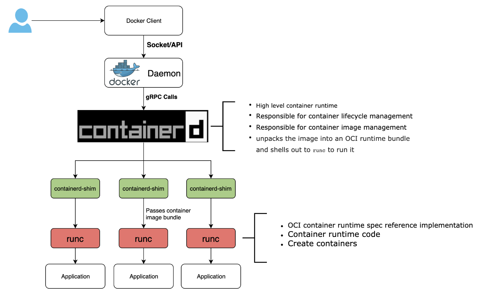

# 7.3 开放容器标准 OCI

云原生技术流行之后，各类容器运行时实现不断涌现，为了确保不同容器运行时都能够运行任何构建工具生成的镜像，Linux 基金会联合部分科技公司如 CoreOS、Docker Inc、RedHat 和 VMware 等共同成立了开放容器标准 OCI（Open Container Initiative，开放容器标准）。

OCI 致力于围绕容器格式和运行时创建开放的行业标准，使得任何支持 OCI 运行时标准的容器运行时都可以使用 OCI 镜像来运行容器，OCI 的出现使得整个容器社区都在朝着标准化的方向发展。

## 7.3.1 OCI

OCI 目前提出的规范有如下：

- Runtime Specification	：运行时规范，主要定义了在不同平台上运行容器的标准流程
- Image Format 镜像规范， 对镜像格式、打包(Bundle)、存储等进行了定义
- Distribution Specification 镜像分发的规范，该规范用于标准化镜像的分发标准，使 OCI 的生态覆盖镜像的全生态链路，从而成为一种跨平台的容器镜像分发标准。

标准如果没有人支持的话就只是个 Markdown 文件而已，整个容器社区为 OCI 标准成为真正的行业标准付出了艰辛的努力，以 Docker 拆分为例一览其中发展。

### OCI in Docker

自从 Docker 发布之后，Docker 项目逐渐成为了一个庞然大物。为了能够降低项目维护的成本，促进行业发展，Docker 公司提出了 “基础设施管道宣言” (Infrastructure Plumbing Manifesto)。

- 只要有可能，重新使用现有的管道并提供改进：当您需要创建新的管道时，可以轻松地重复使用并提供改进。 这增加了可用组件的公共池，每个人都受益。
- 遵循 UNIX 原则：几个简单的组件比一个复杂的组件要好
- 定义标准接口：可用于将许多简单组件组合到更复杂的系统中

Docker 开始自行拆分自己项目中的管道代码并形成一个个新的开源项目。在 OCI 项目启动后，docker 公司将 libcontainer 的实现移动到 runc 并捐赠给了 OCI。随后 docker 开源并将 containerd 捐赠给了 CNCF。从 Docker 1.11 版本开始，Docker 运行就不是简单通过 Docker Daemon 来启动了，现阶段的 Docker 通过集成 containerd、containerd-shim、runc 等多个组件共同完成。Docker 架构流程图，已如下所示：

	

