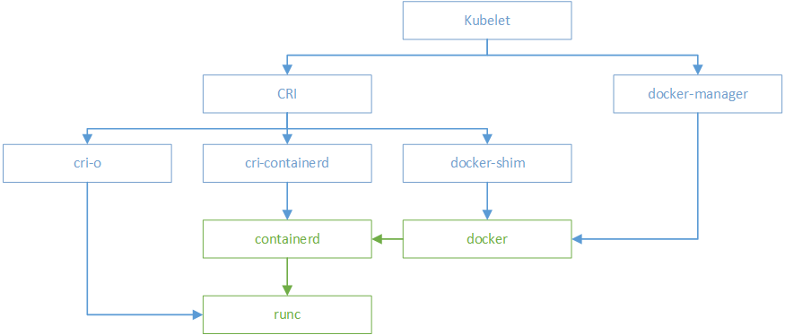

# 7.7.3 使用多运行时 RuntimeClass

RuntimeClass 是 v1.12 引入的新 API 对象，用来支持多容器运行时，比如

- Kata Containers/gVisor + runc
- Windows Process isolation + Hyper-V isolation containers

RuntimeClass 表示一个运行时对象，在使用前需要开启特性开关 RuntimeClass，并创建 RuntimeClass CRD：

```bash
kubectl apply -f https://github.com/kubernetes/kubernetes/tree/master/cluster/addons/runtimeclass/runtimeclass_crd.yaml
```

然后就可以定义 RuntimeClass 对象

```yaml
apiVersion: node.k8s.io/v1alpha1  # RuntimeClass is defined in the node.k8s.io API group
kind: RuntimeClass
metadata:
  name: myclass  # The name the RuntimeClass will be referenced by
  # RuntimeClass is a non-namespaced resource
spec:
  runtimeHandler: myconfiguration  # The name of the corresponding CRI configuration

```

在 Pod 中定义使用哪个 RuntimeClass：


```yaml
apiVersion: v1
kind: Pod
metadata:
  name: mypod
spec:
  runtimeClassName: myclass

```

## 小结

梳理完 CRI 的发展关系后，总结 kubelet 调用 各容器运行时 关系如下图所示：

<div  align="center">
	
</div>
