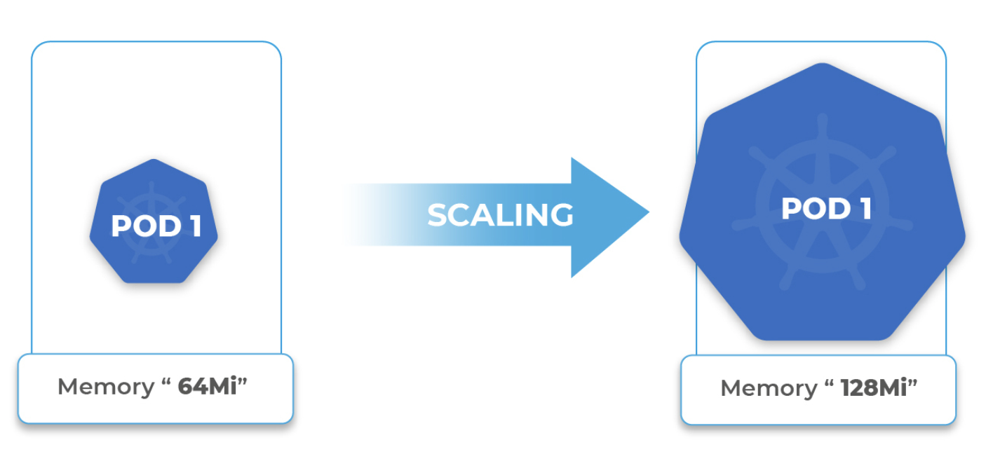
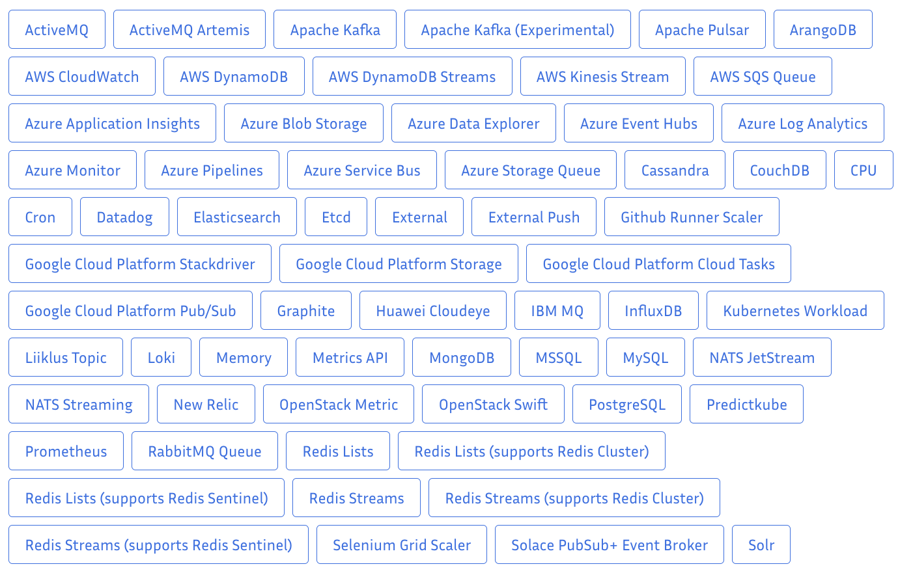

# 7.8 弹性伸缩

弹性伸缩（Elastic Scaling Service，简称ESS），也称 Auto Scaling，目标是通过解决欠配置（损失服务可用性）和过度配置（导致不必要的成本）实现容量与成本之间博弈的平衡。

Kubernetes 弹性伸缩组件可以从伸缩方向和伸缩对象两个维度进行解读。如下表所列，HPA 负责容器的水平伸缩，cluster-autoscaler 负责节点的水平伸缩。

|| Node | Pod |
|:--|:--|:--|
| Horizontal | Cluster AutoScaler | Horizontal Pod Autoscaler（HPA，水平 Pod 垂直自动伸缩器）|
| Vertical | 无 | Vertical Pod Autoscaler（VPA，垂直 Pod 自动伸缩器）|

如果集群的资源不够，那就得对节点进行扩容。集群节点的弹性伸缩本来是一件非常麻烦的事情，好在现在的集群大多都是构建在云上，云上可以直接调用接口添加删除节点，这就使得集群节点弹性伸缩变得非常方便。

这是一个自动扩展和收缩 Kubernetes 集群 Node 的扩展。当集群容量不足时，它会自动去 Cloud Provider （支持绝大部分的云服务商 GCE、GKE、Azure、AKS、AWS 等等）创建新的 Node，而在 Node 长时间（超过 10 分钟）资源利用率很低时（低于 50%）自动 Pod 会自动调度到其他 Node 上面，并删除节点以节省开支。

  

Cluster Autoscaler 虽然是 Kubernetes 官方标准，但是由于他深度依赖公有云厂商，因此具体使用方法，功能以及限制以公有云厂商具体实现为准。

VPA 组件确保工作负载适配方式是动态调整 Pod 资源上限而不是水平扩展它们。但这里有一个问题：增强型的 Pod 并不一定好，大多数情况下使用更多的进程处理数据远比使用一个大且强的工作进程更高效。

  
  
VPA 调整 Pod 的大小

用到最多的是 HPA组件，HPA 根据观察到的指标（主要是 CPU、内存）来横向增加或减少 Pod 数量。HPA 从最初的 v1 版本只支持 CPU、内存利用率的伸缩，到后来的自定义指标、聚合层 API 的支持，到了 v1.18 版本又加入了配置伸缩行为的支持。现在最新的版本是 autoscaling/v2，引入 Prometheus 的广泛指标。

	
  
HPA 改变 Pod 的数量

传统的指标如 CPU 和内存不一定就能代表服务的负载情况。比如事件驱动的应用程序 Kafka，传入 kafka 事件的数量才是确定负载的真实指标。在持续集成（CI）流水线中，当提交代码时，可能会触发一系列的流水线作业（镜像编译、应用打包、可用性测试），如果持续集成的作业出现瓶颈，这里的度量标准应该是等待执行的任务数，那么基于作业队列数量伸缩比仅仅观察 CPU 或者内存指标更有效。

当然，Kubernetes 也看到了这一点。HPA 在经过三个大版本的演进之后，也实现支持 Resource Metrics（资源指标，如pod的CPU）和Custom Metrics（自定义指标）和 ExternalMetrics（额外指标）的缩放，如果需要基于其他地方如 Prometheus、Kafka、云供应商或其他事件上的指标进行伸缩，那么可以通过 v2 版本提供的 external metrics 来实现

## 基于事件驱动的方式

HPA v2 版本就可以实现基于外部指标弹性伸缩，只是实现上比较麻烦。而 Kedify、Microsoft 开源的 KEDA（Kubernetes Event-driven Autoscaling）项目则可以简化这个过程，使用起来更加方便，而且 KEDA 已经内置了几十种常见的 Scaler 可以直接使用。

:::tip 
KEDA 的出现是为了增强 HPA，而不是替代 HPA。 
:::

KEDA 并没有取代 HPA，而是对 Kubernetes 内置的 HAP 组件的补充。

基于事件的触发方式，KEDA 就是一个 HPA + 多种触发器。只要触发器收到某个事件被触发，KEDA 就可以使用 HPA 进行自动伸缩了。

  

KEDA 使得 Kubernetes 能够对 Pods 副本缩0或者扩展到更多是基于标准内置的 Kubernetes 指标，例如CPU和内存等标准，但也基于高级指标，例如消息队列的排队深度，每秒请求数，调度的 Cron 作业数，或者从您自己的应用程序记录中以及您可以想象的其他所有指标中的自定义指标

KEDA 会从外部度量提供者系统 (上面提到的指标扩展器，比如 Azure Monitor) 监控度量，然后根据基于度量值的伸缩规则进行伸缩。作为一个Kubernetes Operator 运行直接与度量提供者系统通信，

  

## 离在线混部

https://keda.sh/docs/2.12/scalers/

