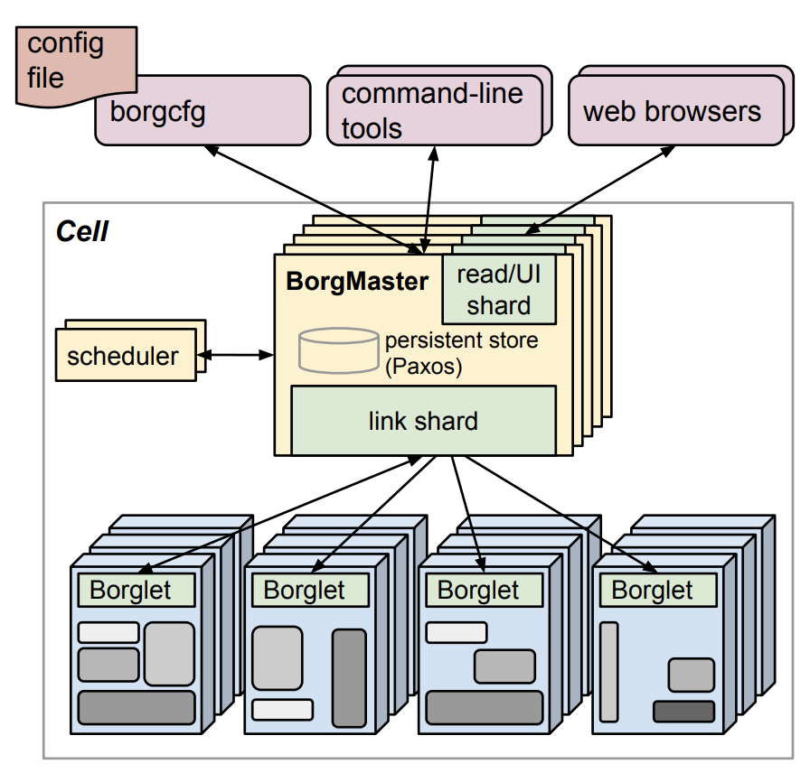
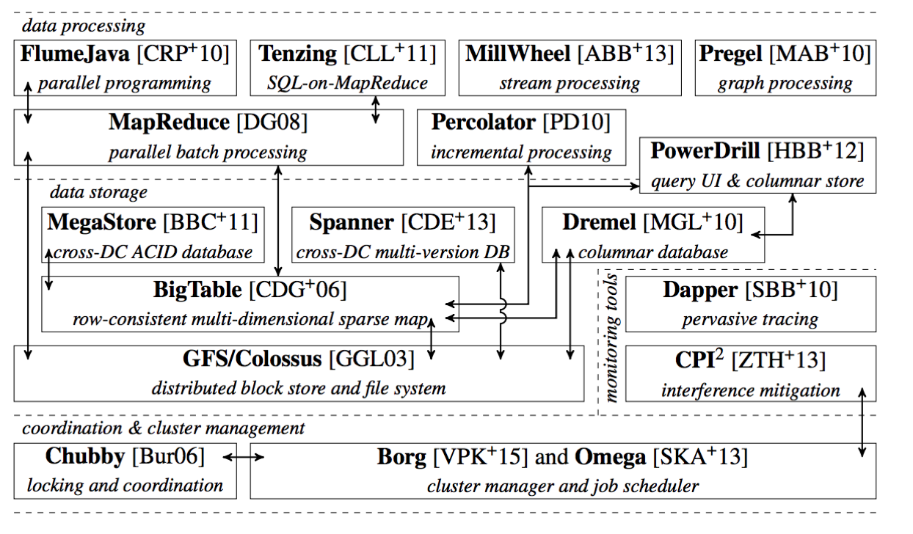
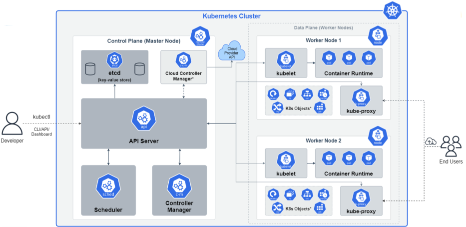

# 7.1 从 Borg 到 Kubernetes

这几年业界对容器技术兴趣越来越大，但在 Google 内部十几年前就已经开始大规模容器实践了，这个过程中也先后设计了三套不同的容器管理系统。

在开发这三套容器管理系统的过程中，Google 向外界分享了大量的源码、论文和设计理念，直接促进了容器技术的创新和普及，对整个行业的技术演进产生了深远的影响。

## 7.1.1 Borg 系统
Google 内部第一代容器管理系统叫 Borg。Borg 的架构如图 7-1 所示，是典型的 Master（图中 BorgMaster) + Agent（图中的 Borglet）架构。

用户通过命令行或者浏览器将任务提交给 Master，Master 负责记录“某某任务运行在某某机器上”这类元信息，然后 Agent 与 Master 通信，获取分配给自己的任务，最后在 Work 节点中执行任务。

:::center
   
  图 7-1 Borg 架构图 [图片来源](https://research.google/pubs/large-scale-cluster-management-at-google-with-borg/)
:::

开发 Borg 的过程中，Google 的工程师为 Borg 设计了两种 Workload（工作负载）：
- **Long-Running Service（长期运行的服务）**：通常是对请求延迟敏感的在线业务，例如 Gmail、Google Docs 和 Web 搜索以及内部基础设施服务。
- **Batch Job（批处理作业任务）**：通常用于一次性地、按批次处理一大批数据或执行一系列任务，涉及大量数据处理，需要较长的运行时间和较多的计算资源。典型的 Batch Job 为 Apache Hadoop 或 Spark 等框架进行的各类离线计算任务。

区分 2 种不同类型 Workload 原因在于：

- **两者运行状态不同**：Long-Running Service 存在“环境准备ok，但进程没有启动”、“健康检查失败”等状态，这些状态 Batch Job 是没有的。运行状态不同，决定了两类应用生命周期管理、监控、资源分配操作的不同。
- **关注点与优化方向不一样**：一般而言，Long-Running Service 关注的是服务的“可用性”，而 Batch Job 关注的是系统的整体吞吐。关注点的不同，会进一步导致内部实现的分化。

Borg 中大多数 Long-Running Service 都会被赋予高优先级（此类任务在 Borg 中称 prod），而 Batch Job 则会被赋予低优先级（此类任务在 Borg 中称 non-prod）。生产实践中，高优先级类型的任务享有分配和占用大部分的 CPU 和内存资源的“特权”。这样的设计，在 Borg 中称“资源抢占”模型，即 prod 任务可以占用 non-prod 任务的资源。

**底层支撑上述设计的是 Google 贡献给 Linux 内核的 cgroups 技术。cgroups 技术是众多容器技术的基础，它实现了各类资源（网络、计算、存储等）的隔离，
Borg 基于 cgroups 技术，使不同类型 Workload 可以混合部署，共享资源的同时互不影响**。从结果上看，Borg 系统提升了资源利用率，并降低了硬件支出成本。

随着 Google 内部的应用程序越来越多地被部署到 Borg 上，应用团队与基础架构团队开发了大量围绕 Borg 的管理工具和服务：资源需求量预测、自动扩缩容、服务发现和负载均衡、Quota 管理等等，并逐渐形成一个基于 Borg 的内部生态。

## 7.1.2 Omega 系统

驱动 Borg 生态发展的是 Google 内部的不同团队，从结果看，Borg 生态是一堆异构、自发的工具和系统，而非一个有设计的体系。

为了使 Borg 的生态系统更加符合软件工程规范，Google 在吸取 Borg 经验的基础上开发了 Omega 系统。相比 Borg ，Omega 最大的改进是将 BorgMaster 的功能拆分为了几个彼此交互的组件，而不再是一个单体的、中心式的 Master。Omega 还重点改进了大规模集群作业调度效率问题：

- Omega 将集群状态存储在基于 Paxos 算法实现的一致且高可用的键值存储内（该键值存储在 Omega 内称 Store）；
- BorgMaster 拆分出来的组件（例如容器编排调度器、中心控制器）都可以直接访问这个 Store；
- 基于 Store，Omega 提出了一种共享状态双循环调度策略，解决了大规模集群的作业调度效率问题，这个设计又反哺到 Borg 系统中（该设计详细分析情参见本章 7.7.4 节）。

如图 7-2 所示，改进后的 Borg 与 Omega 成为 Google 最关键的基础设施。

:::center
    
  图 7-2 Borg 与 Omega 是 Google 最关键的基础设施 [图片来源](https://cs.brown.edu/~malte/pub/dissertations/phd-final.pdf)
:::

## 7.1.3 Kubernetes 系统

Google 开发的第三套容器管理系统叫 Kubernetes。开发这套系统的背景是：
- 全球越来越多的开发者开始对 Linux 容器感兴趣（Linux 容器是 Google 的家底，但全世界的工程师提到容器，第一个想到是 Docker，Google 并没有吃到红利）；
- Google 已经把公有云基础设施作为一门业务在卖，且在持续增长（Google 是云计算概念提出者，但起了大早赶了个晚集，云计算市场被 AWS 、阿里云等占尽先机）。

2013 年夏天，Google 的工程师们开始讨论借鉴 Borg 的经验进行容器编排系统的开发，并希望用 Google 十几年的技术积累影响错失的云计算市场格局。

Kubernetes 项目获批后，Google 在 2014 年 6 月的 DockerCon 大会上正式宣布将其开源。通过图 7-3 观察 Kubernetes 架构，能看出大量设计来源于 Borg/Omega 系统：

- API Server、Scheduler、Controller Mannager、Cloud Controller Mannager 等彼此交互的分布式组件构成的 Master 系统；
- Kubernetes 的最小运行单元 Pod。在 Borg 系统中，Pod 的原型是 Alloc（“资源分配”的缩写）；
- 在工作节点中，用于管理容器的 Kublet。从它的名字可以看出，它的设计来源于 Brog 系统中的 Borglet 组件；
- 基于 Raft 算法实现的分布式一致性键值存储 Etcd，对应 Omega 系统中基于 Paxos 算法实现的 Store 等等。

:::center
   
  图 7-3 Kubernetes 架构以及组件概览 [图片来源](https://link.medium.com/oWobLWzCQJb)
:::

出于降低用户使用的门槛，并最终达成 Google 从底层进军云计算市场意图，Kubernetes 定下的设计目标是**享受容器带来的资源利用率提升的同时，让部署和管理复杂分布式系统的基础设施标准化且更简单**。

为了进一步理解基础设施的标准化，来看 Kubernetes 从一开始就提供的东西，用于描述各种资源需求的标准 API：

- 描述 Pod、Container 等计算资源需求的 API。
- 描述 Service、Ingress 等网络功能的 API。
- 描述 Volumes 之类的持久存储的 API。
- 甚至还包括 Service Account 之类的服务身份的 API 等等。

各云厂商已经将 Kubernetes 结构和语义对接到它们各自的原生 API 上，所以 Kubernetes 描述资源需求的 API 是跨公有云、私有云和各家云厂商的，也就是说只要基于 Kubernetes 的规范管理应用，那么应用就能无缝迁移到任何云中。

**提供一套跨厂商的标准结构和语义来声明核心基础设施（Pod、Service、Volume...）是 Kubernetes 设计的关键，在此基础上，它又通过 CRD（Custom Resource Define，自定义资源定义） 将这个设计扩展到几乎所有的基础设施资源**。

有了 CRD，用户不仅能声明 Kubernetes API 预定义的计算、存储、网络服务，还能声明数据库、Task Runner、消息总线、数字证书等等任何云厂商能想到的东西！

随着 Kubernetes 资源模型越来越广泛的传播，现在已经能够用一组 Kubernetes 资源来描述一整个软件定义计算环境。就像用 docker run 可以启动单个程序一样，现在用 kubectl apply -f 就能部署和运行一个分布式应用，而无需关心是在私有云、还是公有云或者具体哪家云厂商上。

## 7.1.4 以应用为中心的转变

从最初的 Borg 到 Kubernetes，**容器化技术的最大的益处早就超越了单纯的提高资源使用率的范畴**；**更大的变化在于数据中心运营的范畴已经从以机器为中心迁移到了以应用为中心**。

容器化使数据中心的运营观念从原来的面向机器向了面向应用：

- 容器封装了应用环境，向应用开发者和部署基础设施屏蔽了大量的操作系统和机器细节；
- 每个设计良好的容器和容器镜像都对应的是单个应用，因此管理容器其实就是在管理应用，而不再是管理机器。

正是因为以应用为中心，云原生技术体系才会无限强调让基础设施能更好的配合应用、以更高效方式为应用输送基础设施能力：

1. 应用开发者和应用运维团队无需再关心机器和操作系统等底层细节；
2. 基础设施团队引入新硬件和升级操作系统更加灵活，最大限度减少对线上应用和应用开发者的影响；
3. 通过将收集到的各类关键性能指标（如 CPU 使用率、内存用量、每秒查询率 QPS 等）与应用程序而非物理机器关联起来，显著提高了应用监控的精确度和可观测性，尤其是在系统垂直扩容、 机器故障或主动运维等场景。这项理念变革直接促使软件可观测性领域应运而生。
