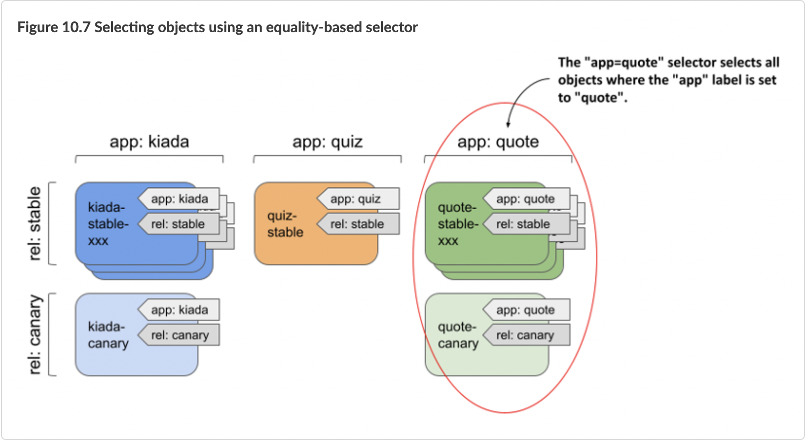

# 7.1 从 Borg 到 Kubernetes

这几年业界对容器技术兴趣越来越大，但在 Google 内部十几年前就已经开始大规模容器实践了，这个过程中也先后设计了三套不同的容器管理系统。 这三代系统虽然出于不同目的设计，但每一代都受前一代的强烈影响。

## 7.1.1 Borg

Borg 是 Google 内部第一代容器管理系统。

如图 7-1 所示，Borg 是非常典型的 Master(BorgMaster) + Agent(Borglet)架构。用户的操作请求提交给 Master，由 Master 负责记录下『某某实例运行在某某机器上』这类元信息，然后 Agent 通过与 Master 通讯得知分配给自己的任务、在单机上执行管理操作。

:::center
  
  图 7-1 Borg 架构图
:::

开发 Borg 的过程中，Google 的工程师们为 Borg 设计了两种 workload：
- **long-running service（长期运行的服务）**：通常是在线的业务，对请求延迟敏感（几微秒到几百毫秒之间），譬如 Gmail、Google Docs 和 Web 搜索以及内部基础设施服务（如 BigTable）。
- **batch job（批处理作业任务）**：批处理作业运行时间在几秒到几天不等；它们对短期性能波动并不敏感。典型的 batch job 为各色的离线计算任务。

为什么需要区分两种不同的 workload 呢？原因是这两类 workload 差异性实在太大：

- **二者的运行状态机不同**：long-running service 存在『环境准备ok，但进程没有启动』、『健康检查失败』等状态，这些状态 batch job 是没有的。状态机的不同，决定了对这些应用有着不同的『操作接口』，进一步影响了用户的API设计。
- **关注点与优化方向不一样**：一般而言，long-running service 关注的是服务的『可用性』，而 batch job 关注的是系统的整体吞吐。关注点的不同，会进一步导致内部实现的彻底分化。

Borg 通过这两种类型 workload 的混部，实现了共享计算资源，**提升了资源利用率，降低了成本**。而底层支撑这种共享的是 Linux 内核中新出现的容器技术（Google 给 Linux 容器技术贡献了大量代码），它能实现**延迟敏感型应用**和 **CPU 密集型批处理任务**之间的更好隔离。

:::tip 容器技术的发展得益于 Google 的贡献

当前 Linux 内核中用于物理资源隔离的 cgroups，就是 google borg 研发团队贡献给社区的。这个工作是后面众多容器技术的基础。早期的 LXC，以及后面发展起来的 Docker 等，都受益于 google 的贡献。

:::

随着 Google 内部的应用程序越来越多地被部署到 Borg 上，应用团队与基础架构团队开发了大量围绕 Borg 的管理工具和服务：资源需求量预测、自动扩缩容、服务发现和负载均衡、Quota 管理...逐渐形成一个基于 Borg 的内部生态。

驱动 Borg 生态发展的是 Google 内部的不同团队，从结果来看，Borg 生态是一堆异构、自发的工具和系统，而非一个有设计的体系。

## 7.1.2 Omega

为了使 Borg 的生态系统更加符合软件工程规范，Google 在吸取 Borg 经验的基础上开发了 Omega 系统。

Omega 的开发并没有复用 Borg 的代码但是吸取了 Borg 的设计思想：
- Omega 将集群状态存储在一个基于 Paxos 的中心式面向事务 store（数据存储）内
- 控制平面组件（例如调度器）都可以直接访问这个 store；
- 用乐观并发控制来处理偶发的访问冲突。

相比 Borg 的改进是 Omega 将 BorgMaster 的功能拆分为了几个彼此交互的组件，而不再是一个单体的、中心式的 Master。改进后的 Borg 与 Omega 成为 Google 最关键的基础设施。

:::center
  
  图 7-2 Borg 与 Omega 是 Google 最关键的基础设施
:::

## 7.1.3 Kubernetes

Google 开发的第三套容器管理系统叫 Kubernetes。开发这套系统的背景是：

- 全球越来越多的开发者也开始对 Linux 容器感兴趣；
- Google 已经把公有云基础设施作为一门业务在卖，且在持续增长。

凭借多年运行 GCP（Google Cloud Platform，Google 云端平台）和 Borg 的经验，使得 Google 非常认可容器技术，也深知目前 Docker 在规模化使用场景下的不足。如果 Google 率先做好这件事不仅能让自己在云计算市场扳回一局，而且也能抓住一些新的商业机会。比如，在 AWS 上运行的应用有可能自由地移植到 GCP 上运行，这对于 Google 的云计算业务无疑极其有利。

2013 年夏天，Google 的工程师们开始讨论借鉴 Borg 的经验进行容器编排系统的开发。Kubernetes 项目获批后，Google 在 2014 年 6 月的 DockerCon 大会上正式宣布将其开源。

与 Borg 和 Omega 不同的是，Kubernetes  在设计时就非常注重应用开发者的体验：首要设计目标就是在享受容器带来的资源利用率提升的同时，让部署和管理复杂分布式系统更简单。

## 7.1.4 经验以及教训

### 1. 底层 Linux 内核容器技术

容器技术提供的资源隔离能力，使 Google 的资源利用率远高于行业标准。例如，Borg 能利用容器实现延迟敏感型应用和 CPU 密集型批处理任务的混部，从而提升资源利用率，

- 业务用户为了应对突发业务高峰和做好 failover，通常申请的资源量要大于他们实际需要的资源量，这意味着大部分情况下都存在着资源浪费；
- 通过混部就能把这些资源充分利用起来，给批处理任务使用。

容器提供的资源管理工具使以上需求成为可能，再加上强大的内核资源隔离技术，就能避免这两种类型任务的互相干扰。

但这种隔离并未达到完美的程度：容器无法避免那些不受内核管理的资源的干扰，例如三级缓存（L3 cache）、 内存带宽；此外，还需要对容器加一个安全层（例如虚拟机）才能避免公有云上各种各样的恶意攻击。

现代容器技术处理提供资源隔离外，另外还有一个很重要的机制是实现应用程序依赖文件的打包和部署。Google 内部使用了一个叫 MPM 的工具来构建和部署。这一技术本身和容器的关系就如同 docker 容器和 docker image 之间的关系。

### 2. 面向应用程序的基础设施

随着时间推移，Google 意识到**容器化技术的最大的益处早就超越了单纯的提高硬件资源使用率的范畴**；**更大的变化在于数据中心运营的范畴已经从以机器为中心迁移到了以应用程序为中心**。

容器化使数据中心的观念从原来的面向机器（machine oriented）转向了面向应用（application oriented）：

- 容器封装了应用环境（application environment），向应用开发者和部署基础设施屏蔽了大量的操作系统和机器细节，
- 每个设计良好的容器和容器镜像都对应的是单个应用，因此管理容器其实就是在管理应用，而不再是管理机器。

#### 3. 应用开发环境

最初内核提供的类似于 cgroup/chroot/namespace这样的机制的目的是想保护应用程序运行时候的资源使用，避免相邻的应用程序（他们共享一个内核）带来的噪音和干扰。 随着这些隔离能力和容器镜像被结合在一起，甚至使用不同操作系统（可能是异构的系统）的应用程序也可以在同样的内核里面被调度执行。

这种镜像和实际运行的操作系统的解耦使得为开发环境和实际生产环境部署同样的运行环境成为可能；从而又极大地提高了部署的可靠性，经由减少环境的不一致而加速了应用程序开发的步伐。

这种做法能够成功的关键在于使用一个具有良好隔离性的容器镜像，保证该镜像可以封装应用程序所需要的几乎所有的依赖； 然后唯一剩下的依赖是容器和宿主内核之间的系统调用接口。 因为这些系统接口是非常稳定很少变更的，容器镜像的可移植性得到了极大的提高。

#### 4. 管理任务的基本单元迁移到了容器

围绕容器而非机器构建 management API，将数据中心的核心从机器转移到了应用，这带了了几方面好处：

1. 应用开发者和应用运维团队无需再关心机器和操作系统等底层细节；
2. 基础设施团队引入新硬件和升级操作系统更加灵活， 可以最大限度减少对线上应用和应用开发者的影响；
3. 将收集到的 telemetry 数据（例如 CPU、memory usage 等 metrics）关联到应用而非机器，显著提升了应用监控和可观测性，尤其是在垂直扩容、 机器故障或主动运维等需要迁移应用的场景。

#### 5. 通用 API 和自愈能力

容器能提供一些通用的 API 注册机制，使管理系统和应用之间无需知道彼此的实现细节就能交换有用信息。

- 在 Borg 中，这个 API 是一系列 attach 到容器的 HTTP endpoints。 例如，/healthz endpoint 向 orchestrator 汇报应用状态，当检测到一个不健康的应用时， 就会自动终止或重启对应的容器。这种自愈能力（self-healing）是构建可靠分布式系统的最重要基石之一。
- K8s 也提供了类似机制，health check 由用户指定，可以是 HTTP endpoint 也可以一条 shell 命令（到容器内执行）。

#### 6. 用 annotation 描述应用结构信息

容器还能提供或展示其他一些信息。例如，

- Borg 应用可以提供一个字符串类型的状态消息，这个字段可以动态更新；
- K8s 提供了 key-value annotation， 存储在每个 object metadata 中，可以用来传递应用结构（application structure）信息。 这些 annotations 可以由容器自己设置，也可以由管理系统中的其他组件设置（例如发布系统在更新完容器之后更新版本号）。

容器管理系统还可以将 resource limits、container metadata 等信息传给容器， 使容器能按特定格式输出日志和监控数据（例如用户名、job name、identity）， 或在 node 维护之前打印一条优雅终止的 warning 日志。

#### 7. 应用维度 metrics 聚合：监控和 auto-scaler 的基础

容器还能用其他方式提供面向应用的监控：例如，cgroups 提供了应用的 resource-utilization 数据；前面已经介绍过了，还可以通过 export HTTP API 添加一些自定义 metrics 对这些进行扩展。

基于这些监控数据就能开发一些通用工具，例如 auto-scaler 和 cAdvisor3， 它们记录和使用这些 metrics，但无需理解每个应用的细节。 由于应用收敛到了容器内，因此就无需在宿主机上分发信号到不同应用了；这更简单、更健壮， 也更容易实现细粒度的 metrics/logs 控制，不用再 ssh 登录到机器执行 top 排障了 —— 虽然开发者仍然能通过 ssh 登录到他们的 容器，但实际中很少有人这样做。

监控只是一个例子。面向应用的转变在管理基础设施（management infrastructure）中产生涟漪效应：

- 我们的 load balancer 不再针对 machine 转发流量，而是针对 application instance 转发流量；
- Log 自带应用信息，因此很容易收集和按应用维度（而不是机器维度）聚合； 从而更容易看出应用层面的故障，而不再是通过宿主机层的一些监控指标来判断问题；
- 从根本上来说，实例在编排系统中的 identity 和用户期望的应用维度 identity 能够对应起来， 因此更容易构建、管理和调试应用。

#### 8. 容器封装的等级

Borg里容器被分为两级，最外层的提供对于池化资源的集合，而内层的容器则负责具体的部署；外层的容器被成为Alloc。 Kubernetes里外层的容器被叫做POD。 Borg甚至允许应用程序跑在最外层的容器外面，然而这一设计变成了一系列麻烦的来源，所以Kubernetes统一化了所有的应用程序部署和调度方法。

一种常见的范式是将一个复杂的应用程序的一个实例防止在外层的容器中，然后将其内部的不同的部分防止在不同的内部子容器中。

相比于把所有功能打到一个二进制文件，这种方式能让不同团队开发和管理不同功能，好处：

- 健壮：例如，应用即使出了问题，log offloading 功能还能继续工作；
- 可组合性：添加新的辅助服务很容易，因为操作都是在它自己的 container 内完成的；
- 细粒度资源隔离：每个容器都有自己的资源限额，比如 logging 服务不会占用主应用的资源。

### 容器编排仅仅是个开始

Borg 使得我们能在共享的机器上运行不同类型的 workload 来提升资源利用率。 但围绕 Borg 衍生出的生态系统让我们意识到，Borg 本身只是开发和管理可靠分布式系统的开始， 各团队根据自身需求开发出的围绕 Borg 的不同系统与 Borg 本身一样重要。下面列举其中一些， 可以一窥其广和杂：

#### 对象元信息

这些工具本来是被创造出来解决一些具体服务的特定问题的，随着它们被更广泛的采纳和部署，慢慢地它们就演进成了更为通用的工具使得所有的不属于容器中的微服务都可以采用。 由于这种做法是通过演进地方式得来的，早期的Borg系统中集成这些服务会遭遇诸如文件位置等类似的惯例带来的部署复杂性。 Kubernetes则尝试采用一致的基于API的方式来降低复杂性。 Kubernetes里面使用ObjectMetadata、Specification、Status这三类元信息，并将它们放置在所有的API对象的属性集中。

:::center
  
  图 7-1 元信息
:::

- Object Metadata：所有 object 的 Object Metadata 字段都是一样的，包括
	- object name
	- UID (unique ID)
	- object version number（用于乐观并发控制）
	- labels
- Spec：用于描述这个 object 的期望状态； Spec and Status 的内容随 object 类型而不同。
- Status：用于描述这个 object 的当前状态；

这种统一 API 提供了几方面好处：

- 学习更加简单，因为所有 object 都遵循同一套规范和模板；
- 编写适用于所有 object 的通用工具也更简单；
- 用户体验更加一致。

#### 通用API的好处

基于前辈 Borg 和 Omega 的经验，K8s 构建在一些可组合的基本构建模块之上，用户可以方便地进行扩展， 通用 API 和 object-metadata 设计使得这种扩展更加方便。 例如，pod API 可以被开发者、K8s 内部组件和外部自动化工具使用。

为了进一步增强这种一致性，K8s 还进行了扩展，支持用户动态注册他们自己的 API， 这些 API 和它内置的核心 API 使用相同的方式工作。 另外，我们还通过解耦 K8s API 实现了一致性（consistency）。 API 组件的解耦考虑意味着上层服务可以共享相同的基础构建模块。

统一形式的API带来的好处是多重的

- 学习系统的API变得简单 - 尽管很多初学者反应Kubernetes非常不好理解有陡峭的学习曲线
- 创建通用的工具变得简单，因为API对象具有很多相似的地方
- 开发体验的一致性，这是上面两点自然而然的结果
- 未来扩展新的对象更加容易

### 控制器协调调度循环

我们还通过让不同 k8s 组件使用同一套设计模式来实现一致性。Borg、Omega 和 k8s 都用到了 reconciliation controller loop 的概念，提高系统的容错性。

首先对观测到的当前状态（“当前能找到的这种 pod 的数量”）和期望状态（“label-selector 应该选中的 pod 数量”）进行比较；如果当前状态和期望状态不一致，则执行相应的行动 （例如扩容 2 个新实例）来使当前状态与期望相符，这个过程称为 reconcile（调谐）。

由于所有操作都是基于观察（observation）而非状态机， 因此 reconcile 机制非常健壮：每次一个 controller 挂掉之后再起来时， 能够接着之前的状态继续工作。

## Google 的经验指南

### 不要尝试让容器管理系统直接来管理端口（port）

早期的 Borg 系统由于允许所有的服务共享宿主机的 IP 地址，所以它为每个容器都分配了唯一的端口号，同时该端口号成为平台调度处理的一部分。当容器被移动到一个新的机器上的时候，它会得到一个新的端口号。

这意味着：

- 类似 DNS（运行在 53 端口）这样的传统服务，只能用一些内部魔改的版本；
- 客户端无法提前知道一个 service 的端口，只有在 service 创建好之后再告诉它们；
- URL 中不能包含 port（容器重启 port 可能就变了，导致 URL 无效），必须引入一些 name-based redirection 机制；

因此在设计 k8s 时，我们决定给每个 pod 分配一个 IP，

- 这样就实现了网络身份（IP）与应用身份（实例）的一一对应；
- 避免了前面提到的魔改 DNS 等服务的问题，应用可以随意使用 well-known ports（例如，HTTP 80）；
- 现有的网络工具（例如网络隔离、带宽控制）也无需做修改，直接可以用；

此外，所有公有云平台都提供 IP-per-pod 的底层能力；在 bare metal 环境中，可以使用 SDN overlay 或 L3 routing 来实现每个 node 上多个 IP 地址。

### 容器索引不要用数字 index，用 labels

用户一旦习惯了容器开发方式，马上就会创建一大堆容器出来， 因此接下来的一个需求就是如何对这些容器进行分组和管理。

Borg提供了一种叫做jobs的机制来对容器进行分组，一个job里面包含多个执行等同任务的容器，它们用基于0开始的连续的整数下标作为索引。 看起来种方式很自然和直接，然而随着复杂性的增加这一方案很快就露出了它的弊端：

作为对比，k8s 主要使用 labels 来识别一组容器（groups of containers）。

:::center
  
  图 7-1 元信息
:::

Kubernetes则基于这些问题的考虑而采用了基于松散的标签的方式来对容器进行分组。如果一个容器头上打了多个标签，那么它就同时隶属于不同的组。 Kubernetes支持动态地添加、删除和修改这些标签，并支持用标签选择器的类似集合的语法来查询某个标签下的所有容器。

###

org、Omega 和 k8s 的一个核心区别是它们的 API 架构。

- Borg 是一个基于单体架构的复杂软件，它的核心模块直到所有的API操作的予以逻辑。其内部维护了包括机器和机器上跑的Job和Task的集群状态控制逻辑，并使用基于Paxos的中心化存储来保存这些状态信息。

- Omega则不在保留中心化的状态管理逻辑，而仅仅保留了一个处于从属角色的全局的状态存储用于异常恢复。所有的逻辑语义控制操作则被下放给了数据存储的使用端，它们会直接读写对应的数据存储。 实现上每一个Omega组件使用了完全相同的客户端库来做数据结构的序列化、反序列化，重试和语义一致性处理。
- Kubernetes走了一条中间路线：既保留了Omega的去中心化存储架构的扩展性和灵活性，又复用了系统范围的数据修改策略的一致性。 这种做法依赖于一个中心化的API Server，该Server屏蔽了底层存储和对象校验、默认值初始化、版本处理的细节。