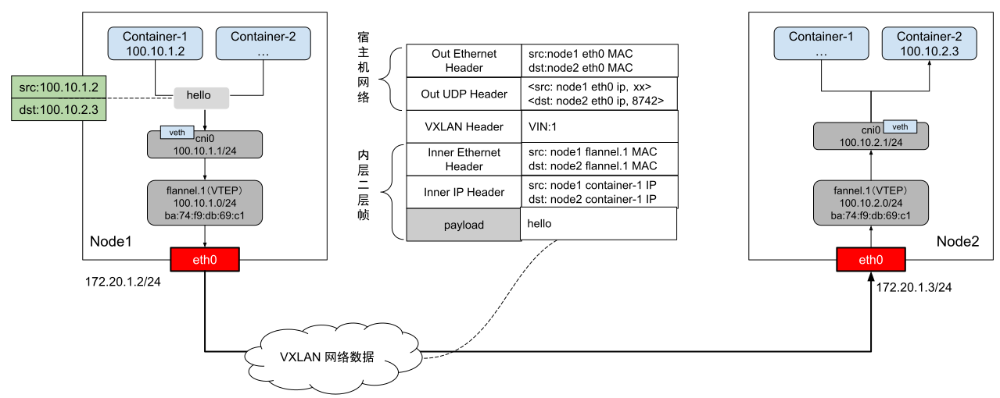
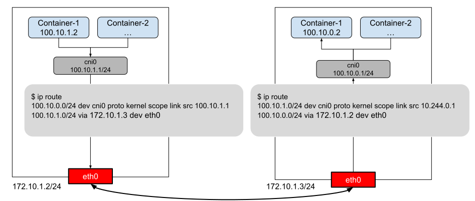
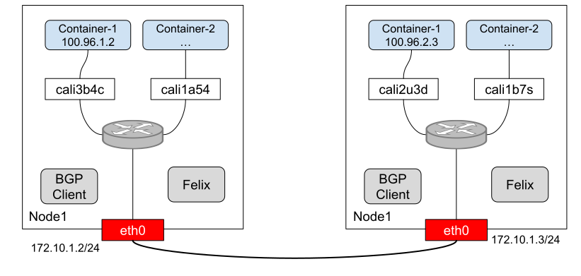
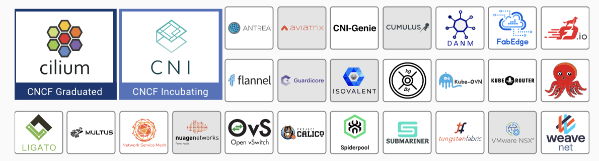

# 7.6 容器间通信的原理

理解了容器镜像的构建、持久化存储的挂载以及容器的运行机制之后，相信还有个问题反复萦绕在你心头：“整个容器集群是如何实现相互通信的？”。

要理解容器间通信，一定要从 Flannel 项目入手，Flannel 是 CoreOS 推出的容器网络解决方案，是公认“最简单”的容器网络解决方案，它支持的两种工作模式 VXLAN 和 host-gw ，分别对应了容器跨主机通信 Overlay（覆盖网络）和三层路由方式。

## 7.6.1 Overlay 覆盖网络模式

本书第三章 5.4 节已经详细介绍过 Overlay 的设计思想：即在现有的三层网络之上“覆盖”一层虚拟的、由内核 VXLAN 模块负责维护的二层网络。

为了能够在宿主机网络之上，构建二层网络通信的“隧道”，VXLAN 会在宿主机上设置一个特殊网络设备作为“隧道”的端点，这个设备就是 VTEP（VXLAN Tunnel Endpoints，VXLAN 隧道端点）。VTEP 设备根据 VXLAN 通信规范对 VXLAN 二层网络之内的“主机”（容器或者虚拟机）的数据包进行封装/解封。这样，这些“主机”就可以像在一个局域网内通信。实际上，这些“主机”可能分布在不同的节点、不同的子网，甚至不再一个物理机房内。

上述基于 VTEP 设备构建“隧道”通信的流程可总结为图 7-29。

:::center
   <br/>

  图 7-29 Flannel VXLAN 模式通信逻辑
:::

从图 7-29 可以看到，宿主机内的容器通过 veth-pair（虚拟网卡）桥接到一个名称为 cni0 的 Linux Bridge。每个宿主机内都有一个 flannel.1 设备，它们充当 VXLAN 所需的 VTEP 设备，当容器收到或发送数据包时，会通过 flannel.1 设备进行封装/解封。

VXLAN 规范的数据包由两层构成：内层帧（Inner Ethernet Header）属于 VXLAN 逻辑网络；外层帧属于宿主机网络（Out Ethernet Header
）。可以看出，VXLAN 实际是基于 IP 网络、采用“MAC in UDP” 封装形式的二层 VPN 技术。

当主机加入 Flannel 网络后，Flannel 会在主机内运行一个驻守程序 flanneld ，flanneld 为主机内的容器分配子网、同步 Kubernetes 集群内的网络配置信息。

现在，我们看看当 Node1 中的 Container-1 与 Node2 中的 Container-2 通信时，Flannel 是如何封包/解包的。

首先，Container-1 发出请求之后，目的地是 100.10.2.3 的 IP 包会进入 cni0 Linux 网桥。因为目的地地址不在 cni0 网桥的转发范围内，所以该数据包被送进 Linux 内核。

flanneld 启动后，会在 Node1 中添加如下路由规则（其他节点也会添加类似的规则）。
```bash
[node1]# route -n
Kernel IP routing table
Destination     Gateway         Genmask         Flags Metric Ref    Use Iface
100.10.1.0      0.0.0.0         255.255.255.0   U     0      0        0 cni0
100.10.2.0      100.10.2.0      255.255.255.0   UG    0      0        0 flannel.1
```
上面两条路由的意思是：
- 凡是发往 100.10.1.0/24 网段的 IP 报文，都需要经过接口 cni0。
- 凡是发往 100.10.2.0/24 网段的 IP 报文，都需要经过接口 flannel.1，并且最后一跳的网关地址是 10.224.1.0（也就是 Node2 中 VTEP 的设备）。

根据上面的路由规则，Container-1 的发出的数据包交由 flannel.1 接口处理，也就是说数据包进入了隧道的“起始端点”。

所以，当“起始端点”收到“原始的 IP 包”之后，就得想办法构造出 VXLAN 内层以太网帧，然后发给隧道网络“目的地端点”，也就是 Node2 中的 VTEP 设备。

构造内层以太网帧，需要解决的问题是 flannel.1 得知道源 MAC 地址，目地 MAC 地址。源 MAC 地址很简单，因为数据包是从 flannel.1 设备发出，源 MAC 地址就是 flannel.1 设备的 MAC 地址。那目的地 MAC 地址呢？也就是 Node2 中 flannel.1 设备的 MAC 地址怎么获取？

实际上，这个地址也已经由 fanneld 自动添加到 Node1 ARP 表中了，在 Node1 中通过 ip 命令查看。
```bash
[root@Node1 ~]# ip n | grep flannel.1
10.244.1.0 dev flannel.1 lladdr ba:74:f9:db:69:c1 PERMANENT # PERMANENT 表示永不过期
```
上面记录的意思是，IP 地址 10.10.1.0（Node2 flannel.1 设备的 IP）对应的 MAC 地址是 ba:74:f9:db:69:c1。

:::tip 注意
这里 ARP 表记录并不是通过 ARP 协议学习得到的，而是 flanneld 预先为每个节点设置好的，没有过期时间。
:::

现在，隧道网络的内层数据帧已经封装好了。接下来 Linux 内核还要把内层数据帧作为 Payload 封装到宿主机网络中的数据帧中。然后通过搭便车方式，在宿主机 eth0 网卡中传输。

为了实现“搭便车”的机制，Linux 内核会在内层数据帧前面塞一个特殊的 VXLAN Header，表示“乘客”实际是 Linux 内核中 VXLAN 模块要使用的数据。

VXLAN header 里面有个重要的标志 VNI，这是 VETP 设备判断是否属于自己要处理的依据。Flannel VXLAN 工作模式，所有节点中的 VNI 默认为 1，这也是 VTEP 设备为什么叫 flannel.1 的原因。

接着，Linux 内核接续构造外层 VXLAN UDP 报文，要进行 UDP 封装，就要知道四元组信息：源IP、源端口、目的IP、目的端口。
- Linux 内核中默认为 VXLAN 分配的 UDP 监听端口为 8472。
- 目的 IP 则通过 fdb 转发表获得。当然，fdb 表中的数据也是由 Flannel 提前设置好的。

使用 bridge fdb show 查看 fdb 表的记录。

```bash
[root@Node1 ~]# bridge fdb show | grep flannel.1
ba:74:f9:db:69:c1 dev flannel.1 dst 192.168.50.3 self permanent
```
上面记录的意思是，目的 MAC 地址为 92:8d:c4:85:16:ad 的数据帧封装后，应该发往哪个目的IP。根据上面的记录可以看出，UDP 包的目的 IP 应该为 192.168.2.103，也就是 Node2 宿主机 IP。

至此，Linux 内核已经得到了所有完成 VXLAN 封包所需的信息，然后调用 UDP 协议的发包函数进行发包。后面的过程和本机的 UDP 程序发包没什么区别了：Linux 内核对 UDP 包封装到宿主机的二层数据帧内，然后到达 Node2。

继续，再看看 Node2 是如何处理这个数据包的，当数据包到达 Node2 的 8472 端口后：
- VXLAN 模块比较 VXLAN Header 中的 VNI 和本机的 VXLAN 网络的 VNI 是否一致。
- 再比较内层数据帧中目的 MAC 地址与本机的 flannel.1 设备的 MAC 地址是否一致。

两个判断匹配后，则去掉数据包的 VXLAN Header 和 Inner Ethernet Header，得到原始的 container-1 发出的数据包。

然后，根据 Node2 节中的路由规则（由 Flannel 维护）。

```bash
[root@peng03 ~]# route -n
Kernel IP routing table
Destination     Gateway         Genmask         Flags Metric Ref    Use Iface
...
100.10.2.0      0.0.0.0         255.255.255.0   U     0      0        0 cni0
```
上面的路由规则中，目的地属于 100.10.2.0 /24 网段的数据包交由 cni0 设备处理。后面，就是我们在本书第三章《Linux 网络虚拟化》的内容了。

## 7.6.2 三层路由模式

三层路由模式除了 host-gw 模式外，还有一个更具代表性的项目 Calico，我们由浅入深，先来了解 Flannel 是如何实现三层路由，然后再了解 Calico 基于 BGP 的路由模式。

Flannel 的 host-gw 模式的逻辑非常简单，如图 7-30 所示。

:::center
   <br/>
  图 7-30 Flannel 的三层路由模式
:::

假设，现在 Node1 中的 container-1 要访问 Node2 中的 container-2。当设置 Flannel 使用 host-gw 模式之后，flanneld 会在宿主机上创建这样的路由规则。

```bash
$ ip route
100.96.2.0/24 via 10.244.1.0 dev eth0
```
这条路由的意思是，凡是目的地属于 100.96.2.0/24 IP 包，应该通过本机 eth0 设备（dev th0）发出，并且它的下一跳地址是 10.244.1.0 （via 10.244.1.0 ）。

:::tip 下一跳
所谓下一跳，就是 IP 数据包发送时，需要经过某个路由设备的中转，那下一跳的地址就是这个路由的 IP 地址。譬如你个人电脑中配置网关地址 192.168.0.1，意思就是本机发出去的所有 IP 包，都要经过 192.168.0.1 中转。
:::

知道了下一跳地址，接下来 IP 包被封装为二层数据帧，并顺利到达下一跳地址，也就是 Node2 上。

同样的，Node2 中也有 flanneld 提前创建好的路由。
```bash
$ ip route
100.10.0.0/24 dev cni0 proto kernel scope link src 100.10.0.1
```
这条路由规则的意思是，凡是目的地目属于 10.244.1.3/24 网段 IP 包，应该被送往 cni0 网桥。

由此可见，Flannel 的 host-gw 模式其实就是将每个容器子网（譬如 Node1 中的 100.10.1.0/24）下一跳设置成了对应的宿主机的 IP 地址，借助宿主机的路由功能，充当容器间通信的“路由网关”，这也是 “host-gw” 名字的由来。

**由于没有封包/解包的额外消耗，这种直接通过宿主机路由的方式性能肯定要好于前面介绍的 overlay 模式。但也由于 host-gw 通过下一跳路由，那么肯定无法再被路由网关内，因此不可能再跨越子网通信。**

现在，相信你已经理解了三层路由的原理。接下来，我们再来认识另外一个三层路由容器网络解决方案 - Calico。

Calico 和 Flannel 的原理都是直接利用宿主机的路由功能实现容器间通信，但与 Flannel 的 host-gw 不同的是“**Calico 通过 BGP 实现对路由规则自动化分发**”，因此灵活性更强、更适合大规模容器组网。

:::tip 什么是 BGP
边界网关协议，BGP 使用 TCP 作为传输层的路由协议，用来交互 AS 之间的路由规则。每个 BGP 服务的实例一般称 BGP Router，与 BGP Router 连接的对端叫 BGP Peer。每个 BGP Router 收到了 Peer 传来的路由信息后，经过校验判断之后，就会存储在路由表中。
:::

了解了 BGP 之后，再看 Calico 的架构（图 7-31 ），就能理解它组件的作用了：
- Felix，负责在宿主机上插入路由规则，相当于 BGP Router。
- BGP Client，BGP 的客户端，负责在集群内分发路由规则，相当于 BGP Peer。

:::center
   <br/>
  图 7-31 Calico BGP 路由模式
:::

除了对路由信息的维护外，Calico 与 Flannel 的另外一个不同之处是它不会设置任何虚拟网桥设备。

从上图可以看到，Calico 并没有创建 Linux Bridge，而是把每个 Veth-Pair 设备的另一端放置在宿主机中（名字以 cali 为前缀），然后通过路由转发。譬如 Node2 中 container-1 的路由规则如下。
```bash
$ ip route
10.223.2.3 dev cali2u3d scope link
```
这条路由的规则的意思是，发往 10.223.2.3 的数据包，应该进入与 container-1 连接的 cali2u3d 设备。

由此可见，Calico 实际上将集群的每一个节点的容器作为一个 AS，并把节点当做边界路由器，节点之间相互交互路由规则，从而构建了容器间三层路由连接网络。

## 7.6.3 Underlay 底层网络模式

Underlay 就是 2 层互通的底层网络，传统网络大多数属于这种类型。这种模式，一般使用 MACVLAN 技术，使配置的容器网络同主机网络在同一个 LAN 里面，因此就具备了和主机一样的网络能力。

由于没有 Linux Bridge 以及封装/解包的负担。因此，Underlay 模式能最大限度的利用硬件的能力，有着**最优先的性能表现**，但也由于它直接依赖硬件和底层网络环境限制，必须根据软硬件情况部署，没有 Overlay 那样开箱即用的灵活性。


## 7.6.4 CNI 插件以及生态

容器网络配置是一个很复杂的过程，Kubernetes 本身并不实现集群内的网络模型，而是通过 CNI 接口把网络变成外部可扩展的功能。

:::tip CNI 接口
 CNI 接口最初由 CoreOS 为 rkt 容器创建，现在已经成为容器网络事实标准，大部分容器平台（Kubernetes、Mesos）都采用 CNI 标准。
 注意 CNI 的接口并不是指 gRPC 这样的接口，而是指对可执行程序的调用（exec），这些可执行的程序称为 CNI 插件。
:::

以 Kubernetes 为例，Kubernetes 节点默认的 CNI 插件路径为 /opt/cni/bin，在 Kubernetes 节点上查看该目录，看到可供使用的 CNI 插件。

```bash
$ ls /opt/cni/bin/
bandwidth  bridge  dhcp  firewall  flannel calico-ipam cilium...
```

当需要设置容器网络时，由容器运行时根据 CNI 的配置规范（【譬如设置 VXLAN 网络，设置各个节点子网范围等）通过标准输入（stdin）向 CNI 插件传递网络配置信息，CNI 插件配置完网络后，再通过标准输出（stdout）向容器运行时返回执行结果。

如此，需要接入什么样的网络，设计一个对应的网络插件即可。这样一来节省了开发资源可以集中精力到 Kubernetes 本身，二来可以利用开源社区的力量打造一整个丰富的生态。

现如今，支持 CNI 的插件多达二十几种，如下图所示。

:::center
   <br/>
  图 7-32 CNI 网络插件 [图片来源](https://landscape.cncf.io/guide#runtime--cloud-native-network)
:::

上述几十种网络插件笔者不可能逐一解释，但就实现的容器通信模式而言，总结就上面三种：Overlay 网络、三层路由模式、Underlay 模式。

最后，考虑对于容器编排系统来说，网络也并非孤立的功能模块，最好还要能提供各类的网络访问策略能力支持，譬如 Kubernetes 的 Network Policy 这种用于描述 Pod 之间访问这类 ACL 策略以及加密通信，还有对网络流量数据进行分析监控的功能。

这些明显不属于 CNI 范畴，因此并不是每个 CNI 插件都会支持这些额外的功能。


