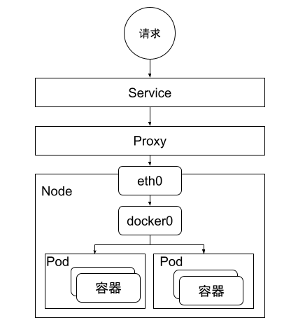
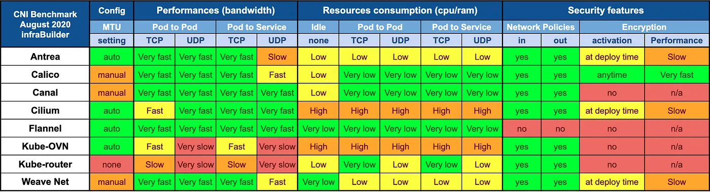

# 容器间通信模型

在 Docker、Kubernetes 之前，所有接触过 OpenStack 的人心里都有一个难以释怀的阴影，那就是网络问题。于是，后来者 kubernetes 明智地避开了这个“雷区”，把网络功能从容器运行时或者编排系统剥离出去，让更专业的提供商通过插件的设计实现。如此，把网络变成外部可扩展的功能，需要接入什么样的网络，设计一个对应的网络插件即可。

这一节，我们走进容器网络通信，去了解容器间通信的设计以及 Kubernetes 集群的网络模型定义。如果把 Pod 比作超亲密容器组。由亲密关系的远近，也带来以下几个以距离进行分类的容器通信模型。

- 同一个 Pod 内容器 A 与 容器 B 是如何通信
- 同一个 Node 中的 Pod 如何通信

**不同 Node 之间的 Pod 如何通信**

Kubernetes 的网络模型设计的一个基本原则，**每个 pod 都拥有一个独立的 IP 地址，而且假定所有的 Pod 都在一个可以直接联通的、扁平的网络空间中，不管它们是否运行在同一个 Node（宿主机）中，都可以直接通过对方的 IP 进行访问**。

	

## 网络插件生态

Kubernetes 本身不实现集群内的网络模型，而是通过将其抽象出来提供了 CNI 接口给第三方实现，只要最终的网络模型符合标准即可。这样一来节省了开发资源可以集中精力到 Kubernetes 本身，二来可以利用开源社区的力量打造一整个丰富的生态。现如今，支持 CNI 的插件多达二十几种，如下图所示[^1]。

	
	
CNI 网络插件 

以上几十种网络插件笔者不可能逐一解释，但跨主机通信不论形式如何变化，总归为以下几种。

- **Overlay 模式**：笔者在 VXLAN 篇已经介绍过 Overlay 网络通信的原理，这是一种虚拟的上层逻辑网络，其优点是不受底层网络限制，只要是三层网络互通，就能完成跨数据中心的网络互联，但弊端是数据封包、解包有一定的计算压力和网络延迟消耗。在一个网络受限的环境中（譬如不允许二层通信，只允许三层转发），那么就意味着只能使用 Overlay 模式网络插件。常见的 Overlay 模式网络插件有 Cilium（VXLAN 模式）、Calico（IPIP 模式）以及 Flannel（VXLAN）等。

- **三层路由**，主要是借助 BGP 等三层路由协议完成路由传递。这种方案优势是传输率较高，不需要封包、解包， 但 BGP 等协议在很多数据中心内部支持，设置较为麻烦。常见的路由方案网络插件有 Calico（BGP 模式）、Cilium（BGP 模式）。

此外，对于容器编排系统来说，网络并非孤立的功能模块，还要能提供各类的网络访问策略能力支持，譬如 Kubernetes 的 Network Policy 这种用于描述 Pod 之间访问这类 ACL 策略，明显不属于 CNI 范畴，因此并不是每个 CNI 插件都会支持 NetworkPolicy 声明。如果你有这方面的需求，那么 CNI 插件的选择第一个就要排除 Flannel 了。

CNI 插件性能方面，笔者引用 
Alexis Ducastel 发布的文章 《Benchmark results of Kubernetes network plugins (CNI) over 10Gbit/s network (Updated: August 2020)》的数据[^2]供你参考，此文中测试了不同 CNI 插件（Antrea、Calico、Canal、Cilium、Kube-router、Flannel、WeaveNet）在裸金属服务器之间，从 Pod to Pod、Pod to Service、网络策略以及加密影响等的通信表现。受限于篇幅，笔者给出文章的最后的测试结论，其结果如下图所示。

	

如果你只是一个小型节点集群，且不关心安全性，那么建议使用最轻最稳定的 Flannel。如果是一个标准化的集群，Calico 

[^1]: 参见 https://landscape.cncf.io/guide#runtime--cloud-native-network
[^2]: 参见 https://itnext.io/benchmark-results-of-kubernetes-network-plugins-cni-over-10gbit-s-network-updated-august-2020-6e1b757b9e49