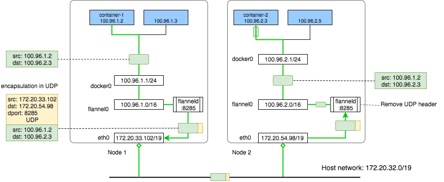
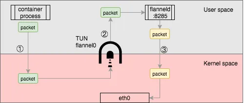

# 7.6 容器间通信模型

这一节，我们走进容器网络通信，了解容器间通信的逻辑以及 Kubernetes 集群的网络模型设计。

绝大部分分析跨主机网络的都选择 Flannel，这是因为 Flannel 它的组件能和本书前面铺垫的各类虚拟设备产品关联，它的设计也足够简单，

:::tip Flannel

Flannel 是 CoreOS 开发的容器网络解决方案。它支持三种网络模型 UDP、VXLAN、host-gw。
:::

## 7.6.1 overlay 模式

overlay 是虚拟的上层逻辑网络，其优点是不受底层网络限制，只要是三层网络互通，就能完成跨数据中心的网络互联，但弊端是数据封包、解包有一定的计算压力和网络延迟消耗。

Flannel 的 UDP 以及 VXLAN 模式都属于 overlay 网络。

### 1. UDP 模式
:::tip 注意
UDP 模式因为性能较差已经被弃用，但因为它的逻辑清晰简单，具有很好的教学价值，用来分析封包/解包、网络路由等跨主机通信过程十分合适。
:::

基于 Flannel 的 UDP 的跨主机通信基本逻辑如图所示。

:::center
  <br/>
  图 基于 Flannel UDP 模式的跨主机通信原理
:::

每个主机上，flannel 运行一个名为的守护进程 flanneld，它会在 Node 1 节点中创建如下路由规则：

```bash
admin@ip-172-20-33-102:~$ ip route
default via 172.20.32.1 dev eth0
100.96.0.0/16 dev flannel0  proto kernel  scope link  src 100.96.1.0
100.96.1.0/24 dev docker0  proto kernel  scope link  src 100.96.1.1
172.20.32.0/19 dev eth0  proto kernel  scope link  src 172.20.33.102
```

可以看到，Node1 中容器 container-1 的目的地（dst:100.96.2.3）跟第 1 条路由规则（100.96.0.0/16）精准匹配，因此，Linux 内核按照路由规则将这个 IP 数据包转发给 flannel0 设备。注意，flannel0 是由 flanneld:8252 创建的 TUN 设备。

:::tip TUN 设备

TUN 设备的原理请回顾本书 3.5.2 节，简单说 TUN 模拟了网络层设备，会将内核传递给它的 IP 报文再传送到与 TUN 设备关联的用户态程序。
:::

于是，TUN 设备 flannel0 将 IP 报文再传递给与它关联的应用程序 flanneld:8252。

flanneld:8252 收到 dst:100.96.2.3 的 IP 报文，从图我们知道 100.96.2.3 是 Node2 中的容器 IP，但 flanneld:8252 怎么知道发送到哪呢？

flanneld:8252 预先将容器子网与宿主机的对应关系保存在 etcd 中。

```bash
admin@ip-172-20-33-102:~$ etcdctl ls /coreos.com/network/subnets
/coreos.com/network/subnets/100.96.1.0-24
/coreos.com/network/subnets/100.96.2.0-24
/coreos.com/network/subnets/100.96.3.0-24
admin@ip-172-20-33-102:~$ etcdctl get /coreos.com/network/subnets/100.96.2.0-24
{"PublicIP":"172.20.54.98"}
```

如上所示，flanneld:8252 查询 etcd 了解到 100.96.2.3 与第一条匹配，100.96.2.0-24 子网对应的宿主机 PublicIP 为 172.20.54.98，也就是 Node2 节点。

现在，flanneld:8252 知道了目标宿主机地址，于是，它创建一个 UDP 数据包，以自己主机的 IP 作为源地址，Node2 的 IP 作为目标地址，并将原始的 IP 报文包装在 UDP 包内。

当 UDP 数据包达到目标主机 Node2 后，内核协议栈将数据包发送给 flanneld，然后 flanneld 获取 UDP 数据包的 payload，也就是源容器生成的原始 IP 数据包。接下来，flanneld 将 IP 报文发送给与它关联的 TUN 设备，接下来内核协议栈负责处理这个 IP 报文，根据路由表匹配到第 3 条记录，也就是要发送到 docker0 网桥。

```bash 
admin@ip-172-20-54-98:~$ ip route
default via 172.20.32.1 dev eth0
100.96.0.0/16 dev flannel0  proto kernel  scope link  src 100.96.2.0
100.96.2.0/24 dev docker0  proto kernel  scope link  src 100.96.2.1
172.20.32.0/19 dev eth0  proto kernel  scope link  src 172.20.54.98
```

接下来流程就简单了，实际就是 Linux Bridge 内部的通信。

容器通过网络二层发送 ARP 广播，正确的虚拟网卡（Veth）响应这个 ARP 报文，然后建立起 MAC 地址表，这和物理局域网内的通信没有差别。

最后，从上面的通信过程中，你能发现 UDP 模式有什么问题呢？

如下图所示，从原始容器进程发送数据包，因为使用了 TUN 设备，必须在用户空间和内核空间之间复制 3 次，产生严重的性能问题。

:::center
  <br/>
  图 TUN 设备在用户空间/内核空间来回复制
:::

现在，新版本的 flannel 已经弃用了 UDP 模式，推荐使用下面要介绍的 VXLAN 模式。

### 2. VXLAN 模式

:::tip VXLAN

VXLAN 的原理已在本书 3.5.4 详细介绍，就不再展开讨论了。

VXLAN 的设计思想是，在现有三层网络之上覆盖一层虚拟的、由内核 VXLAN 模块负责维护的二层网络，连接在这个 VXLAN 二层网络中的 Pod，就可以实现像在局域网内一样通信。

:::

与 UDP 模式 不同的是 VXLAN 操作的是二层数据帧，且对封装解封全部在内核中完成，没有用户空间/内核空间来回转换的损失。

发送端：在PodA中发起 ping 10.244.1.21 ，ICMP 报文经过 cni0 网桥后交由 flannel.1 设备处理。 flannel.1 设备是一个VXLAN类型的设备，负责VXLAN封包解包。 因此，在发送端，flannel.1 将原始L2报文封装成VXLAN UDP报文，然后从 eth0 发送。
接收端：Node2收到UDP报文，发现是一个VXLAN类型报文，交由 flannel.1 进行解包。根据解包后得到的原始报文中的目的IP，将原始报文经由 cni0 网桥发送给PodB。


当 Node 启动后加入 Flannel 网络后，Flanneld 会添加一条如下的路由规则。
```
[node1]# route -n
Kernel IP routing table
Destination     Gateway         Genmask         Flags Metric Ref    Use Iface
10.224.0.0      0.0.0.0         255.255.255.0   U     0      0        0 cni0
10.224.1.0      10.224.1.0      255.255.255.0   UG    0      0        0 flannel.1
```
上面这条路由的意思是，凡是发往 10.224.1.0/24 网段的 IP 报文，都需要经过 flannel.1 发出。并且下一跳的网关地址是 10.224.1.0。从图可以看出，10.224.1.0 正是 VETP 设备的 IP 地址。

当数据包到达 flannel.1 时，需要对其进行二层封装，它首先得知道源 MAC 地址以及目地 MAC 地址。

因为数据包从 flannel.1 虚拟网卡发出，因此源 MAC 地址为 flannel.1 的 MAC 地址。那目的地 MAC 地址，也就是 Node2 的 flannel.1 怎么获取的。

实际上这个地址已经由 fanneld 自动添加到 Node1 的路由表了，通过命令查看 10.244.1.0 对应的 MAC 地址。
```bash
[root@Node1 ~]# ip n | grep flannel.1
10.244.1.0 dev flannel.1 lladdr ba:74:f9:db:69:c1 PERMANENT # PERMANENT 表示永不过期
```
上面的记录为 IP 地址 10.244.1.0 对应的 MAC 地址是 ba:74:f9:db:69:c1。

要注意的是，这里 ARP 表并不是通过 ARP 学习得到的，而是 flanneld 预先为每个节点设置好的，由 flanneld 负责维护，没有过期时间。

有了上面的信息，flannel.1 就可以构造出内层的 2 层以太网帧了。

接着，VXLAN 模块继续进行 UDP 封装，要进行 UDP 封装，就要知道四元组信息：源IP、源端口、目的IP、目的端口。
- 首先是目的端口，Linux 内核中默认为 VXLAN 分配的 UDP 监听端口为 8472
- 源端口是根据封装的内部数据帧做一个哈希值得到
- 接下来是目的IP

:::tip FDB 表
FDB表（Forwarding database）用于保存二层设备中 MAC 地址和端口的关联关系，就像交换机中的 MAC 地址表一样。在二层设备转发二层以太网帧时，根据FDB表项来找到对应的端口。例如 cni0 网桥上连接了很多 veth pair 网卡，当网桥要将以太网帧转发给 Pod 时，FDB 表根据 Pod 网卡的 MAC 地址查询 FDB 表，就能找到其对应的 veth 网卡，从而实现联通。
:::

使用 bridge fdb show 查看 FDB 表。
```bash
[root@Node1 ~]# bridge fdb show | grep flannel.1
ba:74:f9:db:69:c1 dev flannel.1 dst 192.168.50.3 self permanent
```

至此，flannel.1 已经得到了所有完成 VXLAN 封包所需的信息，最终通过 eth0 发送一个 VXLAN UDP 报文，后面的过程和本机的UDP程序发包没什么区别。

当数据包到达Peng03的8472端口后（实际上就是VXLAN模块），VXLAN模块就会比较这个VXLAN Header中的VNI和本机的VTEP（VXLAN Tunnel End Point，就是flannel.1）的VNI是否一致，然后比较Inner Ethernet Header中的目的MAC地址与本机的flannel.1是否一致，都一致后，则去掉数据包的VXLAN Header和Inner Ethernet Header，然后把数据包从flannel.1网卡进行发送。

然后，在 Node2 节中上会有如下的路由（由 flanneld 维护），根据路由判断要把数据包发送到 cni0 网卡上。

```bash
[root@peng03 ~]# route -n
Kernel IP routing table
Destination     Gateway         Genmask         Flags Metric Ref    Use Iface
...
172.26.1.0      0.0.0.0         255.255.255.0   U     0      0        0 cni0
```

## 7.6.3 三层路由模式

## 7.6.4 underlay 模式

underlay 模式就是 2 层互通的底层网络，传统网络大多数属于这种类型。

容器网络使用这种组网，常使用的技术就有 IPVLAN（L2 模式）和 MACVLAN。这种模式所配置的容器网络同主机网络在同一个 LAN 里面，可以具有和主机一样的网络能力，并且没有其它诸如 bridge 等方式带来的 bridge 处理和地址翻译的负担。

underlay 模式的跨主机通信，能最大限度的利用硬件的能力，往往有着**最优先的性能表现**，但也由于它直接依赖硬件和底层网络环境限制，必须根据软硬件情况部署，没有 overlay 那样开箱即用的灵活性。

## 7.6.5 网络插件生态

Kubernetes 本身不实现集群内的网络模型，而是通过将其抽象出来提供了 CNI 接口由更专业的第三方提供商实现，如此，把网络变成外部可扩展的功能，需要接入什么样的网络，设计一个对应的网络插件即可。这样一来节省了开发资源可以集中精力到 Kubernetes 本身，二来可以利用开源社区的力量打造一整个丰富的生态。现如今，支持 CNI 的插件多达二十几种，如下图所示[^1]。

<div  align="center">
	
	<p>CNI 网络插件 </p>
</div>

上述几十种网络插件笔者不可能逐一解释，但跨主机通信不论形式如何变化，总归为以上的三种类型（overlay、三层路由、underlay）。


对于插件性能表现方面，笔者引用 cilium 官方的测试数据[^2]，受限于篇幅，笔者给出文章内一部分性能占用表现（运行 32 个并行的 netperf 进程，按 TCP-CRR 的策略测试 cilium 与 Calico 的每秒请求数以及资源占用情况），其结果如下图所示。

:::tip TCP-CRR
表示在一次 TCP 链接中只进行一组Request/Response 通信即断开
:::

<div  align="center">
	
	<p>性能表现</p>
</div>
<div  align="center">
	
	<p>资源占用表现</p>
</div>

从结果上看，综合吞出量、延迟表现或者资源占用的表现 Cilium 无疑非常出色。


最后，考虑对于容器编排系统来说，网络并非孤立的功能模块，还要能提供各类的网络访问策略能力支持，譬如 Kubernetes 的 Network Policy 这种用于描述 Pod 之间访问这类 ACL 策略以及加密通信，这些明显不属于 CNI 范畴，因此并不是每个 CNI 插件都会支持这些额外的功能。如果你有这方面的需求，那么第一个就要排除 Flannel 了，如果按功能的丰富度而言，受到广泛关注的无疑是 Calico 和 Cilium。

且刨除网络受限环境的影响，假设所有的 CNI 插件我们都可以选择：
- 如果只是一个小型节点集群，且不关心安全性，那么建议使用最轻最稳定的 Flannel；
- 如果是一个标准化的集群，且看中 CNI 之外的功能（譬如可观测、Network Policy、加密通信），建议就选择势头正劲的 Cilium。

[^1]: 参见 https://landscape.cncf.io/guide#runtime--cloud-native-network
[^2]: 参见 https://cilium.io/blog/2021/05/11/cni-benchmark/