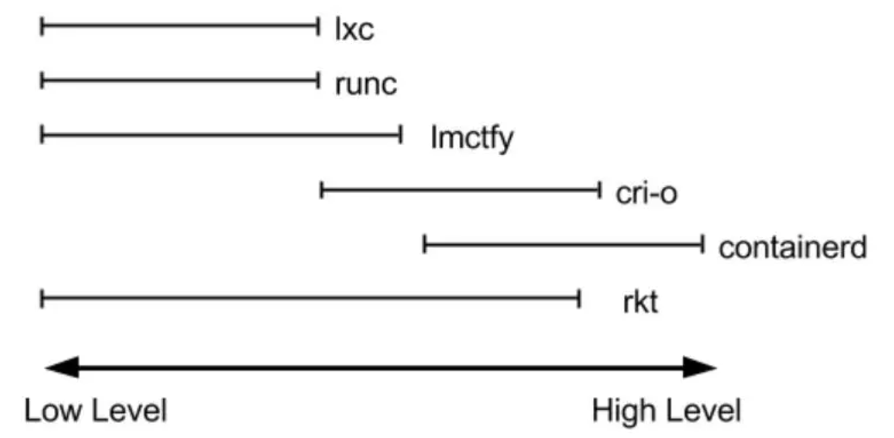
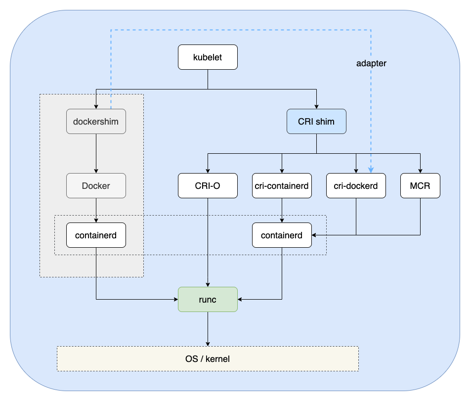

# 容器标准化 OCI

2013年，Docker 公司发布 Docker 开源项目，提供了一系列简便的工具链来使用容器。

毫不夸张地说，Docker 公司率先点燃了容器技术的火焰，拉开了云原生应用变革的帷幕，促进容器生态圈一日千里地发展。后续随着 IaaS、PaaS 和 SaaS 等云平台逐渐成熟，用户对云端应用开发、部署和运维的效率不断重视, 2015年，容器行业标准项目 OCI 作为 Linux 基金会项目成立，旨在推动开源技术社区制定容器镜像和运行时规范，使不同厂家的容器解决方案具备互操作能力。同年还成立了 CNCF，目的是促进容器技术在云原生领域的应用，降低用户开发云原生应用门槛

容器技术已经进入了百花齐放的时代。

## OCI

OCI（Open Container Initiative，开放容器计划），是在 2015 年由 Docker、CoreOS 等公司共同成立的项目，并由 Linux 基金会进行管理，致力于围绕容器格式和运行时创建开放的行业标准。

OCI 目前提出的规范有如下：

- Runtime Specification	
- Image Format	
- Distribution Specification	

image 规范对镜像格式、打包(Bundle)、存储等进行了定义。runtime 是对镜像运行时的规范，它定义了利用镜像的Artifact在不同的平台上运行容器的标准流程。在 OCI 标准下，运行一个容器的过程就是下载一个 OCI 的镜像，将其解压到某个 Filesystem Bundle 中，然后某个 OCI Runtime 就会运行这个 Bundle。

而 Distribution Specification 则是镜像分发的规范，该规范用于标准化镜像的分发标准，使 OCI 的生态覆盖镜像的全生态链路，从而成为一种跨平台的容器镜像分发标准。例如，Docker的官方镜像仓库distribution就是一个符合分发规范的Registry，同理，腾讯软件源所使用的Harbor也是符合分发规范的仓库。

## Container Runtime

对于 runtime 其中一个理解是：“为了运行特定语言而提供的特定实现和设计”，再具体到 container runtime ，就是容器整个生命周期的设计和实现。容器运行时相当复杂，每个运行时都涵盖了从低级到高级的不同部分，如下图所示：

	

以 docker 为例，其作为一个整体的container runtime 系统，主要提供的功能如下：

- 制定容器镜像格式
- 构建容器镜像
- 运行容器
- ...

目前较为流行的说法是将容器运行时分成了 low-level 和 high-level 两类，通常只关注正在运行的容器的实际Container Runtime通常称为“low-level container runtime”。支持更多高级功能（如镜像管理和gRPC/Web API）的运行时通常称为“high-level container runtimes”。

实际应用中，low-level container runtime 和high-level container runtime 如下图所示，按照各自的分工，协作完成容器管理的工作。

	

其实high-level container runtime 是通过不同 shim 对接不同的low-level container runtime。比如 containerd 对接 kata-runtime：

	

### Low-level runtime

low-level container runtime 从原理上来讲是用linux namespace实现命名空间的隔离、资源的虚拟化和用cgroup来实现资源的使用控制。
所以一个最基本的low-level容器运行时需要做的包括：

- Create cgroup
- Run command(s) in cgroup
- Unshare to move to its own namespaces
- Clean up cgroup after command completes (namespaces are deleted automatically when not referenced by a running process)

最最简单的一个运行时就是把容器文件放到一个文件夹里面，用chroot控制文件访问，再把cgroups，还有namespace创建好，就算是实现隔离了。

典型的low level runtime实现有：lmctfy，runc，rkt

### High-level runtime

low-level container runtime负责实际运行容器，而high-level container runtime负责容器映像的传输和管理，解压缩映像，然后传递到低级运行时以运行容器。

高级运行时提供了守护程序应用程序和API，远程应用程序可使用它们来逻辑运行容器并对其进行监视，但是它们位于底层并委托低级运行时或其他高级运行时进行实际工作。

目前主流的 high-level runtime 有：

- docker  (docker 亦可称为 high-high-level runtime)
- containerd
- podman

## CRI shim

当前实现了 CRI 的 remote shim 有如下：

- containerd：由 Docker 公司创建，并且在 2017 年捐赠给了 CNCF，2019 年毕业。
- CRI-O：基于 OCI 规范的作为 CRI 和 OCI 之间的一座桥梁。
- Docker Engine：Docker 运行时的支持，由 cri-dockerd 进行实现。
- Mirantis Container Runtime：Docker 企业版(Enterprise Edition) 运行时的支持，由 Mirantis Container Runtime(MCR) 进行实现。

	

