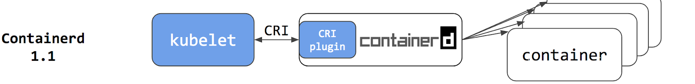
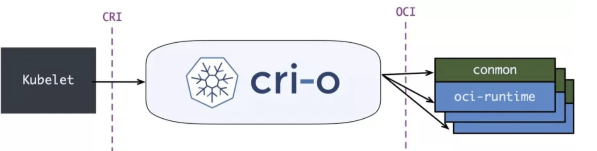

# 目前流行的运行时 containerd

## CRI plugin

虽然取消了 dockershim， 但是这仍然多了一个独立的 daemon，从 containerd 1.1 开始，社区选择在 containerd 中直接内建 CRI plugin，通过方法调用来进行交互，从而减少一层 gRPC 的开销，最终的容器启动流程如下：

	

containerd 内置的 CRI 插件实现了 Kubelet CRI 接口中的 Image Service 和 Runtime Service，通过内部接口管理容器和镜像，并通过 CNI 插件给 Pod 配置网络。最终的结果是 Kubernetes 的 Pod 启动延迟得到了降低，CPU 和内存占用率都有不同程度的降低。

	

但是这还不是终点，为了能够直接对接 OCI 的 runtime 而不是 containerd，社区孵化了 CRI-O 并加入了 CNCF。

CRI-O 的目标是让 kubelet 与运行时直接对接，减少任何不必要的中间层开销。CRI-O 运行时可以替换为任意 OCI 兼容的 Runtime，镜像管理，存储管理和网络均使用标准化的实现

	

