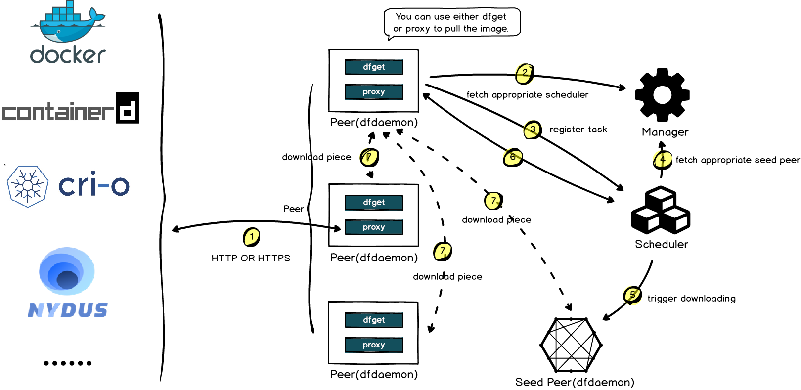

# 7.6.2 镜像分发加速方案 Dragonfly

容器云平台达到一定规模之后，镜像分发就可能成为整个平台的性能瓶颈。举例说明：在生产实践中，较大尺寸的容器镜像有多方面的问题，其一影响容器启动效率，其二在应对瞬时高峰启动几百、几千 Pod 时，受带宽、镜像仓库服务瓶颈等影响，会存在较长的耗时，有时候甚至流量高峰已过，集群还没有扩展完毕。

Dragonfly 则是解决此类容器镜像资源管理和分发瓶颈的方案。

## 1. Dragonfly 介绍

Dragonfly 是阿里巴巴开源的容器镜像分发系统，旨在解决容器镜像分发效率低下和镜像共享依赖公共镜像仓库等问题。Dragonfly 的核心思想是基于 P2P 的镜像分发模型，以提高镜像传输速度和并发性，减少公共镜像仓库的依赖。

Dragonfly 的主要特点和优势如下：

- 快速分发：利用 P2P 技术进行镜像分发，提高传输速度和并发性，支持自动发现、下载和缓存镜像。
- 高效存储：支持镜像存储中心的横向扩展和透明级联，提供高可用和高扩展性的镜像存储方案。
- 安全性：支持私有部署和访问权限管理，保证镜像传输和存储的安全性。
- 易于部署：支持多种部署方式，如二进制包、容器和 Kubernetes Operator 等，方便快速部署和集成。

## 2. Dragonfly 运作流程

Dragonfly 是一种无侵入的解决方案，并不需要修改 Docker 等源码，下图为 Dragonfly 的架构图，在每一个节点上会启动一个 dfdaemon 和 dfget, dfdaemon 是一个代理程序，他会截获 dockerd 上传或者下载镜像的请求，dfget 是一个下载客户端工具。每个 dfget 启动后 将自己注册到 supernode 上。supernode 超级节点以被动 CDN 的方式产生种子数据块，并调度数据块分布。

	

通过镜像加速下载的场景，解析其中运作原理：

- dfget-proxy 拦截客户端 docker 发起的镜像下载请求（docker pull）并转换为向 SuperNode 的 dfget 下载请求。
- SuperNode 从镜像源仓库下载镜像并将镜像分割成多个 block 种子数据块。
- dfget 下载数据块并对外共享已下载的数据块，SuperNode 记录数据块下载情况，并指引后续下载请求在结点之间以 P2P 方式进行数据块下载。
- dfdaemon 将将镜像分片文件组成完整的镜像。