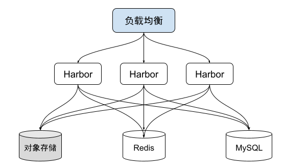

# 7.6.1 开源企业级镜像仓库 Harbor

Harbor 是一款开源的企业级开源镜像仓库软件，在镜像管理和存储方面提供了一种高效、安全、可靠的方式。它最初是由 VMware 公司在 2014 年推出，目前已成为 CNCF 的孵化项目。

Harbor 的架构模块化、高可用性、可扩展性强，很容易和其它应用集成，同时支持私有云和公有云等多种部署方式。它被广泛应用于企业内部构建、测试和部署容器镜像，加强了镜像的可管理性和安全性。

Harbor 主要功能包括：

- 注册中心：支持 Docker V2 镜像协议，管理和存储镜像，提供镜像下载和推送功能。
- 安全扫描：提供漏洞扫描和镜像签名等安全功能，确保镜像的安全性。
- 权限控制：提供用户和团队的访问控制和角色管理，确保镜像的安全和合规性。
- 存储管理：提供基于存储策略的自动清理和存储管理功能，节省存储资源。
- 远程复制：提供将镜像库同步到远程镜像库的功能，方便多地点使用和备份。

## 1. Harbor 高可用部署

Harbor 支持高可用部署，将多个 Harbor 和负载均衡集成，每一个 Harbor 通过对接 MySQL/Postgres、Redis 共享集群元数据，镜像仓库对接对象存储，从而将 Harbor 镜像仓库做成高可用的无状态服务。

	

## 2. Harbor 特点：镜像复制

Harbor 一个亮点是它的镜像复制功能，在多机房部署场景中，镜像需要在多个镜像仓库之间相互复制，Harbor 提供了多个镜像仓库复制的功能， 用户可以选择某个项目复制到指定远程仓库，触发模式包括手动、定时、和即刻。

Harbor 的镜像复制基于 Docker Registry API，内容通过状态机维护镜像推送状态。首先通过本地仓库 API 获取镜像元数据 manifest，从而获取分层的 Hash，校验镜像分层是否已经存在在远程仓库，如果不存在，则推送到远程仓库，最后上传元数据，完成镜像推送。