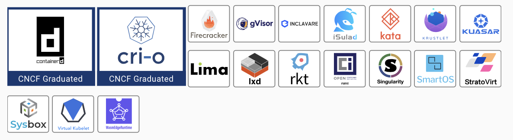
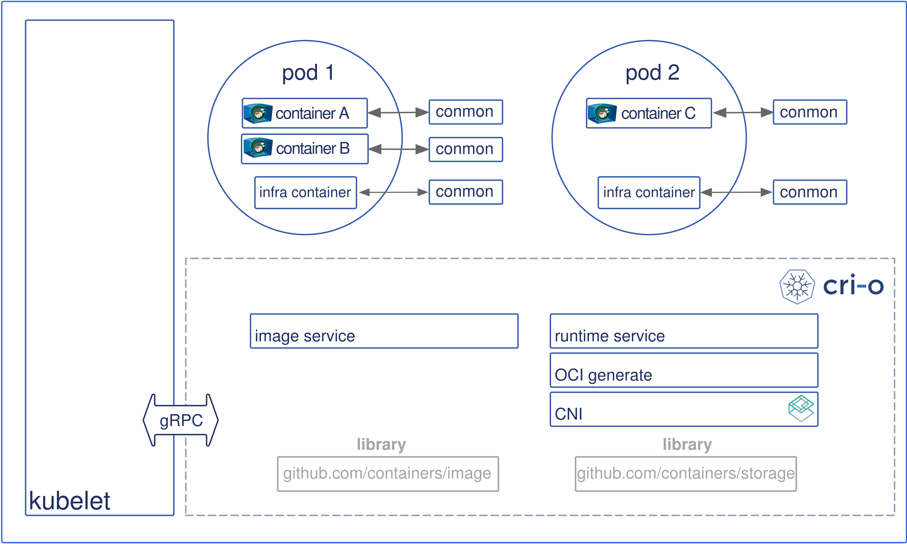

# 7.5.2 高层容器运行时

当引入 Kubernetes 容器编排时，为实现对接各类容器运行时，Kubernetes 在容器编排的角度上抽象了容器运行时的高级规范：也就是 CRI（Container Runtime Interface），与 OCI 运行时不同，实现 CRI 规范的运行时功能包括镜像管理和分发，存储，快照，网络等。

目前主流的高层容器运行时有 Dockershim、containerd 、CRI-O 等。

	

## 1. 工业级标准容器运行时 containerd

containerd 是一个从 Docker 项目中分离出来的高层运行时，符合 CRI 规范。默认情况下，底层是 runc。作为一个轻量级的容器运行时，containerd 旨在嵌入到更大的系统中，containerd 在 Docker 嵌入使用，也可以与 Kubernetes、Swarm 等容器编排工具集成使用，

	
containerd 在 Kubernetes 中的关系

	

## 2. Kubernetes 专用容器运行时 CRI-O

CRI-O 是由 Redhat 发起并专为 Kubernetes 设计容器运行时。 CRI-O 目标是让 kubelet 与运行时直接对接，减少任何不必要的中间层开销。由于 CRI-O 是 Kubernetes 社区开发的项目之一，因此它得到了广泛的社区支持和贡献。与其他运行时相比，CRI-O 在 Kubernetes 环境中无缝集成，同时提供更高的灵活性和稳定性。

	
CRI-O 架构图

	

CRI-O 的特点包括：

- 支持 OCI 容器格式标准。
- 具有高度自定义和可配置的设计，可以根据需要添加插件。
- 默认情况下支持 Pod 及其中的多个容器。
- 可以使用 CNI 来配置网络。
- 执行速度快，内存占用小，在安全性、稳定性等方面具有优势。

