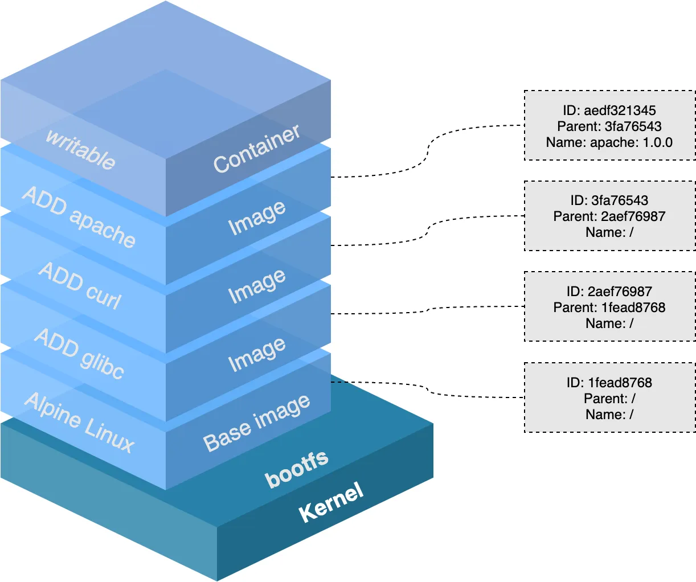
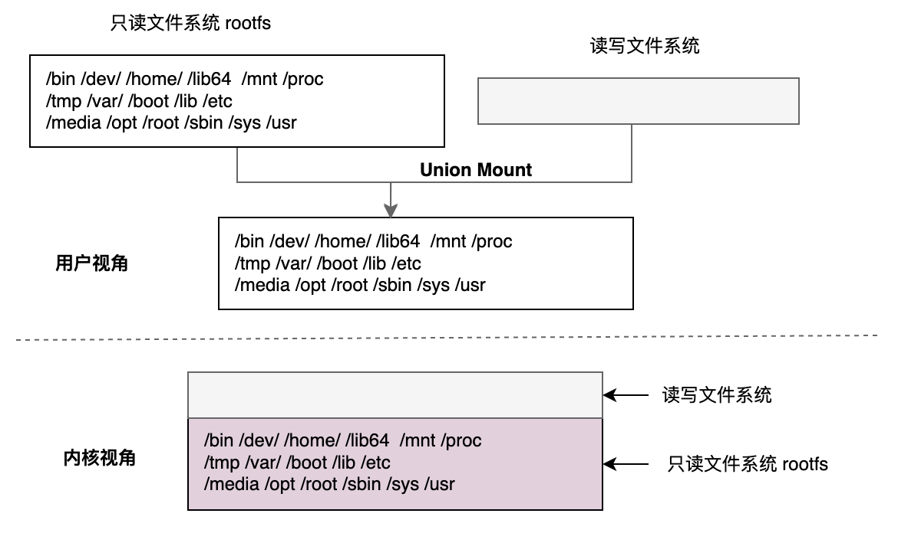

# 容器镜像

在 OCI 标准镜像规范出台之前，有两套广泛使用的镜像规范，分别是 appc 和 docker v2，OCI 组织在 docker v2 的基础上推出了 OCI image spec。OCI image spec 标准的宗旨概括来说就是不受上层结构的绑定，如特定的客户端、编排栈等，同时也不受特定的供应商或项目的绑定，即不限于某种特定操作系统、硬件、CPU 架构、公有云等。

runtime-spec 和 image-spec 两个规范通过 OCI runtime filesytem bundle 的标准格式连接在一起，OCI 镜像通过工具转换成 bundle，然后 OCI 容器引擎能够识别这个 bundle 来运行容器


## OCI 镜像标准规范

OCIv1 镜像主要包括以下几块内容：

- Image Manifest：提供了镜像的配置和文件系统层定位信息，可以看作是镜像的目录，文件格式为 json 。
- Image Layer Filesystem Changeset：序列化之后的文件系统和文件系统变更，它们可按顺序一层层应用为一个容器的 rootfs，因此通常也被称为一个 layer（与下文提到的镜像层同义），文件格式可以是 tar ，gzip 等存档或压缩格式。
- Image Configuration：包含了镜像在运行时所使用的执行参数以及有序的 rootfs 变更信息，文件类型为 json。


<div  align="center">
	
</div>


使用 skopeo 工具，将 Docker 中 redis 镜像转换为 OCI 镜像

```
skopeo --override-os linux copy docker://redis oci:redis
```

我们查看 redis 的OCI 镜像目录

```
$ tree redis
.
├── blobs
│   └── sha256
│       ├── 08769906aa59a6b44a9adc62fc0e0679e3448eaab13317401034f390435c14bf
│       ├── 376e1ba47d221972f7eb9dd659c50d8e42bcfd0e58382d755794a23a8b80976a
│       ├── 37e84c7a626f560a60b27167c9fa9e6c983d3edf548d84419ab018191dc37ae1
│       ├── 635073d8ccd5742db583464e12fc522108ebbe64081f03326fcdf1d6afd1ce5b
│       ├── 806c192e03757340ba67f7ba9b03152f70324d86b62f0d691f53d16438a5f6cf
│       ├── 8db26c5e84351f9ea1f32f57b0c6073bd96d345f3f21574b64e787a725d50f72
│       ├── 94e8d834f31956b2a827b6abb6631bc43c5a3c3402a59f509a30e6762e83deb3
│       └── f03b40093957615593f2ed142961afb6b540507e0b47e3f7626ba5e02efbbbf1
├── index.json
└── oci-layout
```

OCI 镜像的规范是在 Docker image 基础上建立的，相似性很大，我们查看具体的内容。

### oci-layout

oci-layout 是 OCI image的布局文件，主要说明它所遵循的镜像规范标准。

```
$ cat oci-layout | jq
{
  "imageLayoutVersion": "1.0.0"
}
```
此处可以看到，该镜像遵循的标准为 OCI 1.0.0 布局规范。

### index.json

```
$ cat index.json | jq 
{
  "schemaVersion": 2,
  "manifests": [
    {
      "mediaType": "application/vnd.oci.image.manifest.v1+json",
      "digest": "sha256:376e1ba47d221972f7eb9dd659c50d8e42bcfd0e58382d755794a23a8b80976a",
      "size": 1186
    }
  ]
}
```
从它的内容可以看到 mediaType 和 Docker image 类型形式相似，只不过 docker 换成了 oci。 从这个配置中，看到第一个 blob 是 sha256:376e1ba47d221972f7eb9dd659c50d8e42bcfd0e58382d755794a23a8b80976a。


这个入口文件描述了 OCI 镜像的实际配置和其中 Layer的 信息，如果有多层，那么layers 也会相应增加，我们看看它的内容

```
$ cat blobs/sha256/376e1ba47d221972f7eb9dd659c50d8e42bcfd0e58382d755794a23a8b80976a | jq
{
  "schemaVersion": 2,
  "mediaType": "application/vnd.oci.image.manifest.v1+json",
  "config": {
    "mediaType": "application/vnd.oci.image.config.v1+json",
    "digest": "sha256:94e8d834f31956b2a827b6abb6631bc43c5a3c3402a59f509a30e6762e83deb3",
    "size": 6587
  },
  "layers": [
    {
      "mediaType": "application/vnd.oci.image.layer.v1.tar+gzip",
      "digest": "sha256:f03b40093957615593f2ed142961afb6b540507e0b47e3f7626ba5e02efbbbf1",
      "size": 31403586
    },
    {
      "mediaType": "application/vnd.oci.image.layer.v1.tar+gzip",
      "digest": "sha256:8db26c5e84351f9ea1f32f57b0c6073bd96d345f3f21574b64e787a725d50f72",
      "size": 1733
    },
    ...
  ]
}
```

其中，layers mediaType 使用了 application/vnd.oci.image.layer.v1.tar+gzip，说明内容经过可 gzip 压缩。

我们解压第一层，我们会发现是一个 rootfs，这也印证了我们前面所说 镜像的本质。

```
$ tar xzvf f03b40093957615593f2ed142961afb6b540507e0b47e3f7626ba5e02efbbbf1 -C test

$ cd test && ls 
bin	dev	home	lib64	mnt	proc	run	srv	tmp	var
boot	etc	lib	media	opt	root	sbin	sys	usr
```

<div  align="center">
	
</div>


镜像 layer 机制可以体现在以下方面：

- 拉取更快：因为分层了，只需拉取本地不存在的层即可！
- 存储更少：因为共同的层只需存储一份即可！
- 运行时存储更少：容器运行时可以共享相同的层！


