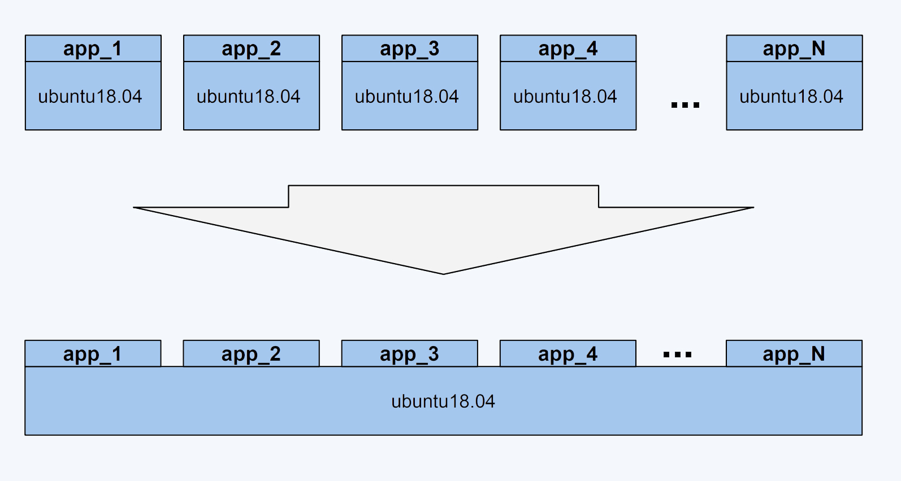
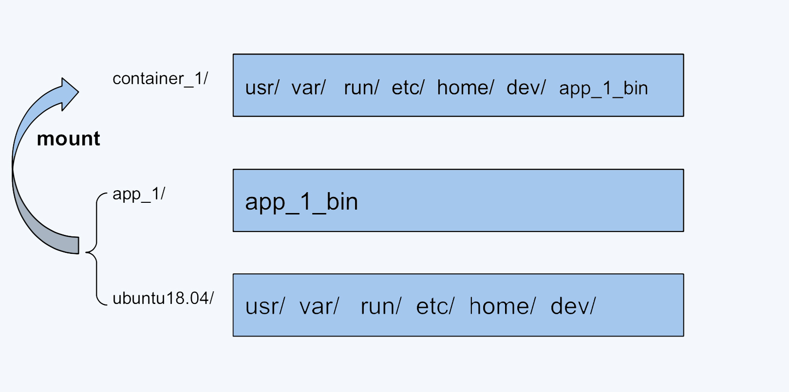
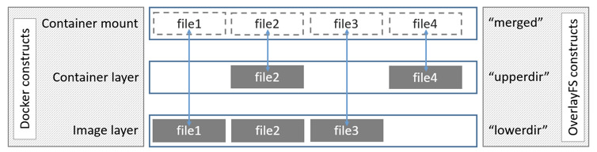
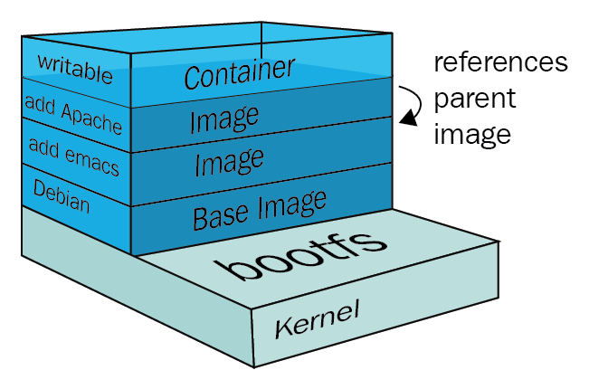

# 7.3 容器镜像的原理与生态

对于 Docker 一类的容器来说，它最核心的原理实际上就以下三点：

- 创建一个新的 mount namespace
- 在新的 mount namespace 中，挂载需要的文件系统。例如 /etc、/bin、/proc
- 使用 chroot 系统调用将进程的根目录更改为新的根目录

挂载在容器根目录用来为容器进程提供隔离后执行环境的文件系统，就是所谓的“容器镜像”，它还有一个更为专业的名字 —— rootfs（根文件系统）。rootfs 打包了包含应用在内的整个操作系统文件和目录，这也意味着其运行的所有依赖都封装在了一起，进而提供了容器最关键的特性 —— 本地云端一致性。


:::tip 额外知识

需要明确的是，Linux 操作系统中只有开机启动时会加载指定版本的内核镜像，因此 rootfs 只是一个操作系统包含的文件、目录，并不包含操作系统内核。

因此，同一台宿主机上所有的容器，都共享宿主机操作系统的内核。如果应用程序需要配置内核参数、加载内核模块、与内核进行交互，那么是有很大风险的，这也是容器相比虚拟机主要的缺陷之一。

:::

## 镜像的问题

我们知道虚拟机需要 iso 镜像才能启动，而容器也需要一个镜像才能启动，并且是从远端仓库 pull 到宿主机。

假设一个 ubuntu:18.04 镜像文件的大小是 500MB，那么 100 个容器的话，就需要下载 `500MB*100= 50GB` 的文件，并且占用 50GB 的磁盘空间。想象下载 几百 MB 甚至 几Gb 的镜像，从下载到启动需要多少时间，如果是这样，容器编排的弹性、灵活性也就成了空谈。


讲到这里，并不难推测出理想的情况应该是什么样的？

没错，当然是在一个宿主机上只要下载并且存储存一份”ubuntu:18.04”，所有基于”ubuntu:18.04”镜像的容器都可以共享这一份通用的部分。这样设置的话，不同容器启动的时候，只需要下载自己独特的程序部分就可以。就像下面这张图展示的这样。

<div  align="center">
  
</div>

正是为了有效地减少磁盘上冗余的镜像数据，同时减少冗余的镜像数据在网络上的传输，选择一种针对于容器的文件系统是很有必要的，而这类的文件系统被称为 UnionFS（联合文件系统）。


## UnionFS 的原理


UnionFS 这类文件系统实现的主要功能是把多个目录（处于不同的分区）一起挂载（mount）在一个目录下。这种多目录挂载的方式，正好可以解决我们刚才说的容器镜像的问题。

例如，我们可以把 ubuntu18.04 这个基础镜像的文件放在一个目录 ubuntu18.04/ 下，容器自己额外的程序文件 app_1_bin 放在 app_1/ 目录下。然后，我们把这两个目录挂载到 container_1/ 这个目录下，作为容器 1 看到的文件系统；对于容器 2，就可以把 ubuntu18.04/ 和 app_2/ 两个目录一起挂载到 container_2 的目录下。这样在节点上我们只要保留一份 ubuntu18.04 的文件就可以了。

<div  align="center">
  
</div>

UnionFS 类似的有很多种实现，比如 OverlayFS、Btrfs 等。在 Linux 内核 3.18 版本中，OverlayFS 代码正式合入 Linux 内核的主分支。在这之后，OverlayFS 也就逐渐成为各个主流 Linux 发行版本里缺省使用的容器文件系统了。

OverlayFS 工作时由四个目录组成：

- lowerdir：只读层，该层无法修改，可以指定多个 lower
- upperdir：读写层，容器数据修改保存的地方
- merged：最终呈现给用户的目录。
- workdir：工作目录，指 OverlayFS 工作时临时使用的目录，保证文件操作的原子性，挂载后会被清空


使用 mount 命令即可将 lower、upper 挂载到 merged。

```
mount -t overlay overlay -o lowerdir=lower1:lower2:lower3,upperdir=upper,workdir=work merged_dir
```

例子来理解一下OverlayFS的一些基本概念

```
#!/bin/bash

umount ./merged
rm upper lower merged work -r

mkdir upper lower merged work
echo "I'm from lower!" > lower/in_lower.txt
echo "I'm from upper!" > upper/in_upper.txt
# `in_both` is in both directories
echo "I'm from lower!" > lower/in_both.txt
echo "I'm from upper!" > upper/in_both.txt

sudo mount -t overlay overlay \
 -o lowerdir=./lower,upperdir=./upper,workdir=./work \
 ./merged

```

在OverlayFS中，最底下这一层里的文件是不会被修改的，你可以认为它是只读的。

然后我们看”uppder/“，它是被mount两层目录中上面的这层 （upperdir）。在OverlayFS中，如果有文件的创建，修改，删除操作，那么都会在这一层反映出来，它是可读写的。

接着是最上面的”merged” ，它是挂载点（mount point）目录，也是用户看到的目录，用户的实际文件操作在这里进行。


<div  align="center">
  
</div>


从挂载点的视角看，upper层的文件会覆盖lower层的文件，比如”in_both.txt”这个文件，在lower层和upper层都有，但是挂载点merged/里看到的只是upper层里的in_both.txt.

如果我们在merged/目录里做文件操作，具体包括这三种

- 新建，这个文件会出现在upper/ 目录中
- 删除
	- 如果我们删除”in_upper.txt”，那么这个文件会在upper/目录中消失
	- 如果删除”in_lower.txt”, 在 lower/目录里的”in_lower.txt”文件不会有变化，只是在 upper/目录中增加了一个特殊文件来告诉OverlayFS，”in_lower.txt’这个文件不能出现在merged/里了，这就表示它已经被删除了。
- 修改文件：类似如果修改”in_lower.txt”，那么就会在upper/目录中新建一个”in_lower.txt”文件，包含更新的内容，而在lower/中的原来的实际文件”in_lower.txt”不会改变


## Docker 镜像的设计

```
$ docker run -d ubuntu:latest sleep 3600
$ docker image inspect ubuntu:18.04

...
 "GraphDriver": {
            "Data": {
                "MergedDir": "/var/lib/docker/overlay2/93873a3eea1d0f99d78445324c9c2997e17769e5de13ba45da2f5d6c9fbe325d/merged",
                "UpperDir": "/var/lib/docker/overlay2/93873a3eea1d0f99d78445324c9c2997e17769e5de13ba45da2f5d6c9fbe325d/diff",
                "WorkDir": "/var/lib/docker/overlay2/93873a3eea1d0f99d78445324c9c2997e17769e5de13ba45da2f5d6c9fbe325d/work"
            },
            "Name": "overlay2"
        },

...
```

可以看到，这个 Ubuntu 镜像，实际上由五个层组成。这五个层就是五个增量 rootfs，每一层都是 Ubuntu 操作系统文件与目录的一部分；而在使用镜像时，Docker 会把这些增量联合挂载
在一个统一的挂载点上（等价于前面例子里的“/C”目录）。


Docker 公司在实现 Docker 镜像时并没有沿用以前制作 rootfs 的标准流程，而是做了一个小小的创新：layer(层)的设计。

从系统的 mounts 信息中，我们可以看到 Docker 是怎么用 OverlayFS 来挂载镜像文件的。

```
$ docker run -t -i ubuntu:18.04 /bin/bash
$ mount | grep overlay
overlay on / type overlay (rw,relatime,lowerdir=/var/lib/docker/overlay2/l/JZMUXNSLJE4FSS65BZWNG7WPP5:/var/lib/docker/overlay2/l/JG3646DAO4GDQ3LNCDUCDURN7L,upperdir=/var/lib/docker/overlay2/db2403496d5f6f0d8140a08dc23c9b9697ad5d02d578fd87ddacde45d613fe9c/diff,workdir=/var/lib/docker/overlay2/db2403496d5f6f0d8140a08dc23c9b9697ad5d02d578fd87ddacde45d613fe9c/work)

```

容器镜像文件可以分成多个层（layer），每层可以对应 OverlayFS 里 lowerdir 的一个目录，lowerdir 支持多个目录，也就可以支持多层的镜像文件。在容器启动后，对镜像文件中修改就会被保存在 upperdir 里了。


<div  align="center">
  
</div>


如此，Docker 镜像 分发更快、存储更少、加载更快。


之前讲到的 OCI 镜像规范 oci image format spec，规定了对于符合规范的镜像，允许开发者只要对容器打包和前面一次，就可以在所有的容器引擎中运行该容器。

镜像层和运行时配置各自有一个唯一 Hash，这些 Hash 会被写进一个叫 Manifest 的 JSON 文件里，在 Pull 镜像时实际就是先拉取 Manifest 文件，然后再根据 Hash 去 Registry 拉取对应的镜像层/容器运行时配置。

<div  align="center">
  
</div>

## 镜像启动加速

SUSE 的工程师 Aleksa Sarai 也专门写过一篇文章 来讨论这个话题，除了 tar 格式本身的标准化问题外，大家对当前的镜像的主要不满集中在

- **内容冗余**：不同层之间相同信息在传输和存储时都是冗余内容，在不读取内容的时候无法判断到这些冗余的存在。
- **无法并行**：单一层是一个整体，对同一个层既无法并行传输，也不能并行提取。
- **无法进行小块数据的校验** 只有完整的层下载完成之后，才能对整个层的数据做完整性校验。

上述这些问题核心是镜像的基本单位是 layer。但实际上，容器的运行整个镜像并不会被充分利用，然而，镜像的数据的实际使用率是很低的，Cern 在《Making containers lazy with Docker and CernVM-FS》的论文中就提到[^2]，一般镜像只有 6% 的内容会被实际用到。为了解决上面这些问题，我们就考虑实现一种新型的镜像结构，对镜像存储利用率、启动速度等更进一步优化，而这些就是 Nydus 要做的工作。


Nydus 是阿里云发起的基于延迟加载原理的镜像加速项目，配合 Dragonfly 做 P2P 加速，能够极大缩短镜像下载时间、提升效率，从而让用户能够更安全快捷地启动容器应用。

Nydus 提供了容器镜像按需加载的能力，在生产环境支撑了每日百万级别的加速镜像容器创建，在启动性能，镜像空间优化，端到端数据一致性，内核态支持等方面相比 OCIv1 有巨大优势。Nydus 符合 OCI 标准，与 containerd、CRI-O、Kata-containers 等流行的运行时有良好的兼容性。

<div  align="center">
	
</div>

Nydus 镜像格式并没有对 OCI 镜像格式在架构上进行修改，主要优化了其中的 Layer 数据层的数据结构。Nydus 将原本统一存放在 Layer 层的文件数据和元数据 （文件系统的目录结构、文件元数据等） 分开，分别存放在 `Blob Layer` 和 `Bootstrap Layer` 中。并对 `Blob Layer` 中存放的文件数据进行分块，以便于延迟加载 （在需要访问某个文件时，只需要拉取对应的 Chunk 即可，不需要拉取整个 Blob Layer） 。

同时，这些分块信息，包括每个 Chunk 在 Blob Layer 的位置信息等也被存放在 Bootstrap Layer 这个元数据层中。这样，容器启动时，仅需拉取 Bootstrap Layer 层，当容器具体访问到某个文件时，再根据 Bootstrap Layer 中的元信息拉取对应 Blob Layer 中的对应的 Chunk 即可。

用户部署了 Nydus 镜像服务后，由于使用了按需加载镜像数据的特性，容器的启动时间明显缩短。在官网的测试数据中，Nydus 能够把常见镜像的启动时间，从数分钟缩短到数秒钟。理论上来说，容器镜像越大，Nydus 体现出来的效果越明显。

<div  align="center">
	
</div>


##  Dragonfly

容器云平台达到一定规模之后，镜像分发就可能成为整个平台的性能瓶颈。举例说明：在生产实践中，较大尺寸的容器镜像有多方面的问题（见过 12G 的镜像文件），其一影响容器启动效率，其二在应对瞬时高峰启动几百、几千 Pod 时，受带宽、镜像仓库服务瓶颈等影响，会存在较长的耗时。笔者见过多次所有的环节准备完毕，唯独遗漏了镜像下载服务，有时候甚至流量高峰已过，集群还没有扩展完毕。

如果你也有过此类的困扰，那么可以看看 Dragonfly。


Dragonfly 是阿里巴巴开源的容器镜像分发系统，目标是解决容器镜像分发效率低下和镜像共享依赖公共镜像仓库等问题。它的核心思想是基于 P2P 的镜像分发模型，以提高镜像传输速度和并发性，减少公共镜像仓库的依赖。


Dragonfly 是一种无侵入的解决方案，并不需要修改 Docker 等源码，下图为 Dragonfly 的架构图，在每一个节点上会启动一个 dfdaemon 和 dfget, dfdaemon 是一个代理程序，他会截获 dockerd 上传或者下载镜像的请求，dfget 是一个下载客户端工具。每个 dfget 启动后 将自己注册到 supernode 上。supernode 超级节点以被动 CDN 的方式产生种子数据块，并调度数据块分布。

<div  align="center">
	
</div>

通过镜像加速下载的场景，解析其中运作原理：

- dfget-proxy 拦截客户端 docker 发起的镜像下载请求（docker pull）并转换为向 SuperNode 的 dfget 下载请求。
- SuperNode 从镜像源仓库下载镜像并将镜像分割成多个 block 种子数据块。
- dfget 下载数据块并对外共享已下载的数据块，SuperNode 记录数据块下载情况，并指引后续下载请求在结点之间以 P2P 方式进行数据块下载。
- dfdaemon 将将镜像分片文件组成完整的镜像。


[^1]: 参见 https://www.cyphar.com/blog/post/20190121-ociv2-images-i-tar
[^2]: 参见 https://indico.cern.ch/event/567550/papers/2627182/files/6153-paper.pdf