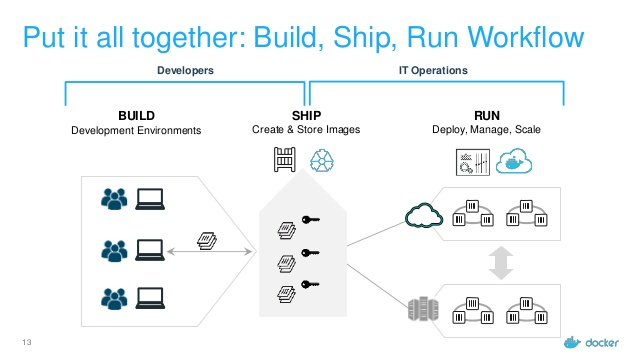

# OCI 镜像

镜像本质是利用 UnionFS （Union File System，联合文件系统）实现的分层文件系统，其内部根据 OCI  规范了镜像的构建系统需要输出的内容和格式。输出的容器镜像可以被解包成一个 runtime bundle 从中可以根据 OCI 运行时标准运行容器。

在 OCI 标准镜像规范出台之前，有两套广泛使用的镜像规范，分别是 appc 和 docker v2，OCI 组织在 docker v2 的基础上推出了 OCI image spec，规定了对于符合规范的镜像，允许开发者只要对容器打包和签名一次，就可以在所有的容器引擎上运行该镜像。

一个典型的容器工作流程是从由开发者制作容器镜像开始的(build)，然后上传到镜像存储中心(ship)，最后部署在集群中(run)。

<div  align="center">
	
</div>

## OCI 镜像标准规范

OCIv1 镜像主要包括以下几块内容：

- Image Manifest：提供了镜像的配置和文件系统层定位信息，可以看作是镜像的目录，文件格式为 json 。
- Image Layer Filesystem Changeset：序列化之后的文件系统和文件系统变更，它们可按顺序一层层应用为一个容器的 rootfs，因此通常也被称为一个 layer（与下文提到的镜像层同义），文件格式可以是 tar ，gzip 等存档或压缩格式。
- Image Configuration：包含了镜像在运行时所使用的执行参数以及有序的 rootfs 变更信息，文件类型为 json。


rootfs (root file system)即 / 根挂载点所挂载的文件系统，是一个操作系统所包含的文件、配置和目录，但并不包括操作系统内核，同一台机器上的所有容器都共享宿主机操作系统的内核。


## layer 的实现基础 UnionFS

镜像中有个概念 Layer，layer 的实现基础是 UnionFS （Union File System，联合文件系统）。例如把一张 CD/DVD 和一个硬盘目录给联合挂载在一起，这样就可以对只读的 CD/DVD 上的文件进行修改，当然修改的文件是存于硬盘上目录中。UnionFS 的核心原理有两个：

- 分支管理：它使用 branch 形式把不同文件系统的文件和目录"透明地"覆盖，形成一个单一一致的文件系统。这些 branch 或者是 read-only，或者是 read-write ，所以当对这个虚拟后的联合文件系统进行写操作的时候，系统是真正写到了一个新的文件中。

- 写时复制：copy-on-write，简写 CoW。它的思想是如果一个资源是重复的，在没有对资源做出修改前，并不需要立即复制出一个新的资源实例，这个资源被不同的所有者共享使用。当任何一个所有者要对该资源做出修改时，复制出一个新的资源实例给该所有者进行修改，修改后的资源成为其所有者的私有资源。


下面以 overlay 实现为例演示联合挂载效果

```
$ tree .
.
├── lower
│   ├── b
│   └── c
├── merged
├── upper
│   ├── a
│   └── b
└── work
```

在 OverlayFS 中，存在 Lower 和 Upper 的概念，overlay 是“覆盖…上面”的意思，表示一个文件系统覆盖在另一个文件系统上面，也就是将 upperdir 参数指定的目录覆盖到 lowerdir 参数指定的目录之上，并且挂载到 merged 目录里面.

使用 mount 命令把 lowerdir 和 upperdir 目录合并挂载到 merged 目录中

```
$ mount -t overlay overlay -o lowerdir=lower,upperdir=upper,workdir=work merged
$ cd merged && tree .
.
├── a
├── b
└── c
```

```
$ echo hi >> c
$ echo hello >> b
```

从上面可以看出 merged 目录就是合并的结果，对 b 文件修改, 生效的是 upper 目录中 b 文件, 而对 c 文件进行修改，则会在 upper 目录中进行 CoW 操作，lower 目录中 c 文件并不进行修改。这是因为 B 在挂载时位于更上层。


## 容器的读写效率问题

为了最小化 I/O 以及缩减镜像体积，容器的联合文件系统在读写文件时会采取CoW 操作，如果一个文件或目录存在于镜像中较低层，而另一个层（包括可写层）需要对其进行读取访问时，会直接访问较低层的文件。

当另一个层第一次需要写入该文件时（在构建镜像或运行容器时），该文件会被复制到该层并被修改。这一举措大大减少了容器的启动时间（启动时新建的可写层只有很少的文件写入），但容器运行后每次第一次修改某个文件都需要先将整个文件复制到 container layer 中。

以上原因导致容器运行时的读写效率不如原生文件系统（尤其是写入效率），在 container layer 中不适合进行大量的文件读写，通常建议将频繁写入的数据库、日志文件或目录等单独挂载出去，如使用 Docker 提供的 Volume，此时目录将通过绑定挂载（Bind Mount）直接挂载在可读写层中，绕过了写时复制带来的性能损耗。
