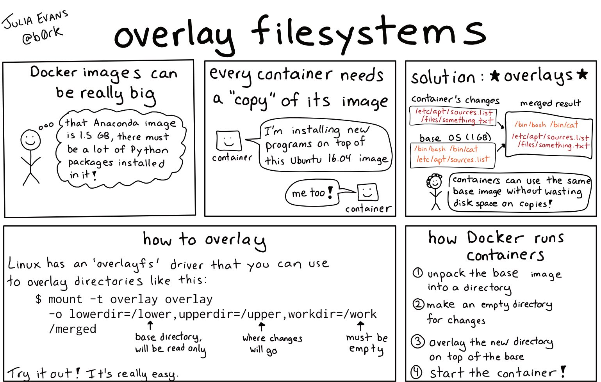

# 7.3 容器镜像的进化

容器的生态中还有一个关键角色“镜像”，那么镜像是什么呢？

实际上，挂载在容器根目录的 rootfs（根文件系统），就是所谓的“容器镜像”，rootfs 将进程运行的所有依赖都封装在了一起，进而提供了容器最关键的特性 —— 本地云端一致性。

:::tip 额外知识

需要明确的是，Linux 操作系统中只有开机启动时会加载指定版本的内核镜像，因此 rootfs 只是一个操作系统包含的文件、目录，并不包含操作系统内核。

因此，同一台宿主机上所有的容器，都共享宿主机操作系统的内核。如果应用程序需要配置内核参数、加载内核模块、与内核进行交互，那么是有很大风险的，这也是容器相比虚拟机主要的缺陷之一。

:::

Docker 镜像时并没有沿用以前制作 rootfs 的流程，而是做了一个小小的创新：layer(层)的设计。借助 layer 复用机制，Docker 镜像实现了分发更快、存储更少、加载更快的目标。

layer 的设计的原理是 UnionFS（联合文件系统）。

:::tip UnionFS 是什么

UnionFS（联合文件系统）技术能够将不同的层整合成一个文件系统，为这些层提供了一个统一视角，这样就隐藏了多层的存在，在用户的角度看来，只存在一个文件系统。

UnionFS 类似的有很多种实现，比如 OverlayFS、Btrfs 等。在 Linux 内核 3.18 版本中，OverlayFS 代码正式合入 Linux 内核的主分支。在这之后，OverlayFS 也就逐渐成为各个主流 Linux 发行版本里缺省使用的容器文件系统了。

:::

<div  align="center">
  
</div>


笔者借用 Stripe 工程师 Julia Evans 撰写的《How containers work: overlayfs》[^1] 中的例子，说明 OverlayFS 中的概念和作用。

```
#!/bin/bash

umount ./merged
rm upper lower merged work -r

mkdir upper lower merged work
echo "I'm from lower!" > lower/in_lower.txt
echo "I'm from upper!" > upper/in_upper.txt
# `in_both` is in both directories
echo "I'm from lower!" > lower/in_both.txt
echo "I'm from upper!" > upper/in_both.txt

// 使用 mount 命令即将 lower、upper 挂载到 merged。

sudo mount -t overlay overlay \
 -o lowerdir=./lower,upperdir=./upper,workdir=./work \
 ./merged
```
在使用 mount 命令并指定 OverlayFS 时，有几个关键的目录：

- lowerdir：只读层，该层无法修改，可以指定多个 lower
- upperdir：读写层，容器数据修改保存的地方
- merged：最终呈现给用户的目录
- workdir：工作目录，指 OverlayFS 工作时临时使用的目录，保证文件操作的原子性，挂载后会被清空

从挂载点的视角看，upper 层的文件会覆盖 lower 层的文件，比如”in_both.txt”这个文件，在 lower 层和 upper 层都有，但是挂载点 merged/里看到的只是 upper 层里的 in_both.txt.

<div  align="center">
  
</div>

如果我们在 merged/ 目录里做文件操作，具体包括这三种

- 新建文件时：这个文件会出现在 upper/ 目录中
- 删除文件时：
	- 如果我们删除 ”in_upper.txt”，那么这个文件会在upper/目录中消失
	- 如果删除 ”in_lower.txt”, 在 lower/目录里的”in_lower.txt”文件不会有变化，只是在 upper/目录中增加了一个特殊文件来告诉OverlayFS，”in_lower.txt’这个文件不能出现在merged/里了，这就表示它已经被删除了。
- 修改文件：类似如果修改”in_lower.txt”，那么就会在upper/目录中新建一个”in_lower.txt”文件，包含更新的内容，而在lower/中的原来的实际文件”in_lower.txt”不会改变


Docker 镜像正式利用 union fs 这种特性，设计出了镜像 layer 的概念。

如下图所示，容器镜像文件可以分成多个层（layer），每层可以对应 OverlayFS 里 lowerdir 的一个目录，lowerdir 支持多个目录，也就可以支持多层的镜像文件。在容器启动后，对镜像文件中修改就会被保存在 upperdir 里了。

<div  align="center">
  
</div>

如下代码所示，可以看到，这个 Ubuntu 镜像，实际上由五个层组成。这五个层就是五个增量 rootfs，每一层都是 Ubuntu 操作系统文件与目录的一部分；而在使用镜像时，Docker 会把这些增量联合挂载
在一个统一的挂载点上（等价于前面例子里的“/C”目录）。


```
$ docker run -d ubuntu:latest sleep 3600
$ docker image inspect ubuntu:18.04

...
 "GraphDriver": {
            "Data": {
                "MergedDir": "/var/lib/docker/overlay2/93873a3eea1d0f99d78445324c9c2997e17769e5de13ba45da2f5d6c9fbe325d/merged",
                "UpperDir": "/var/lib/docker/overlay2/93873a3eea1d0f99d78445324c9c2997e17769e5de13ba45da2f5d6c9fbe325d/diff",
                "WorkDir": "/var/lib/docker/overlay2/93873a3eea1d0f99d78445324c9c2997e17769e5de13ba45da2f5d6c9fbe325d/work"
            },
            "Name": "overlay2"
        },

...
```


OCIv1 格式是一种基于 Docker Image Manifest Version 2 Schema 2 格式的镜像格式规范，由 manifest、镜像索引 (optional)、一系列容器镜像层及配置文件组成，本质上说 OCI 镜像是一个以层为基本单位的镜像格式，每个层存储了文件级别的 diff data，以 tgz 归档格式存储，如下所示。

<div  align="center">
  
</div>

## 镜像下载加速

我们知道镜像文件是从远程仓库下载而来，镜像下载的效率会受带宽、镜像仓库瓶颈的影响。那如何提高镜像下载的效率？你一定能想到 P2P 网络加速。而 Dragonfly 就是基于这一网络模型的容器镜像分发系统。

:::tip 什么是 Dragonfly

Dragonfly 是一款基于 P2P 技术的文件分发和镜像加速系统，它旨在提高大规模文件传输的效率，最大限度地利用网络带宽。在镜像分发、文件分发、日志分发、AI 模型分发以及 AI 数据集分发等领域被大规模使用。

目前 Dragonfly 在 CNCF 托管作为孵化级项目。
:::

Dragonfly 提供了一种无侵入（不修改容器、仓库等源码）的镜像下载加速解决方案，它的工作流程如下图所示。当下载一个镜像或文件时，通过 Peer（类似 p2p 的节点） 的 HTTP Proxy 将下载请求代理到 Dragonfly。Peer 首先会 Scheduler（类似 p2p 调度器）注册 task。Scheduler 会查看 Task 的信息，判断 Task 是否在 P2P 集群内第一次下载

- 第一次下载优先触发 Seed Peer 进行回源下载，并且下载过程中对 Task 基于 Piece 级别切分。Peer 每下载成功一个 Piece， 会将信息上报给 Scheduler 供下次调度使用。
- 如果 Task 在 P2P 集群内非第一次下载，那么 Scheduler 会调度其他 Peer 给当前 Peer 下载。

Peer 从不同的 Peer 下载 Piece，拼接并返回整个文件，那么 P2P 下载就完成了。

<div  align="center">
	
	<p>Dragonfly 怎么运行的</p>
</div>

## 镜像启动加速

容器镜像的大小会影响容器启动的时间，例如 tensorflow 的镜像有 1.83 GB，启动这个镜像的时间要用 3 分钟。在一篇《Making containers lazy with Docker and CernVM-FS》[^3]的论文中就提到容器运行期间整个镜像内容并不会被充分利用，一般镜像只有 6% 的内容会被实际用到。

如果能实现按需加载，肯定能大幅降低容器启动时间，这便是 Nydus 出现的背景。

:::tip Nydus 是什么
Nydus 是蚂蚁集团、阿里云和字节等共建的开源容器镜像加速项目，是 CNCF Dragonfly 的子项目，Nydus 优化了现有的 OCIv1 容器镜像架构，设计了 RAFS (Registry Acceleration File System) 磁盘格式，最终呈现为一种“文件系统”的容器镜像格式的镜像加速实现。

:::

Nydus 主要优化了镜像中 Layer 数据层的数据结构，将容器镜像文件系统的数据 (blobs）和元数据 (bootstrap) 分离，让原来的镜像层（layer）只存储文件的数据部分，并且把文件以 chunk 为粒度分割，每层 blob 存储对应的 chunk 数据。

由于元数据被单独分离出来合为一处，因此对于元数据的访问不需拉取对应的 blob 数据，需要拉取的数据量要小很多，I/O 效率更高。

最后再利用 FUSE（Filesystem in Userspace，用户态文件系统）重写文件系统，实现了容器启动后，按需从远端（镜像中心）拉取镜像数据。

<div  align="center">
	
	<p>Nydus 工作流程</p>
</div>

由于使用了按需加载镜像数据的特性，容器的启动时间明显缩短。在官网给到的数据中，Nydus 能够把常见镜像的启动时间，从数分钟缩短到数秒钟。

<div  align="center">
	
	<p>OCIv1 与 Nydus 镜像启动时间对比</p>
</div>

如此，使用 P2P 的方式加速镜像下载，再结合 Nydus 容器启动延迟加载技术实现瞬时启动几百、几千 Pod 的能力，对于大规模集群或者对冷启动扩容延迟要求较高的场景（大促扩容、游戏服务器扩容、函数计算）来说，不仅能大幅降低容器启动时间，还能大量节省网络/存储开销。

[^1]: 参见 https://jvns.ca/blog/2019/11/18/how-containers-work--overlayfs/
[^2]: 参见 https://www.cyphar.com/blog/post/20190121-ociv2-images-i-tar
[^3]: 参见 https://indico.cern.ch/event/567550/papers/2627182/files/6153-paper.pdf