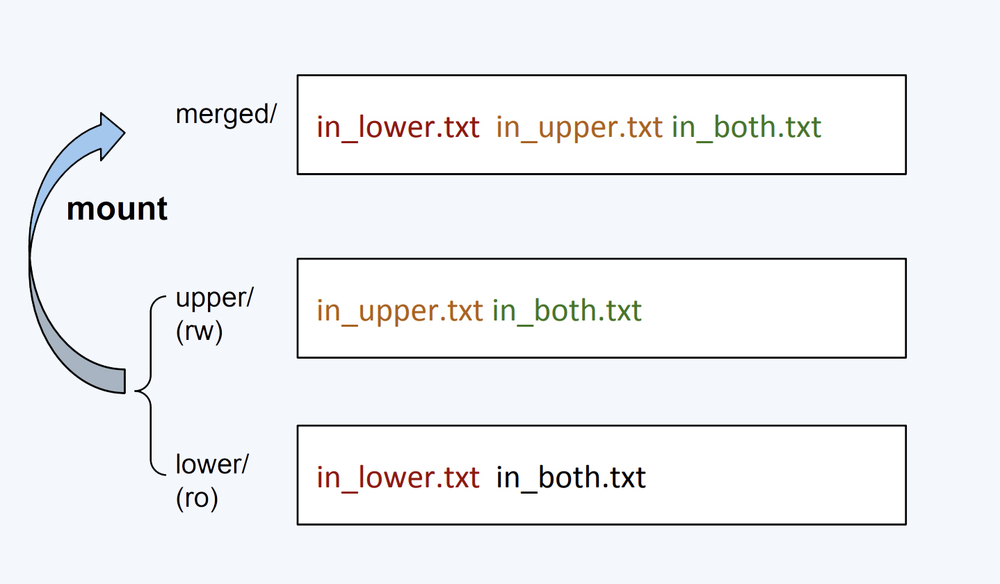
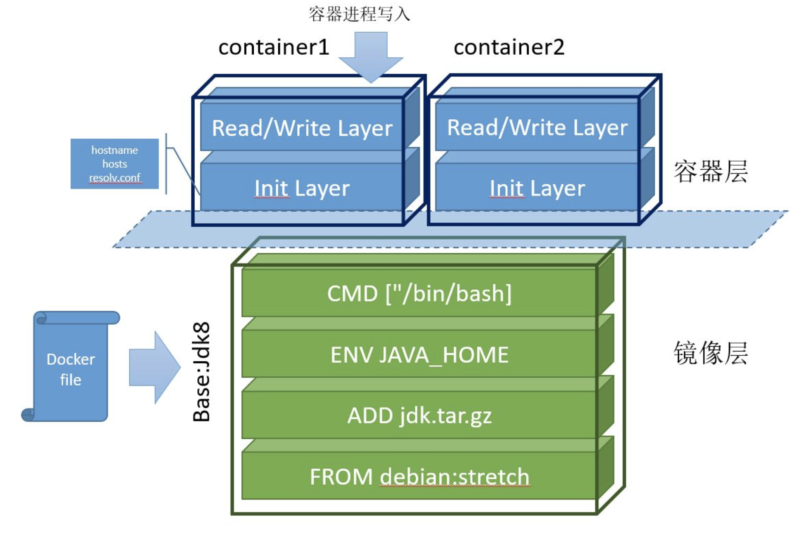

# 7.3 容器镜像的原理与应用

本书反复提到的概念“容器镜像”到底是什么？本节，我们深入分析容器镜像的原理，探索容器镜像在下载加速、启动加速、存储优化等场景中的最佳实践。

## 7.3.1 什么是容器镜像

所谓的“容器镜像”，其实就是一个特殊的压缩包，内含应用程序及其运行所需的全部依赖。容器系统创建一个隔离的“沙盒”环境，在“沙盒”内解压镜像，就可以运行你的应用程序了。

事实上，大部分开发者对应用依赖的理解通常局限于编程语言层面。例如，某个 Java 应用依赖特定版本的 JDK、某个 Python 应用依赖 Python2.7 等等。但一个常被忽视的事实是：“**操作系统本身才是应用运行所需的最完整的依赖环境**”。

所以，你只需提供好操作系统文件与目录，然后使用它制作一个“压缩包”。在 Docker 中，这个操作是：

```bash
$ docker build 镜像名称
```
一旦镜像制作完成，用户就可以让 Docker 创建一个“沙盒”来解压镜像，得到一个包含应用程序运行所需的依赖库、配置的目录。接着，调用 chroot 或 pivot_root 命令，将该目录转变为容器内 rootfs（Root Filesystem，根文件系统）文件系统。然后，在“沙盒”内就能运行自己的应用程序。在 Docker 中，这个操作是：

```bash
$ docker run 镜像名称
```
上述“沙盒”，其实就是上一篇介绍的 Namespace 和 Cgroups 技术创建出来的隔离环境。

由于镜像打包的是“整个操作系统”，应用程序与运行依赖全部封装在了一起，从而赋予了容器最核心的一致性能力：无论是在本地，还是在云端某个虚拟机，只要解压打包好的容器镜像，应用程序运行所依赖的环境就能完美重现。

另外，需要明确的是，Linux 操作系统在启动时会加载指定版本的内核镜像，而 rootfs 只是操作系统的一部分，只是一些按规则组织的文件和目录，并不包含操作系统内核。因此，同一台主机内所有容器都共享主机的操作系统内核。如果容器内的进程与内核交互，将影响到主机内的其他容器，这是容器相比虚拟机的主要缺陷之一。

## 7.3.2 容器镜像分层设计原理

上述的 rootfs 仅解决了应用运行环境的一致性问题，但并未解决所有问题。

例如，当应用升级或运行环境发生改动时，是否需要重新制作一次 rootfs？将整个 rootfs 粗暴地打包在一起，不仅无法复用、还占用大量存储空间。举例来说，笔者基于 CentOS ISO 制作了一个 rootfs，配置了 Java 运行环境。那么，笔者的同事发布 Java 应用时，肯定想复用之前安装过 Java 运行环境的 rootfs，而不是重新制作一个。此外，如果每个人都重新制作 rootfs，考虑到一台主机通常运行几十个容器，将会占用巨大的存储空间。

分析上述 Java 应用对 rootfs 的需求，发现底层的 rootfs（例如 CentOS + JDK）其实是固定的。那么，是否可以通过增量修改的方式来支持不同应用的依赖？比如，维护一个共同的“基础 rootfs”，然后根据应用的不同依赖制作不同的镜像。例如，**CentOS + JDK** + app-1、**CentOS + JDK** + app-2 和 **CentOS** + Python + app-3 等等。

增量修改的想法当然可行，这正是 Docker 设计的精髓所在。Docker 没有沿用传统的 rootfs 制作流程，而是在镜像设计中引入了层（layer）的概念。也就是说，每次制作镜像的操作都会生成一个层，也就是一个增量的 rootfs。

Docker 镜像的分层设计使用了 UnionFS（联合文件系统）技术，UnionFS 能够将不同位置的目录联合挂载（union mount）到同一个目录下，使用户感受到的是一个统一的文件系统视图，而不是多个目录的存在。UnionFS 的实现有很多种，如 OverlayFS、Btrfs、AUFS 等。在 Linux 内核 3.18 版本中，OverlayFS 合入了 Linux 内核的主分支，此后，OverlayFS 逐渐成为各大主流 Linux 发行版中的默认联合文件系统。


OverlayFS 的使用非常简单，只需通过 mount 命令，指定文件系统类型为 overlay（即 OverlayFS），明确下述 OverlayFS 相关的参数：
- lowerdir：OverlayFS 中的只读层，可以指定多个目录，一般用来提供基础的文件系统；
- upperdir：OverlayFS 中的读写层，用来存储用户的增量修改；
- merged：挂载操作完成后，展示给用户的文件系统视图。

笔者举一个具体的例子供你参考，示例代码如下：

```bash
#!/bin/bash

umount ./merged
rm upper lower merged work -r

mkdir upper lower merged work
echo "I'm from lower!" > lower/in_lower.txt
echo "I'm from upper!" > upper/in_upper.txt
# `in_both` is in both directories
echo "I'm from lower!" > lower/in_both.txt
echo "I'm from upper!" > upper/in_both.txt

// 使用 mount 命令即将 lower、upper 挂载到 merged。

$ sudo mount -t overlay overlay \
 -o lowerdir=./lower,upperdir=./upper,workdir=./work \
 ./merged
```

通过上述代码挂载后的文件系统如图 7-7 所示。

:::center
  <br/>
  图 7-7 OverlayFS 挂载后的文件系统视图
:::


当在 merged 目录中进行增删改操作时，OverlayFS 文件系统执行 CoW（Copy-On-Write，写时复制）策略。CoW 的基本原理笔者通过下述操作解释：

- 新建文件时：文件会出现在 upper 目录中。
- 删除文件时：
  - 如果删除 in_upper.txt，文件将在 upper 目录中消失。
  - 如果删除 in_lower.txt，lower 目录中的 in_lower.txt 文件不会发生变化，但 upper 目录中会增加一个特殊文件，表示 in_lower.txt 不再出现在 merged 目录中，表明它已经被删除。
- 修改文件时：如果修改 in_lower.txt，会在 upper 目录中新建一个 in_lower.txt 文件，包含更新后的内容，而 lower 目录中的原文件 in_lower.txt 不会改变。


至此，相信你已经理解了联合文件系统是什么，以及它的作用。再来看 Docker 镜像利用联合文件系统的分层设计，如图 7-8 所示，该容器从下往上由 6 个层构成：

- 最下层是基础镜像 Debian Stretch，该层相当于“base rootfs”，所有的容器都可以共享这一层；
- 往上 3 层是在 Dockerfile 通过指令 ADD、ENV、CMD 等命令生成的只读层；
- Init Layer夹在只读层和可写层之间，主要存放可能会被修改的文件，如 /etc/hosts、/etc/resolv.conf 等。这些文件本来属于 Debian 镜像，但容器启动时，用户往往会写入一些指定的配置，因此 Docker 单独生成了这一层；
- 最上面的是利用 CoW 技术创建的可写层（Read/Write Layer）。容器内部的任何增、删、改操作都发生在此层。但该层的数据不具备持久性，当容器被销毁时，写入的数据会随之消失。容器镜像内无法写入任何数据，体现了不可变基础设施的思想，无论容器重启多少次或在哪台机器上运行，都能保证一份镜像启动相同的服务。


:::center
  <br/>
  图 7-8 Docker 容器镜像分层设计概览
:::

最终，这 6 个层被联合挂载到 /var/lib/docker/overlay/mnt 目录中。容器系统通过系统调用 chroot 和 pivot_root 切换进程的根目录，使得运行在该目录内的进程就像独享一个带有 JAVA 环境的 Debian 操作系统一样。

通过镜像分层的设计，以 Docker 镜像为核心，不同公司、不同团队的开发人员可以紧密连接在一起。每个人都可以发布基础镜像，每个人都可以利用他人制作的基础镜像发布自己的软件。由于镜像的操作是增量的，每次镜像的拉取和推送内容也是增量的，这远比操作虚拟机动辄数 GB 的 ISO 镜像要更敏捷。

更重要的是，一旦容器镜像发布，你可以在全球任何地方下载该镜像，完全复现应用依赖的完整环境，打通了“开发-测试-部署”流程中的每一个环节。

## 7.3.3 构建足够小的容器镜像

容器镜像应用的挑战之一是使镜像尽可能小。足够小的镜像在部署、故障转移、存储成本等方面都有明显的优势。


构建足够小的镜像，可参考以下两种方法：

- **选用精简的基础镜像**：基础镜像应只包含运行应用程序所必需的最小系统环境和依赖。选择 Alpine Linux 这样的轻量级发行版作为基础镜像，通常比选择 CentOS 这样的大而全的基础镜像要小得多；
- **使用多阶段构建镜像**：在镜像构建过程中，编译缓存、临时文件和编译工具等都可能被打包进镜像，但这些并不是应用运行所需的。通过多阶段构建，第一阶段用于编译和测试，第二阶段则仅复制编译后的可执行文件，从而得到一个更加精简的镜像。

下面是通过多阶段构建一个精简的 Nginx 镜像的示例，供读者参考：


```dockerfile
# 第 1 阶段
FROM skillfir/alpine:gcc AS builder01
RUN wget https://nginx.org/download/nginx-1.24.0.tar.gz -O nginx.tar.gz && \
tar -zxf nginx.tar.gz && \
rm -f nginx.tar.gz && \
cd /usr/src/nginx-1.24.0 && \
 ./configure --prefix=/app/nginx --sbin-path=/app/nginx/sbin/nginx && \
  make && make install
  
# 第 2 阶段 只打包最终可执行文件
FROM skillfir/alpine:glibc
RUN apk update && apk upgrade && apk add pcre openssl-dev pcre-dev zlib-dev 

COPY --from=builder01 /app/nginx /app/nginx
WORKDIR /app/nginx
EXPOSE 80
CMD ["./sbin/nginx","-g","daemon off;"]
```

使用 docker build 命令编译镜像，并查看镜像产物。可以看到生成的镜像大小只有 23.4 MB。

```bash
$ docker build -t alpine:nginx .
$ docker images 
REPOSITORY                TAG             IMAGE ID       CREATED          SIZE
alpine                    nginx           ca338a969cf7   17 seconds ago   23.4MB
```

## 7.3.4 加速容器镜像下载

当容器启动时，如果本地没有镜像文件，需要从远程仓库（镜像的仓库称 Repository）下载。镜像下载的效率会受到网络带宽和镜像仓库服务质量的影响，镜像越大，下载时间就越长，容器启动时间也因此变慢。

加速镜像文件下载的有效方式之一是使用 P2P 网络加速技术。Dragonfly 就是一个基于 P2P 网络实现的容器镜像分发加速系统。它提供了一种对原有镜像下载方式无侵入的加速方案，用户无需修改容器或镜像仓库的配置即可享受加速服务。

图 7-9 展示了 Dragonfly 的工作流程。首先，Dragonfly 会在多个节点中启动 Peer 服务（类似 P2P 的节点）。当容器系统下载镜像时，下载请求通过 Peer 转发至 Scheduler（类似 P2P 调度器），Scheduler 判断该镜像是否为首次下载：

- 如果是：Scheduler 触发回源动作，即从源服务器获取镜像文件。此过程中，Dragonfly 将镜像文件切分为多个“块”（ Piece）。每个块被缓存在不同的节点，相关配置上报至 Scheduler，供后续的调度决策使用；
- 如果不是：Scheduler 根据配置，提供一个镜像所有块的下载调度指令。

最后，Peer 根据调度策略，从集群不同节点下载所有块，拼接成完整的镜像文件。

:::center
  <br/>
  图 7-9 Dragonfly 是怎么工作的 [图片来源](https://d7y.io/zh/docs/)
:::

Dragonfly 整个镜像下载加速流程与 P2P 下载加速非常相似，二者原理都是通过分布式节点和智能调度加速大文件的传输与重组。

## 7.3.5 加速容器镜像启动

容器镜像的大小直接影响启动时间，一些大型软件的镜像可能超过数 GB。例如，机器学习框架 TensorFlow 的镜像大小为 1.83 GB，冷启动时至少需要 3 分钟。大型镜像不仅启动缓慢，镜像内的文件往往未被充分利用（业内研究表明，通常镜像中只有 6% 的内容被实际使用）[^1]。

2020 年，阿里巴巴技术团队发布了 Nydus，目标是提升容器镜像的启动速度和减少镜像的存储空间。Nydus 将镜像层的数据（blobs）与元数据（bootstrap）分离，容器第一次启动时，首先拉取元数据，再按需拉取 blobs 数据。相较于拉取整个镜像层，下载的数据量大大减少。值得一提的是，Nydus 使用 FUSE 技术（Filesystem in Userspace，用户态文件系统）重构文件系统，用户几乎无需任何特殊配置（感知不到 Nydus 的存在），即可按需从远程镜像中心拉取数据，加速容器镜像启动。

:::center
  <br/>
  图 7-10 Nydus 是怎么工作的 [图片来源](https://d7y.io/zh/blog/2022/06/06/evolution-of-nydus/)
:::

如图 7-11 所示，在 OCIv1（默认镜像格式）与 Nydus 镜像格式启动时间的对比中，Nydus 能将常见应用镜像的启动时间从数分钟缩短到仅数秒钟。

:::center
  <br/>
  图 7-11 OCIv1 与 Nydus 镜像启动时间对比
:::

总结上述镜像的应用：在最初的编译阶段生成足够小的镜像。接着，利用分布式节点和智能调度（也就是 P2P 网络）加速镜像下载。最后，利用 Nydus 技术实现镜像层的按需加载。最关键的是，上述所有的技术调整，并没有破坏原有应用层流程，对于业务工程师而言，完全是透明的。

上述优化措施对于大规模集群，或对冷启动扩容延迟有严格要求的场景（如大促扩容、游戏服务器扩容等），不仅能显著降低容器启动时间，还能大幅节省网络和存储成本。

[^1]: 参见 https://indico.cern.ch/event/567550/papers/2627182/files/6153-paper.pdf