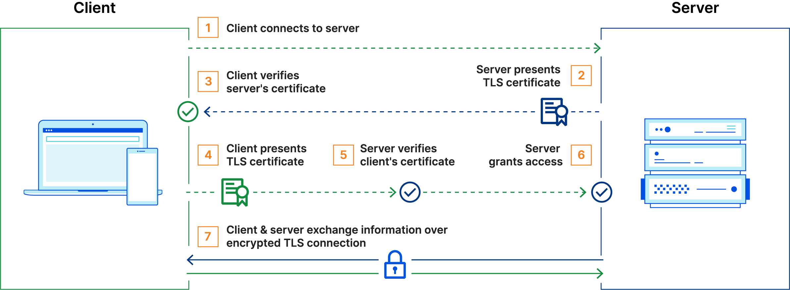
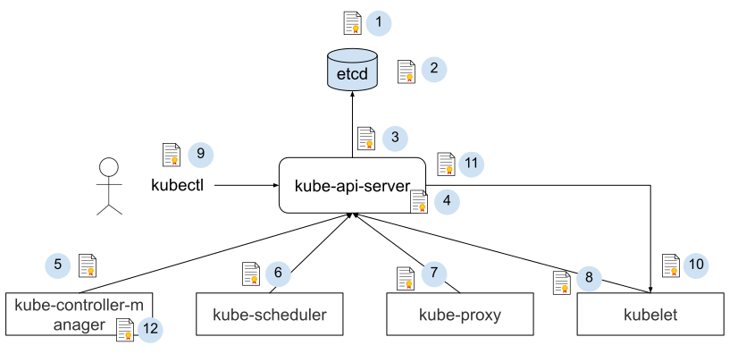

# 证书配置

Kubernetes 的安装和组件启动参数中有大量的证书配置相关参数，很多同学在此会遇到各种各样“稀奇古怪”的问题。在本节，我们先去了解 Kubernetes 中证书配置背后的流程和原理，这将有助于我们深入理解 kubernetes 各个组件的配置及流程逻辑。

首先，Kubernetes 中各个组件是以独立进程形式运行，组件之间通过 HTTP/GRPC 相互通信。如下图所示，控制平面中 etcd、kube-api-server、kube-scheduler 等组件相互进行远程调用：kube-api-server 调用 etcd 接口存储数据；kube-api-server 调用工作节点中的 kubelet 管理和部署应用...。

<div  align="center">
	
	<p>kubernetes 组件</p>
</div>

由于组件之间的调用都是通过网络进行，为避免恶意第三方伪造身份窃取信息或者对系统进行攻击，就得对通信进行加密。希望你还能回忆起 2.5.1 篇节介绍过 TLS 的通信原理，不过常规的 TLS 是一个单向验证的过程（只校验了服务端），而在 Kubernetes 中，**各个组件提供的接口中包含了集群的内部信息，如果接口被非法访问，将影响集群的安全性。因此它们之间的通信就需要采用 mTLS（Mutual TLS，双向 TLS）认证的方式**[^1]，即客户端和服务器端都需要验证对方的身份信息。


使用 mTLS 双向认证时，涉及到下面这些证书相关的文件：

- 服务端：
  - 服务端证书，用于证明自身身份的数字证书，里面主要包含了服务器端的公钥以及服务器的身份信息，配置中的一般含有 cert file 关键词。
  - 服务端公钥，服务器端证书中包含的公钥所对应的私钥，公钥和私钥是成对使用的，在进行 TLS 验证时，服务器使用该私钥来向客户端证明自己是服务器端证书的拥有者，配置中的一般含有 key file 关键词。
  - 服务器端 CA 根证书，签发服务器端证书的 CA 根证书，提前安装在客户端，客户端使用该 CA 根证书来验证服务器端证书的合法性。配置中的一般含有 ca-file 关键词。

- 客户端：
  - 客户端证书，用于证明自身身份的数字证书
  - 客户端私钥，使用该私钥来向请求者证明自己是该证书的拥有者。配置中一般为 key-file
  - 客户端 CA 根证书，签发客户端证书的 CA 根证书，服务器端使用该 CA 根证书来验证客户端证书的合法性。


<div  align="center">
  
  <p>kubernetes 组件</p>
</div>

Kubernetes 中使用了大量的证书，本文不会视图覆盖到多有的证书，但会讨论到主要的证书。理解了这些证书的使用方法和原理后，也能很快理解其他可能遇到的证书文件。

<div  align="center">
	
	<p>HTTPS 通信流程</p>
</div>

1. etcd 集群证书，由于一个 etctd 节点既为其他节点提供服务，又需要作为客户端访问其他节点，因此该证书同时用作服务器证书和客户端证书。
2. etcd 集群向外提供服务使用的证书，该证书是服务器证书。
3. kube-apiserver 作为客户端访问 etcd 使用的证书。该证书是客户端证书
4. kube-apiserver 对外提供服务使用的证书。该证书是服务器证书。
5. kube-controller-manager 作为客户端访问 kube-apiserver 使用的证书,该证书是客户端证书
6. kube-scheduler 作为客户端访问 kube-apiserver 使用的证书
7. kube-proxy 作为客户端访问 kube-apiserver 使用的证书,该证书是客户端证书
8. kubelet 作为客户端访问 kube-apiserver 使用的证书,该证书是客户端证书
9. 管理员用户通过 kubectl 访问 kube-apiserver 使用的证书,该证书是客户端证书
10. kubelet 对外提供服务使用的证书。该证书是服务器证书。
11. kube-apiserver 作为客户端访问 kubelet 采用的证书。该证书是客户端证书
12. kube-controller-manager 用于生成和验证 service-account token 的证书。该证书并不会像其他证书一样用于身份认证，而是将证书中的公钥/私钥对用于 service account token 的生成和验证。kube-controller-manager 会用该证书的私钥来生成 service account token，然后以 secret 的方式加载到 pod 中。pod 中的应用可以使用该 token 来访问 kube-apiserver。

## 安装 cfssl

:::tip cfssl
cfssl 是 CloudFlare 开源的证书管理工具，使用 json 文件生成证书，相比 openssl 更方便使用。
:::


```
$ curl -s -L -o /usr/local/bin/cfssl https://github.com/cloudflare/cfssl/releases/download/v1.6.4/cfssl_1.6.4_linux_amd64
$ curl -s -L -o /usr/local/bin/cfssljson https://github.com/cloudflare/cfssl/releases/download/v1.6.4/cfssljson_1.6.4_linux_amd64
$ curl -s -L -o /usr/local/bin/cfssl-certinfo https://github.com/cloudflare/cfssl/releases/download/v1.6.4/cfssl-certinfo_1.6.4_linux_amd64

$ chmod +x /usr/local/bin/cfssl*
$ cfssl version
```

## 创建认证中心(CA)

CFSSL可以创建一个获取和操作证书的内部认证中心。运行认证中心需要一个CA证书和相应的CA私钥（任何知道私钥的人都可以充当CA颁发证书，所以保证私钥安全至关重要）

配置证书生成策略，确认根证书的使用场景 (profile) 和具体参数 (usage，过期时间、服务端认证、客户端认证、加密等)：

```
cd ssl/
cat > ca-config.json <<EOF
{
  "signing": {
    "default": {
      "expiry": "87600h"
    },
    "profiles": {
      "kubernetes": {
        "usages": [
            "signing",
            "key encipherment",
            "server auth",
            "client auth"
        ],
        "expiry": "87600h"
      }
    }
  }
}
EOF
```
- expiry 证书有效期 10 年
- kubernetes：表示该配置（profile）的用途是为kubernetes生成证书及相关的校验工作
  - signing：表示该证书可用于签名其它证书
  - server auth：表示可以该 CA 对 server 提供的证书进行验证
  - client auth：表示可以用该 CA 对 client 提供的证书进行验证

2. 创建 CA 证书签名请求

创建 ca-csr.json 文件，内容如下：

```
cat > ca-csr.json <<EOF
{
  "CN": "kubernetes",
  "key": {
    "algo": "ecdsa",
    "size": 256
  },
  "names": [
    {
      "C": "CN",
      "ST": "Shanghai",
      "L": "Shanghai",
      "O": "k8s",
      "OU": "System"
    }
  ]
}
EOF
```

- key，签名算法，可以选择 ecdsa 或者 RSA。
- CN，Common Name，在 Kubernetes 集群中，apiserver 会从证书中提取该字段作为请求的用户名
- O：Organization，apiserver 会从证书中提取该字段作为请求用户所属的组

3. 生成 CA 根证书

```
$ cfssl gencert -initca ca-csr.json | cfssljson -bare ca
```

该命令会生成运行CA所必需的文件ca-key.pem（私钥）和ca.pem（证书），还会生成ca.csr（证书签名请求），用于交叉签名或重新签名。


4. 创建 kubernetes 证书

创建 kubernetes 证书签名请求文件 kubernetes-csr.json：

```
cat > kubernetes-csr.json <<EOF
{
    "CN": "kubernetes",
    "hosts": [
      "127.0.0.1",
      "192.168.31.37",
      "192.168.31.38",
      "192.168.31.39",
      "kubernetes",
      "kubernetes.default",
      "kubernetes.default.svc",
      "kubernetes.default.svc.cluster",
      "kubernetes.default.svc.cluster.local"
    ],
    "key": {
        "algo": "ecdsa",
        "size": 256
    },
    "names": [
        {
            "C": "CN",
            "ST": "Shanghai",
            "L": "Shanghai",
            "O": "k8s",
            "OU": "System"
        }
    ]
}
EOF
```
生成 kubernetes 证书和私钥
```
$ cfssl gencert -ca=ca.pem -ca-key=ca-key.pem -config=ca-config.json -profile=kubernetes kubernetes-csr.json | cfssljson -bare kubernetes
```


[^1]: 参见 https://www.cloudflare.com/zh-cn/learning/access-management/what-is-mutual-tls/


