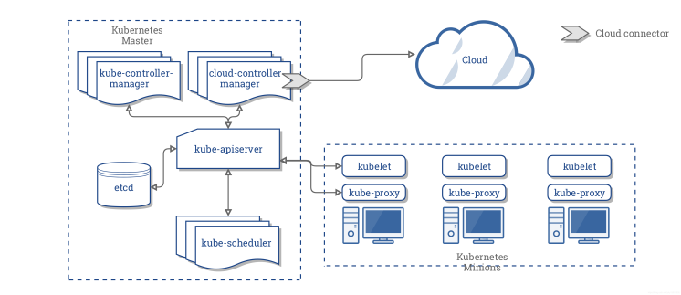

# 证书机制以及配置

Kubernetes 的安装和组件启动参数中有大量的证书配置相关参数，很多同学在此会遇到各种各样“稀奇古怪”的问题，在本节，笔者花费一定的篇幅解释 Kubernetes 中证书证书配置背后的流程和原理，这将有助于我们深入理解 kubernetes 的安装过程和组件的配置。

首先，在 Kubernetes 中各个组件是以独立进程形式运行，这些组件之间通过 HTTP/GRPC 相互通信。如下图所示，
Kubernetes 控制平面中 etcd、kube-api-server、kube-scheduler 等组件会相互进行远程调用，kube-api-server 调用 etcd 接口存储数据；kube-api-server 调用工作节点中的 kubelet 管理和部署应用...。

<div  align="center">
	
	<p>kubernetes 组件</p>
</div>

由于这些组件之间的相互调用都是通过网络进行，为避免恶意第三方伪造身份窃取信息或者对系统进行攻击，需要进行加密通信。笔者在 2.5.1 篇节介绍过 TLS 的通信原理，我们回忆前文，典型的 TLS 加密的流程如下。

<div  align="center">
	
	<p>HTTPS 通信流程</p>
</div>

- 服务端向 CA 机构申请证书，
- 客户端请求服务端时，服务端向客户端下发证书
- 客户端根据本地根证书校验服务端的证书
- 客户端拿到证书的内公钥，加密之后传递服务端，服务端用本地的私钥进行解密获取正文。

上面的流程中，实际是一个单向验证的过程（客户端验证了服务端的合法性，但服务端未验证客户端的合法性），而在 Kubernetes 中，**各个组件既是调用方也是被调用方，组件之间的通信就需要采用 mTLS（Mutual TLS，双向 TLS）认证的方式**。mTLS 中，客户端和服务器都有一个证书，并且双方都使用它们的公钥/私钥对进行身份验证。与常规 TLS 相比，mTLS 中有一些额外步骤来验证双方（额外的步骤加粗显示）。

- 客户端连接到服务器
- 服务器出示其 TLS 证书
- 客户端验证服务器的证书
- **客户端出示其 TLS 证书**
- **服务器验证客户端的证书**
- **服务器授予访问权限**
- 客户端和服务器通过加密的 TLS 连接交换信息


两个组件进行双向认证时，会涉及到下面这些证书相关的文件：

- **服务器端证书**：服务器用于证明自身身份的数字证书，里面主要包含了服务器端的公钥以及服务器的身份信息。配置中一般以 cert-file 为参数。
- **服务器端私钥**：服务器端证书中包含的公钥所对应的私钥。公钥和私钥是成对使用的，在进行 TLS 验证时，服务器使用该私钥来向客户端证明自己是服务器端证书的拥有者。配置中一般为 key-file。
- **客户端证书**：客户端用于证明自身身份的数字证书，里面主要包含了客户端的公钥以及客户端的身份信息。
- **客户端私钥**：客户端证书中包含的公钥所对应的私钥，同理，客户端使用该私钥来向服务器端证明自己是客户端证书的拥有者。
- **服务器端 CA 根证书**：签发服务器端证书的 CA 根证书，客户端使用该 CA 根证书来验证服务器端证书的合法性。一般参数名为 ca-file。
- **客户端端 CA 根证书**：签发客户端证书的 CA 根证书，服务器端使用该 CA 根证书来验证客户端证书的合法性。

## 安装 cfssl

:::tip cfssl

CFSSL 是CloudFlare开源的一款PKI/TLS工具。CFSSL 包含一个命令行工具和一个用于签名，验证并且捆绑TLS证书的 HTTP API 服务。 使用Go语言编写


:::

cfssl是一个开源的证书管理工具，使用json文件生成证书，相比openssl更方便使用。


```
curl -s -L -o /usr/local/bin/cfssl https://github.com/cloudflare/cfssl/releases/download/v1.6.4/cfssl_1.6.4_linux_amd64
curl -s -L -o /usr/local/bin/cfssljson https://github.com/cloudflare/cfssl/releases/download/v1.6.4/cfssljson_1.6.4_linux_amd64
curl -s -L -o /usr/local/bin/cfssl-certinfo https://github.com/cloudflare/cfssl/releases/download/v1.6.4/cfssl-certinfo_1.6.4_linux_amd64

chmod +x /usr/local/bin/cfssl*
cfssl version
```

CA 配置文件用于配置根证书的使用场景 (profile) 和具体参数 (usage，过期时间、服务端认证、客户端认证、加密等)：

```
cd ssl/
cat > ca-config.json <<EOF
{
  "signing": {
    "default": {
      "expiry": "87600h"
    },
    "profiles": {
      "kubernetes": {
        "usages": [
            "signing",
            "key encipherment",
            "server auth",
            "client auth"
        ],
        "expiry": "876000h"
      }
    }
  }
}
EOF

```
- expiry 证书有效期 10 年

2. 创建 CA 证书签名请求

```
{
  "CN": "kubernetes",
  "key": {
    "algo": "rsa",
    "size": 2048
  },
  "names": [
    {
      "C": "CN",
      "ST": "BeiJing",
      "L": "BeiJing",
      "O": "k8s",
      "OU": "System"
    }
  ],
    "ca": {
       "expiry": "87600h"
    }
}
```