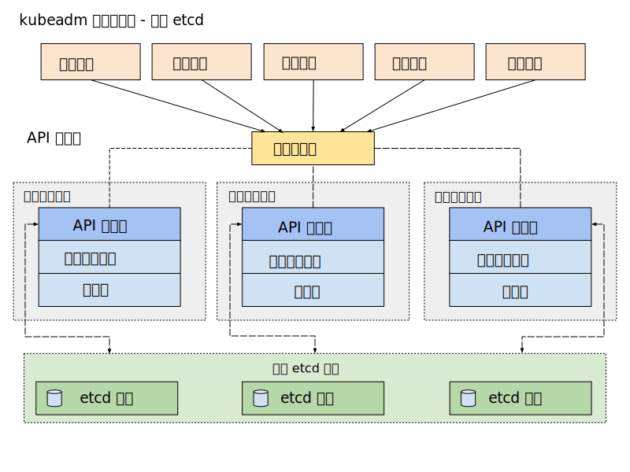

# 7.7 生产级 Kubernetes 部署实践

Kubernetes 部署有多种方式，例如 kubeadm，还有一些更上层的包装，如 Rancher 等等，这些方式虽然简化了安装，但也屏蔽了很多技术细节，出现问题的时候会让你没有头绪处理。

本节，笔者使用最原始的方式（二进制包）部署一个完整的 Kubernetes 集群，并开启 TLS 安全认证。整个安装过程中，笔者将尽量给出架构配置的依据以及各个参数的意义，这些内容有助于读者了解系统各组件的交互原理，以便能快速解决生产中的各类问题。

	

## 集群信息

- 系统内核版本：5.15.145-1.el7.x86_64
- Kubernetes 版本 1.29（2023.11.16）
- 容器运行时 containerd 1.7.11（）
- 网络 clilium 1.14（VXLAN 模式）

## API Server 高可用负载均衡

在 Kubernetes 集群中，apiserver 是整个集群的入口，任何用户或者程序对集群资源的增删改查操作都需要经过 kube-apiserver，因此它的高可用性决定了整个集群的高可用能力。

kube-apiserver 本质上是一个无状态的服务器，为了实现其高可用，通常会部署多个 kube-apiserver 实例，同时引入外部负载均衡器（以下简称 LB）进行流量代理。后续用户（kubectl 、dashboard 等其他客户端）和集群内部的组件都将通过访问 LB 来访问 apiserver 。

