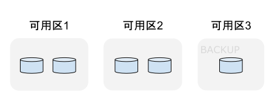

# 生产级 Kubernetes 部署实践

## API Server 高可用负载均衡

在 Kubernetes 集群中，apiserver 是整个集群的入口，任何用户或者程序对集群资源的增删改查操作都需要经过 kube-apiserver，因此它的高可用性决定了整个集群的高可用能力。

kube-apiserver 本质上是一个无状态的服务器，为了实现其高可用，通常会部署多个 kube-apiserver 实例，同时引入外部负载均衡器（以下简称 LB）进行流量代理。后续用户（kubectl 、dashbaord 等其他客户端）和集群内部的组件都将通过访问 LB 来访问 apiserver 。

## etcd 高可用集群

etcd 是 Kubernetes 的核心存储，Kubernetes 所有的资源对象都保存在 etcd etcd 是否健壮将直接影响 Kubernetes 服务。

etcd 使用 Raft 协议，因 raft 选举或者可用性要求，一般部署节点的个数奇数且数量大于 3 个，注意，笔者用的是“一般”，**raft 并不严格限定到底是奇数还是偶数，只要 (n-1)/2 以上的节点正常，集群就能正常工作**。譬如配置 4 个节点，其中 1 个节点宕机了，但还有  (n-1)/2 个节点正常，对 etcd 而言不论是选举还是可用性，都不会产生影响。

etcd 的极限受两个部分影响：单机性能的影响以及网络的开销。etcd 是默认是线性一致性（最强一致性），每次操作所有的节点都要参与，节点越多性能越低，所以增加再多的节点意义不是很大。官方推荐 etcd 节点个数 3、5、7。

笔者用多个可用区的方式部署 etcd，假设的是云商**某个可用区产生重大故障，短时间内无法恢复**。注意这个并不是防止脑裂，官方给到的解释也是 etcd 没有脑裂。

:::tip etcd 没有脑裂
The majority side becomes the available cluster and the minority side is unavailable; there is no “split-brain” in etcd.
:::

但有一种特殊情况，假如旧的 Leader 和集群其他节点出现了网络分区，其他节点选出了新的 Leader，但是旧 Leader 并没有感知到新的 Leader，那么此时集群可能会出现一个短暂的“双 Leader”状态，但这个并不是脑裂，原因是 raft 有恢复机制，这个状态并不会持续很长，其次 etcd 也有 ReadIndex、Lease read 机制解决这种状态下的一致性问题。

	

[^1]: 参见 https://etcd.io/docs/v3.5/op-guide/failures/