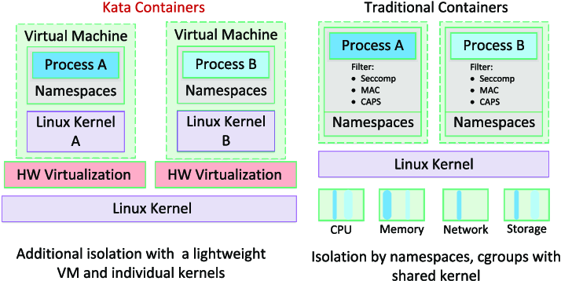

# 安全容器时：Kata Containers 

尽管容器有许多技术优势，然而传统的以 runC 为代表的容器方案基于共享内核技术，通过Linux提供的 namespace、Cgroups 等技术进行隔离和控制，如果某个容器中的恶意程序利用系统缺陷从容器中逃逸，则会对宿主机造成严重的威胁，尤其是公有云环境，安全威胁很可能会波及到其他用户的数据和业务。

如果将不同容器再嵌套放入到不同的虚拟机，通过增加一层相对安全、成熟的隔离技术，就能大大提高系统的安全性，减少系统被攻破的可能。基于这种思想的开源技术也随之出现，代表性的两个项目为 Intel 开源技术中心的 Clear Containers 和 Hyper.sh 的 runV。

2017 年，这两个开源项目合并，共同创建了开源项目 Kata Containers，其目标是将虚拟机的安全优势与容器的高速及可管理性相结合，为用户提供标准化、安全、高性能的容器解决方案。

Kata Containers 安全容器的诞生解决了许多普通容器场景无法解决的问题，例如多租户安全保障、不同 SLO 混部容器混合部署、可信/不可信容器混合部署等等。在这些优势的基础上，安全容器在虚拟化上也追求极致的轻薄，从而让整体资源消耗和弹性能力接近 runC 容器方案，以此达到 Secure as VM、Fast as Container 的技术目标

	

## Kata Containers in  Kubernetes

Kata Containers  运行符合 OCI 规范，这也意味着 Kata Containers 可以直接运行 Docker 制作的镜像，同时 Kata Containers  还兼容 Kubernetes CRI 规范

Kata Containers  通过虚拟机作为进程隔离环境之后，原生就带有 Kubernetes Pod， 也就是说 Kata Containers  启用的虚拟机就是一个 Pod，虚拟机里面的进程共享网络空间。

为了高效地和 Kubernetes CRI 集成， 新版的 Kata-Container 为了缩短容器的调用链直接将 Containerd-shim 和 kata-shim 以及 kata-proxy 融合到一起。

CRI 和 Kata Containers 的集成下图所示：

	

